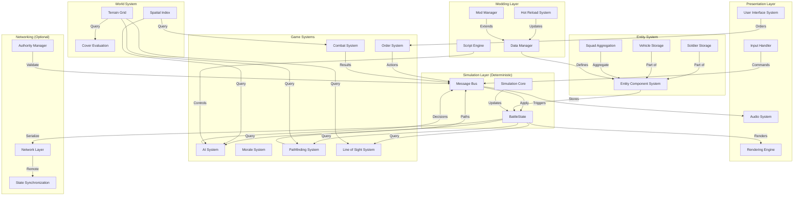
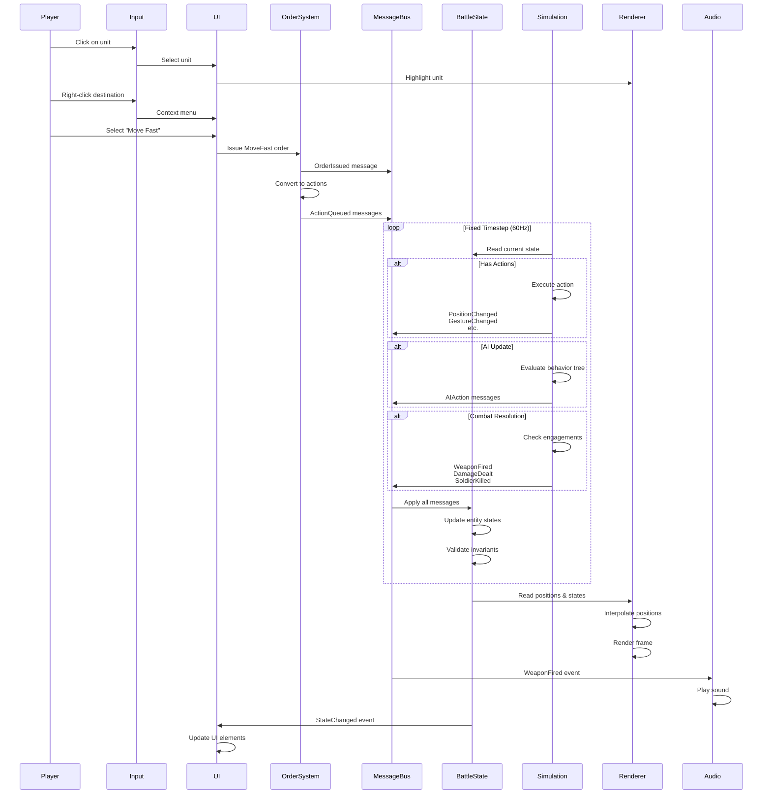

# Close Combat Clone: Architecture Blueprint

## A Complete Reference Specification for Building Tactical Wargames

---

**Version:** 1.0  
**Target Platform:** Modern Tactical Wargame (2024 Standards)  
**Philosophy:** Hybrid Architecture (Synthesis of Best Practices)  
**Specification Type:** Language-Agnostic

---

## Table of Contents

1. [Blueprint Overview](#1-blueprint-overview)
2. [System Architecture Diagram](#2-system-architecture-diagram)
3. [Core Systems Specification](#3-core-systems-specification)
4. [Data Flow](#4-data-flow)
5. [File Organization](#5-file-organization)
6. [API Specifications](#6-api-specifications)
7. [Technology Recommendations](#7-technology-recommendations)
8. [Implementation Roadmap](#8-implementation-roadmap)

---

## 1. Blueprint Overview

### 1.1 Mission Statement

This blueprint provides a complete, production-ready reference architecture for building a Close Combat-style tactical wargame. It synthesizes lessons learned from three reference implementations (OpenCombat-SDL, OpenCombat, CloseCombatFree) spanning nearly two decades of development.

### 1.2 Target Characteristics

| Aspect | Target Specification |
|--------|---------------------|
| **Entity Count** | 500-1000 units at 60 FPS |
| **Determinism** | Full reproducibility for multiplayer/replay |
| **Modding** | Full data-driven + scripting support |
| **Platform** | PC primary, console capable |
| **Network** | Lockstep multiplayer (optional Phase 5) |

### 1.3 Core Philosophy: Hybrid Architecture

```
┌─────────────────────────────────────────────────────────────────────┐
│                    HYBRID ARCHITECTURE PHILOSOPHY                   │
├─────────────────────────────────────────────────────────────────────┤
│                                                                     │
│  CORE SIMULATION (OpenCombat patterns)                             │
│  ├── Deterministic game loop with fixed timestep                    │
│  ├── Message-driven state updates                                   │
│  ├── Server-authoritative (prepared for multiplayer)                │
│  └── Type-safe entity references                                    │
│                                                                     │
│  ENTITY DEFINITIONS (CloseCombatFree patterns)                     │
│  ├── JSON/YAML data files for all content                           │
│  ├── Lua scripting for behaviors and AI                             │
│  ├── Hot reload for rapid iteration                                 │
│  └── Component composition over inheritance                         │
│                                                                     │
│  SIMULATION DEPTH (OpenCombat-SDL patterns)                        │
│  ├── 64-bit bitfield for orthogonal capabilities                    │
│  ├── Automatic prerequisite chaining                                │
│  └── Rich state interactions and emergent behavior                  │
│                                                                     │
└─────────────────────────────────────────────────────────────────────┘
```

### 1.4 Key Design Principles

1. **Determinism First**: Every system must be reproducible given the same inputs
2. **Separation of Concerns**: Simulation, Rendering, and Input are distinct layers
3. **Data-Driven**: All game content exists outside code
4. **Type Safety**: Compile-time prevention of entity reference errors
5. **Modularity**: Systems can be tested, replaced, or extended independently

---

## 2. System Architecture Diagram

### 2.1 High-Level Architecture



### 2.2 Layer Responsibilities

| Layer | Responsibility | Determinism Required |
|-------|---------------|---------------------|
| **Simulation** | Game logic, state management, AI | YES - Must be 100% deterministic |
| **Entity** | Storage, component management, lifecycle | YES - Part of simulation |
| **World** | Terrain, spatial queries, LOS | YES - Part of simulation |
| **Data** | Loading, validation, hot reload | NO - I/O operations |
| **Scripting** | Lua execution, behavior customization | YES - Scripts must be deterministic |
| **Networking** | Synchronization, authority | YES - Network layer is deterministic |
| **Presentation** | Rendering, audio, UI | NO - Visual only |

---

## 3. Core Systems Specification

### 3.1 State Management

#### 3.1.1 Specification: Three-Tier Hierarchy + Bitfield Overlay

**Pattern**: Hybrid state system combining hierarchy for timescale separation with bitfield for orthogonal capabilities.

```pseudocode
// Three-Tier Hierarchy for behavioral states
enum Phase {
    Deployment,
    Battle,
    Victory(Side),
    Defeat(Side)
}

enum Behavior {
    Idle(Body),
    MoveTo(Path),
    Defend(Angle),
    EngageSoldier(SoldierIndex),
    Hide(Angle),
    Dead,
    Panicked
}

enum Gesture {
    Idle,
    Reloading(endFrame: uint64),
    Aiming(endFrame: uint64, target: SoldierIndex),
    Firing(endFrame: uint64, target: SoldierIndex),
    ChangingStance(from: Body, to: Body, endFrame: uint64)
}

enum Body {
    Stand,
    Crouch,
    Prone
}

// 64-bit Capability Bitfield for orthogonal states
enum Capability : uint64 {
    CanMove = 1 << 0,
    CanFire = 1 << 1,
    CanSee = 1 << 2,
    CanSprint = 1 << 3,
    IsProne = 1 << 4,
    IsCrouching = 1 << 5,
    IsSuppressed = 1 << 6,
    IsPinned = 1 << 7,
    IsInBuilding = 1 << 8,
    IsInVehicle = 1 << 9,
    IsConcealed = 1 << 10,
    IsExposed = 1 << 11,
    IsCommander = 1 << 12,
    IsWounded = 1 << 13,
    // ... 50 more available
}

// Combined Unit State
struct UnitState {
    // Hierarchy
    phase: Phase
    behavior: Behavior
    gesture: Gesture
    
    // Bitfield overlay
    capabilities: uint64
    conditions: uint64
    
    // Gesture timing
    gestureStartFrame: uint64
    gestureEndFrame: uint64
}
```

#### 3.1.2 Data Structures (Language-Specific)

**C++ Implementation:**
```cpp
enum class Phase : uint8_t {
    Deployment,
    Battle,
    Victory,
    Defeat
};

enum class Behavior : uint8_t {
    Idle,
    MoveTo,
    Defend,
    EngageSoldier,
    Hide,
    Dead,
    Panicked
};

struct Gesture {
    enum Type : uint8_t {
        Idle,
        Reloading,
        Aiming,
        Firing,
        ChangingStance
    };
    
    Type type;
    uint64_t endFrame;
    uint32_t targetId;  // For aiming/firing
};

enum class Capability : uint64_t {
    CanMove = 1ULL << 0,
    CanFire = 1ULL << 1,
    CanSee = 1ULL << 2,
    IsProne = 1ULL << 4,
    IsSuppressed = 1ULL << 6,
    // ...
};

constexpr uint64_t operator|(Capability a, Capability b) {
    return static_cast<uint64_t>(a) | static_cast<uint64_t>(b);
}

struct UnitState {
    Phase phase;
    Behavior behavior;
    Gesture gesture;
    uint64_t capabilities;
    uint64_t conditions;
};

// Fast capability query
inline bool hasCapability(const UnitState& state, Capability cap) {
    return (state.capabilities & static_cast<uint64_t>(cap)) != 0;
}
```

**Rust Implementation:**
```rust
use bitflags::bitflags;

#[derive(Debug, Clone, Copy, PartialEq, Eq)]
pub enum Phase {
    Deployment,
    Battle,
    Victory(Side),
    Defeat(Side),
}

#[derive(Debug, Clone, Copy, PartialEq, Eq)]
pub enum Behavior {
    Idle(Body),
    MoveTo(WorldPaths),
    Defend(Angle),
    EngageSoldier(SoldierIndex),
    Hide(Angle),
    Dead,
    Panicked,
}

#[derive(Debug, Clone, Copy, PartialEq, Eq)]
pub enum Gesture {
    Idle,
    Reloading(u64),  // completion frame
    Aiming(u64, SoldierIndex),
    Firing(u64, SoldierIndex),
    ChangingStance(Body, Body, u64),
}

#[derive(Debug, Clone, Copy, PartialEq, Eq)]
pub enum Body {
    Stand,
    Crouch,
    Prone,
}

bitflags! {
    pub struct Capabilities: u64 {
        const CAN_MOVE = 1 << 0;
        const CAN_FIRE = 1 << 1;
        const CAN_SEE = 1 << 2;
        const CAN_SPRINT = 1 << 3;
        const IS_PRONE = 1 << 4;
        const IS_CROUCHING = 1 << 5;
        const IS_SUPPRESSED = 1 << 6;
        const IS_PINNED = 1 << 7;
        const IS_IN_BUILDING = 1 << 8;
        const IS_IN_VEHICLE = 1 << 9;
        const IS_CONCEALED = 1 << 10;
        const IS_EXPOSED = 1 << 11;
        const IS_COMMANDER = 1 << 12;
        const IS_WOUNDED = 1 << 13;
    }
}

pub struct UnitState {
    pub phase: Phase,
    pub behavior: Behavior,
    pub gesture: Gesture,
    pub capabilities: Capabilities,
    pub conditions: Capabilities,
}
```

**C# Implementation:**
```csharp
[Flags]
public enum Capabilities : ulong {
    CanMove = 1 << 0,
    CanFire = 1 << 1,
    CanSee = 1 << 2,
    CanSprint = 1 << 3,
    IsProne = 1 << 4,
    IsCrouching = 1 << 5,
    IsSuppressed = 1 << 6,
    IsPinned = 1 << 7,
    IsInBuilding = 1 << 8,
    IsInVehicle = 1 << 9,
    IsConcealed = 1 << 10,
    IsExposed = 1 << 11,
    IsCommander = 1 << 12,
    IsWounded = 1 << 13,
}

public enum Phase {
    Deployment,
    Battle,
    Victory,
    Defeat
}

public enum Behavior {
    Idle,
    MoveTo,
    Defend,
    EngageSoldier,
    Hide,
    Dead,
    Panicked
}

public struct Gesture {
    public enum Type {
        Idle,
        Reloading,
        Aiming,
        Firing,
        ChangingStance
    }
    
    public Type GestureType;
    public ulong EndFrame;
    public int TargetId;
}

public struct UnitState {
    public Phase CurrentPhase;
    public Behavior CurrentBehavior;
    public Gesture CurrentGesture;
    public Capabilities Capabilities;
    public Capabilities Conditions;
}
```

#### 3.1.3 Transition Rules

```pseudocode
// Valid behavior transitions (simplified)
table BehaviorTransitions {
    Idle -> [MoveTo, Defend, EngageSoldier, Hide, Dead]
    MoveTo -> [Idle, Defend, EngageSoldier, Hide, Dead]
    Defend -> [Idle, MoveTo, EngageSoldier, Hide, Dead]
    EngageSoldier -> [Idle, Defend, MoveTo, Hide, Dead]
    Hide -> [Idle, MoveTo, Defend, Dead]
    Dead -> []  // Terminal state
    Panicked -> [Idle, Hide]  // Must calm down first
}

// Gesture transitions (automatic based on behavior)
function transitionGesture(unit, newGesture) {
    // Check if gesture can be interrupted
    if unit.gesture.isInterruptible {
        unit.gesture = newGesture
        unit.gestureStartFrame = currentFrame()
        unit.gestureEndFrame = currentFrame() + newGesture.duration
    }
}

// Phase transitions (game-level)
function transitionPhase(game, newPhase) {
    // Validate all units ready
    for unit in game.units {
        if !canTransitionPhase(unit, newPhase) {
            return Error("Units not ready for phase transition")
        }
    }
    
    game.phase = newPhase
    emitEvent(PhaseChangedEvent { oldPhase, newPhase })
}
```

#### 3.1.4 Validation

```pseudocode
class StateValidator {
    function validateState(state: BattleState): ValidationResult {
        errors = []
        
        // Check all soldiers
        for soldier in state.soldiers {
            // Health must be valid
            if soldier.health.current < 0 {
                errors.append("Negative health")
            }
            if soldier.health.current > soldier.health.max {
                errors.append("Health exceeds max")
            }
            
            // Dead units have specific constraints
            if soldier.state.behavior == Dead {
                if hasCapability(soldier.state, CanMove) {
                    errors.append("Dead unit cannot move")
                }
                if soldier.health.current > 0 {
                    errors.append("Dead unit must have 0 health")
                }
            }
            
            // Position must be valid
            if !state.terrain.isValidPosition(soldier.position) {
                errors.append("Invalid position")
            }
            
            // Squad references must be valid
            if soldier.squadId != null {
                if !state.squads.containsKey(soldier.squadId) {
                    errors.append("Invalid squad reference")
                }
            }
        }
        
        return errors.isEmpty ? Valid : Invalid(errors)
    }
}
```

---

### 3.2 Entity System

#### 3.2.1 Component Composition Model

**Pattern**: Modified ECS with type-safe indices (not pure ECS)

```pseudocode
// Type-safe indices prevent mixing entity types
struct SoldierIndex { value: uint32 }
struct VehicleIndex { value: uint32 }
struct SquadId { value: uint32 }
struct EntityId { value: uint64 }  // Global unique ID

// Components as struct fields (not sparse arrays)
struct Transform {
    position: Vec2
    rotation: float
    previousPosition: Vec2  // For interpolation
}

struct Health {
    current: int
    max: int
    
    function isAlive(): bool { return current > 0 }
    function takeDamage(amount: int) { current = max(0, current - amount) }
}

struct Weapon {
    type: WeaponTypeRef
    ammoInMagazine: int
    ammoInReserve: int
    lastFiredFrame: uint64
    isReloading: bool
    reloadCompleteFrame: uint64
}

struct Armor {
    front: float  // 0.0 to 1.0 protection
    side: float
    rear: float
}

// Soldier Entity
struct Soldier {
    id: EntityId
    index: SoldierIndex  // Index into storage array
    
    // Core components
    transform: Transform
    health: Health
    state: UnitState
    
    // Optional components
    weapon: Option<Weapon>
    armor: Option<Armor>
    
    // Relationships
    squadId: Option<SquadId>
    vehicleId: Option<VehicleIndex>
    
    // AI
    behaviorScript: Option<String>
    sensoryData: SensoryData
    
    // Orders
    orderQueue: List<Order>
    currentAction: Option<Action>
}

// Vehicle Entity
struct Vehicle {
    id: EntityId
    index: VehicleIndex
    
    transform: Transform
    health: Health
    armor: Armor
    
    // Crew management
    crewSlots: Map<CrewRole, Option<SoldierIndex>>
    
    // Movement
    maxSpeed: float
    turnRate: float
    currentSpeed: float
    
    // Weapons
    mountedWeapons: List<Weapon>
    turret: Option<Turret>
}

// Storage in BattleState
struct BattleState {
    // Contiguous arrays for cache efficiency
    soldiers: Array<Soldier>
    vehicles: Array<Vehicle>
    squads: Map<SquadId, Squad>
    
    // Global state
    currentFrame: uint64
    phase: Phase
    
    // Spatial index
    spatialIndex: SpatialIndex
    
    // Pending messages (double buffer)
    messageQueue: Array<BattleMessage>
}
```

#### 3.2.2 Aggregate Pattern for Squads

```pseudocode
struct Squad {
    id: SquadId
    name: String
    faction: Faction
    
    // Leadership
    leader: SoldierIndex
    
    // Members
    members: Array<SoldierIndex>
    
    // Formation
    formation: FormationType
    spacing: float
    
    // Orders
    currentOrder: Option<Order>
    orderQueue: List<Order>
    
    // State
    cohesion: float  // 0.0 to 1.0
    averageMorale: float
    
    // Functions
    function addMember(soldierIdx: SoldierIndex, state: BattleState) {
        members.append(soldierIdx)
        soldier = state.soldiers[soldierIdx.value]
        soldier.squadId = this.id
        updateCohesion(state)
    }
    
    function removeMember(soldierIdx: SoldierIndex, state: BattleState) {
        members.remove(soldierIdx)
        soldier = state.soldiers[soldierIdx.value]
        soldier.squadId = null
        
        // Check if leader died
        if soldierIdx == leader && members.length > 0 {
            leader = members[0]  // Promote next soldier
            broadcastEvent(LeaderKilledEvent { squad: this.id })
        }
        
        updateCohesion(state)
    }
    
    function issueOrder(order: Order, state: BattleState) {
        // Distribute to members based on role
        for (i, memberIdx) in members.enumerate() {
            member = state.soldiers[memberIdx.value]
            
            // Adapt order for formation position
            adaptedOrder = adaptOrderForFormation(order, i, members.length)
            
            // Queue order on member
            member.orderQueue.append(adaptedOrder)
        }
        
        currentOrder = order
    }
    
    function updateCohesion(state: BattleState) {
        if members.length <= 1 {
            cohesion = 1.0
            return
        }
        
        // Calculate average distance between members
        totalDistance = 0.0
        count = 0
        
        for i in 0..members.length {
            for j in (i+1)..members.length {
                pos1 = state.soldiers[members[i].value].transform.position
                pos2 = state.soldiers[members[j].value].transform.position
                totalDistance += distance(pos1, pos2)
                count++
            }
        }
        
        avgDistance = totalDistance / count
        cohesion = clamp(1.0 - (avgDistance / 100.0), 0.0, 1.0)
        
        // Update average morale
        totalMorale = 0.0
        for memberIdx in members {
            totalMorale += state.soldiers[memberIdx.value].morale
        }
        averageMorale = totalMorale / members.length
    }
}

enum FormationType {
    Column,      // Single file (travel)
    Line,        // Horizontal line (combat)
    Wedge,       // V-shape (assault)
    File,        // Follow the leader
    Diamond      // Protective formation
}

function adaptOrderForFormation(order: Order, memberIndex: int, squadSize: int): Order {
    match order.type {
        MoveTo(destination) => {
            // Calculate formation offset
            offset = calculateFormationOffset(
                order.formation, 
                memberIndex, 
                squadSize,
                order.spacing
            )
            return Order(MoveTo, destination + offset)
        }
        
        Defend(position, angle) => {
            // Adjust facing based on formation position
            adjustedAngle = angle + getFormationFacingOffset(order.formation, memberIndex)
            return Order(Defend, position, adjustedAngle)
        }
        
        _ => return order  // Other orders unchanged
    }
}
```

#### 3.2.3 Type-Safe Entity References

```pseudocode
// Prevent mixing different entity types at compile time
struct SoldierIndex { value: uint32 }
struct VehicleIndex { value: uint32 }

// Access patterns
function getSoldier(state: BattleState, idx: SoldierIndex): Soldier {
    return state.soldiers[idx.value]
}

function getVehicle(state: BattleState, idx: VehicleIndex): Vehicle {
    return state.vehicles[idx.value]
}

// Invalid: Mixing types
// getSoldier(state, vehicleIndex)  // Compile error!

// Cross-reference handling
struct Soldier {
    // ...
    vehicleId: Option<VehicleIndex>  // Can only reference vehicles
}

// Safe vehicle entry
function enterVehicle(soldier: Soldier, vehicleIdx: VehicleIndex, state: BattleState) {
    vehicle = getVehicle(state, vehicleIdx)
    
    // Find available slot
    for (role, occupant) in vehicle.crewSlots {
        if occupant == null {
            vehicle.crewSlots[role] = soldier.index
            soldier.vehicleId = vehicleIdx
            soldier.state.capabilities &= ~CanMove  // Cannot move while in vehicle
            return Success
        }
    }
    
    return Error("No available crew slot")
}
```

#### 3.2.4 Lifecycle Management

```pseudocode
class EntityManager {
    state: BattleState
    nextEntityId: uint64 = 1
    
    // Object pools for performance
    soldierPool: ObjectPool<Soldier>
    vehiclePool: ObjectPool<Vehicle>
    
    function createSoldier(template: SoldierTemplate, position: Vec2): SoldierIndex {
        // Get from pool or create new
        soldier = soldierPool.acquire()
        
        // Initialize
        soldier.id = EntityId { value: nextEntityId++ }
        soldier.index = SoldierIndex { value: state.soldiers.length }
        soldier.transform.position = position
        soldier.transform.previousPosition = position
        soldier.health.current = template.maxHealth
        soldier.health.max = template.maxHealth
        soldier.state.phase = Phase.Deployment
        soldier.state.behavior = Behavior.Idle(Body.Stand)
        soldier.state.gesture = Gesture.Idle
        soldier.state.capabilities = CanMove | CanFire | CanSee
        
        // Equipment
        soldier.weapon = createWeapon(template.defaultWeapon)
        
        // Add to state
        state.soldiers.append(soldier)
        state.spatialIndex.insert(soldier.id, position)
        
        // Emit event
        queueMessage(state, BattleMessage::SoldierCreated { 
            index: soldier.index,
            position: position,
            template: template.id
        })
        
        return soldier.index
    }
    
    function destroySoldier(idx: SoldierIndex, state: BattleState) {
        soldier = state.soldiers[idx.value]
        
        // Remove from spatial index
        state.spatialIndex.remove(soldier.id)
        
        // Handle squad membership
        if soldier.squadId != null {
            squad = state.squads[soldier.squadId]
            squad.removeMember(idx, state)
        }
        
        // Handle vehicle occupancy
        if soldier.vehicleId != null {
            vehicle = state.vehicles[soldier.vehicleId.value]
            for (role, occupant) in vehicle.crewSlots {
                if occupant == idx {
                    vehicle.crewSlots[role] = null
                }
            }
        }
        
        // Emit event
        queueMessage(state, BattleMessage::SoldierDestroyed {
            index: idx,
            entityId: soldier.id
        })
        
        // Swap-remove for O(1) deletion
        lastIdx = state.soldiers.length - 1
        if idx.value != lastIdx {
            // Move last element to this position
            state.soldiers[idx.value] = state.soldiers[lastIdx]
            state.soldiers[idx.value].index = idx
        }
        state.soldiers.pop()
        
        // Return to pool
        soldierPool.release(soldier)
    }
}
```

---

### 3.3 Order System

#### 3.3.1 Two-Tier (Orders→Actions) Architecture

```pseudocode
// Tier 1: Orders - Player intent, strategic level
enum OrderType {
    MoveTo,
    MoveFastTo,
    SneakTo,
    Defend,
    Hide,
    Engage,
    Ambush,
    Stop,
    FireAtPosition,
    UseGrenade
}

struct Order {
    id: OrderId
    type: OrderType
    
    // Target information
    targetPosition: Option<Vec2>
    targetEntity: Option<SoldierIndex>
    
    // Modifiers
    formation: FormationType
    stance: Option<Body>
    
    // Metadata
    issuedAt: uint64
    priority: OrderPriority
}

enum OrderPriority {
    Low,      // Suggested action
    Normal,   // Standard order
    High,     // Override current action
    Critical  // Survival (cannot be overridden by AI)
}

// Tier 2: Actions - Physical execution, tactical level
enum ActionType {
    // Stance changes
    StandUp,
    LieDown,
    Crouch,
    
    // Movement
    WalkTo,
    RunTo,
    CrawlTo,
    
    // Combat
    AimAt,
    FireAt,
    Reload,
    ThrowGrenade,
    
    // Interaction
    EnterBuilding,
    ExitBuilding,
    MountVehicle,
    DismountVehicle
}

struct Action {
    type: ActionType
    targetPosition: Option<Vec2>
    targetEntity: Option<SoldierIndex>
    
    // Timing
    startFrame: uint64
    endFrame: uint64
    
    // Prerequisites
    requiredCapabilities: uint64
    requiredState: UnitState
    
    // Results
    addsCapabilities: uint64
    removesCapabilities: uint64
}

// Action requirements table (data-driven)
table ActionRequirements {
    StandUp: {
        requires: [IsProne | IsCrouching],
        adds: [Standing],
        removes: [IsProne, IsCrouching],
        duration: 1.5  // seconds
    }
    
    LieDown: {
        requires: [Standing],
        adds: [IsProne, IsConcealed],
        removes: [Standing, CanSprint],
        duration: 2.0
    }
    
    RunTo: {
        requires: [Standing, CanMove, CanSprint],
        adds: [],
        removes: [CanFire],  // Can't fire while running
        duration: -1  // Variable, until destination reached
    }
    
    FireAt: {
        requires: [CanFire, HasAmmo],
        adds: [IsExposed],
        removes: [IsConcealed],
        duration: 0.1  // Single shot
    }
}
```

#### 3.3.2 Queue Management

```pseudocode
class OrderSystem {
    function issueOrder(soldier: Soldier, order: Order): OrderResult {
        // Validate order
        if !canAcceptOrder(soldier, order) {
            return OrderResult.Rejected("Cannot accept order in current state")
        }
        
        // Check priority
        if !order.priority.canOverride(soldier.currentAction) {
            return OrderResult.Queued  // Will execute after current
        }
        
        // Clear existing orders if high priority
        if order.priority == High || order.priority == Critical {
            soldier.orderQueue.clear()
            soldier.currentAction = null
        }
        
        // Add to queue
        soldier.orderQueue.append(order)
        
        // Process immediately if idle
        if soldier.state.behavior == Behavior.Idle {
            processNextOrder(soldier)
        }
        
        return OrderResult.Accepted
    }
    
    function processNextOrder(soldier: Soldier) {
        if soldier.orderQueue.empty() {
            transitionToState(soldier, Behavior.Idle(Body.Stand))
            return
        }
        
        order = soldier.orderQueue[0]
        
        // Convert order to actions
        actions = orderToActions(order, soldier)
        
        // Execute first action
        if actions.length > 0 {
            executeAction(soldier, actions[0])
        }
    }
    
    function orderToActions(order: Order, soldier: Soldier): List<Action> {
        actions = []
        
        match order.type {
            MoveTo(destination) => {
                // Find path
                path = pathfinder.findPath(soldier.position, destination)
                
                // Convert path to WalkTo actions
                for waypoint in path.waypoints {
                    actions.append(Action {
                        type: WalkTo,
                        targetPosition: waypoint,
                        requiredCapabilities: CanMove
                    })
                }
            }
            
            MoveFastTo(destination) => {
                // Check if we need to stand up first
                if hasCapability(soldier.state, IsProne) {
                    actions.append(Action { type: StandUp, ... })
                }
                
                path = pathfinder.findPath(soldier.position, destination)
                for waypoint in path.waypoints {
                    actions.append(Action {
                        type: RunTo,
                        targetPosition: waypoint,
                        requiredCapabilities: CanMove | CanSprint
                    })
                }
            }
            
            Defend(position, angle) => {
                actions.append(Action {
                    type: WalkTo,
                    targetPosition: position,
                    requiredCapabilities: CanMove
                })
                // Defending is a behavior, not an action
            }
            
            Engage(targetIdx) => {
                target = getSoldier(state, targetIdx)
                
                // Check prerequisites automatically
                if !hasCapability(soldier.state, CanFire) {
                    if hasCapability(soldier.state, IsReloading) {
                        // Wait for reload to complete
                        return []  // Action will be queued after reload
                    }
                    
                    // Need to reload
                    if soldier.weapon.ammoInMagazine == 0 {
                        actions.append(Action { type: Reload, ... })
                    }
                    
                    // Need to stand up if prone
                    if hasCapability(soldier.state, IsProne) {
                        actions.append(Action { type: StandUp, ... })
                    }
                }
                
                // Now we can engage
                actions.append(Action {
                    type: AimAt,
                    targetEntity: targetIdx,
                    duration: calculateAimTime(soldier, target)
                })
                
                actions.append(Action {
                    type: FireAt,
                    targetEntity: targetIdx
                })
            }
            
            _ => {}
        }
        
        return actions
    }
    
    function canAcceptOrder(soldier: Soldier, order: Order): bool {
        // Dead soldiers don't take orders
        if soldier.state.behavior == Dead {
            return false
        }
        
        // Panicked soldiers may refuse orders
        if soldier.state.behavior == Panicked {
            if order.priority != Critical {
                return random() > 0.5  // 50% chance to refuse
            }
        }
        
        // Deployment phase restrictions
        if soldier.state.phase == Phase.Deployment {
            if order.type == MoveFastTo || order.type == Engage {
                return false
            }
        }
        
        return true
    }
}
```

#### 3.3.3 Prerequisite Chain

```pseudocode
class PrerequisiteResolver {
    // Automatic prerequisite insertion
    function queueActionWithPrerequisites(
        soldier: Soldier, 
        desiredAction: Action
    ): List<Action> {
        
        actions = []
        currentState = soldier.state
        
        // Check capability requirements
        missingCapabilities = desiredAction.requiredCapabilities & ~currentState.capabilities
        
        while missingCapabilities != 0 {
            // Find action that adds the first missing capability
            capability = getFirstBit(missingCapabilities)
            prereqAction = findActionThatAddsCapability(capability)
            
            if prereqAction == null {
                // Cannot satisfy prerequisite
                return Error("Cannot satisfy prerequisite: " + capability)
            }
            
            // Recursively resolve this prerequisite's prerequisites
            prereqChain = queueActionWithPrerequisites(soldier, prereqAction)
            actions.prependAll(prereqChain)
            
            // Update state as if we performed the action
            currentState.capabilities |= prereqAction.addsCapabilities
            currentState.capabilities &= ~prereqAction.removesCapabilities
            
            // Check remaining missing capabilities
            missingCapabilities = desiredAction.requiredCapabilities & ~currentState.capabilities
        }
        
        // Add the desired action
        actions.append(desiredAction)
        
        return actions
    }
    
    function findActionThatAddsCapability(capability: uint64): Option<Action> {
        // Search action requirements table
        for (actionType, requirements) in ActionRequirements {
            if (requirements.adds & capability) != 0 {
                return Some(Action { type: actionType, ... })
            }
        }
        return None
    }
}

// Example: Prone soldier ordered to run
// System automatically inserts:
// 1. StandUp (adds Standing, removes IsProne)
// 2. RunTo (the requested action)
```

#### 3.3.4 Interruption Handling

```pseudocode
class InterruptionSystem {
    // Interrupt current action for survival reasons
    function attemptInterrupt(soldier: Soldier, reason: InterruptionReason): bool {
        currentAction = soldier.currentAction
        
        if currentAction == null {
            return true  // Already idle
        }
        
        // Check if action can be interrupted
        if !isInterruptible(currentAction) {
            return false
        }
        
        match reason {
            UnderHeavyFire => {
                // Always interrupt for survival
                cancelCurrentAction(soldier)
                soldier.orderQueue.prepend(Order(Hide, findNearestCover(soldier)))
                return true
            }
            
            TargetDestroyed => {
                // Cancel engagement
                if currentAction.type == FireAt || currentAction.type == AimAt {
                    cancelCurrentAction(soldier)
                    processNextOrder(soldier)
                    return true
                }
            }
            
            NewOrder(Critical) => {
                // Critical orders interrupt everything
                cancelCurrentAction(soldier)
                return true
            }
            
            _ => return false
        }
    }
    
    function cancelCurrentAction(soldier: Soldier) {
        if soldier.currentAction != null {
            // Apply cleanup
            soldier.state.capabilities &= ~soldier.currentAction.addsCapabilities
            soldier.state.capabilities |= soldier.currentAction.removesCapabilities
            
            // Clear gesture
            soldier.state.gesture = Gesture.Idle
            
            soldier.currentAction = null
        }
    }
    
    function isInterruptible(action: Action): bool {
        // Some actions cannot be interrupted
        match action.type {
            Reloading => return false  // Must complete reload
            ChangingStance => return false
            ThrowGrenade => return false  // In mid-throw
            _ => return true
        }
    }
}
```

---

### 3.4 AI System

#### 3.4.1 Reactive Behavior Trees

```pseudocode
enum NodeStatus {
    Success,
    Failure,
    Running
}

abstract class BehaviorNode {
    abstract function tick(soldier: Soldier, world: World): NodeStatus
}

// Selector: Tries children until one succeeds
class Selector extends BehaviorNode {
    children: Array<BehaviorNode>
    currentIndex: int = 0
    
    function tick(soldier: Soldier, world: World): NodeStatus {
        while currentIndex < children.length {
            status = children[currentIndex].tick(soldier, world)
            
            if status == Success {
                currentIndex = 0
                return Success
            }
            
            if status == Running {
                return Running
            }
            
            // Failed, try next
            currentIndex++
        }
        
        currentIndex = 0
        return Failure
    }
}

// Sequence: Executes children in order until one fails
class Sequence extends BehaviorNode {
    children: Array<BehaviorNode>
    currentIndex: int = 0
    
    function tick(soldier: Soldier, world: World): NodeStatus {
        while currentIndex < children.length {
            status = children[currentIndex].tick(soldier, world)
            
            if status == Failure {
                currentIndex = 0
                return Failure
            }
            
            if status == Running {
                return Running
            }
            
            // Succeeded, continue
            currentIndex++
        }
        
        currentIndex = 0
        return Success
    }
}

// Condition: Checks a condition
class Condition extends BehaviorNode {
    check: Function<Soldier, World, bool>
    
    function tick(soldier: Soldier, world: World): NodeStatus {
        if check(soldier, world) {
            return Success
        }
        return Failure
    }
}

// Action: Performs an action
class ActionNode extends BehaviorNode {
    action: Function<Soldier, World, NodeStatus>
    
    function tick(soldier: Soldier, world: World): NodeStatus {
        return action(soldier, world)
    }
}

// Infantry Combat Behavior Tree
function createInfantryCombatTree(): BehaviorNode {
    root = Selector()
    
    // Priority 1: Survival
    survival = Sequence("Survival")
    survival.addChild(Condition((s, w) => s.sensoryData.underFire))
    survival.addChild(ActionNode((s, w) => {
        cover = findNearestCover(s, w)
        if cover != null {
            issueOrder(s, Order(Hide, cover.position))
            return Success
        }
        return Failure
    }))
    root.addChild(survival)
    
    // Priority 2: Engage visible enemies
    engagement = Sequence("Engagement")
    engagement.addChild(Condition((s, w) => s.sensoryData.visibleEnemies.length > 0))
    engagement.addChild(ActionNode((s, w) => {
        target = selectBestTarget(s, s.sensoryData.visibleEnemies)
        if target != null {
            issueOrder(s, Order(Engage, target))
            return Running
        }
        return Failure
    }))
    root.addChild(engagement)
    
    // Priority 3: Follow orders
    orders = Sequence("Orders")
    orders.addChild(Condition((s, w) => s.orderQueue.length > 0))
    orders.addChild(ActionNode((s, w) => {
        // Order already in queue, let OrderSystem handle it
        return Running
    }))
    root.addChild(orders)
    
    // Priority 4: Idle behavior
    root.addChild(ActionNode((s, w) => {
        transitionToState(s, Behavior.Idle(Body.Stand))
        return Success
    }))
    
    return root
}
```

#### 3.4.2 Perception System

```pseudocode
struct SensoryData {
    // Current frame data
    visibleEnemies: Array<SoldierIndex>
    audibleEvents: Array<SoundEvent>
    
    // Memory (persists beyond LOS)
    knownEnemyPositions: Map<SoldierIndex, Vec2>
    lastSeenTime: Map<SoldierIndex, uint64>
    
    // Threat assessment
    underFire: bool
    lastThreatTime: uint64
    incomingFireDirection: Option<Vec2>
    
    // Alert level
    alertness: float  // 0.0 to 1.0
}

class PerceptionSystem {
    function updatePerception(soldier: Soldier, world: World) {
        sensory = soldier.sensoryData
        
        // Visual scan
        sensory.visibleEnemies.clear()
        
        for enemy in getEnemySoldiers(soldier.side) {
            if lineOfSight.canSee(soldier, enemy) {
                sensory.visibleEnemies.append(enemy.index)
                sensory.knownEnemyPositions[enemy.index] = enemy.position
                sensory.lastSeenTime[enemy.index] = currentFrame()
            }
        }
        
        // Auditory processing
        for event in world.soundEvents {
            if distance(soldier.position, event.position) <= event.audibleRange {
                if event.type == Gunfire || event.type == Explosion {
                    sensory.audibleEvents.append(event)
                    
                    if event.side != soldier.side {
                        sensory.underFire = true
                        sensory.lastThreatTime = currentFrame()
                        sensory.incomingFireDirection = normalize(
                            event.position - soldier.position
                        )
                    }
                }
            }
        }
        
        // Update threat status
        if sensory.visibleEnemies.length > 0 {
            sensory.underFire = true
            sensory.lastThreatTime = currentFrame()
        } else if currentFrame() - sensory.lastThreatTime > 300 {  // 5 seconds at 60fps
            sensory.underFire = false
        }
        
        // Decay known positions over time
        for (enemyIdx, lastSeen) in sensory.lastSeenTime {
            if currentFrame() - lastSeen > 1800 {  // 30 seconds
                sensory.knownEnemyPositions.remove(enemyIdx)
                sensory.lastSeenTime.remove(enemyIdx)
            }
        }
        
        // Update alertness
        targetAlertness = 0.0
        if sensory.underFire {
            targetAlertness = 1.0
        } else if sensory.visibleEnemies.length > 0 {
            targetAlertness = 0.7
        } else if sensory.audibleEvents.length > 0 {
            targetAlertness = 0.3
        }
        
        // Gradual alertness change
        if sensory.alertness < targetAlertness {
            sensory.alertness += 0.01  // Ramp up
        } else if sensory.alertness > targetAlertness {
            sensory.alertness -= 0.005  // Slow decay
        }
    }
}
```

#### 3.4.3 Tactical Reasoning Layer

```pseudocode
class TacticalAI {
    function selectBestTarget(soldier: Soldier, enemies: Array<Soldier>): SoldierIndex {
        bestTarget = null
        bestScore = -infinity
        
        for enemy in enemies {
            score = 0.0
            
            // Distance (closer is generally better, but consider weapon range)
            dist = distance(soldier.position, enemy.position)
            weaponRange = soldier.weapon.type.range
            
            if dist <= weaponRange {
                score += 50.0  // Within range
            } else {
                score -= (dist - weaponRange) * 0.5  // Penalty for out of range
            }
            
            // Threat level
            if enemy.weapon != null && enemy.weapon.ammoInMagazine > 0 {
                score += enemy.weapon.type.damage * 0.5
            }
            
            // Target vulnerability
            cover = world.terrain.getCoverAt(enemy.position, getStance(enemy))
            score -= cover * 30.0  // Harder to hit covered targets
            
            if hasCapability(enemy.state, IsSuppressed) {
                score += 20.0  // Easier to hit suppressed targets
            }
            
            // Target priority
            if hasCapability(enemy.state, IsCommander) {
                score += 40.0  // Prioritize enemy leaders
            }
            
            if enemy.weapon != null && enemy.weapon.type.suppression > 30 {
                score += 30.0  // Prioritize machine gunners
            }
            
            if score > bestScore {
                bestScore = score
                bestTarget = enemy
            }
        }
        
        return bestTarget.index
    }
    
    function findBestCover(soldier: Soldier, maxDistance: float): Option<Vec2> {
        candidates = world.spatialIndex.queryRadius(soldier.position, maxDistance)
        
        bestPosition = null
        bestScore = -infinity
        
        for candidate in candidates {
            // Must be cover-providing terrain
            coverValue = world.terrain.getCoverAt(candidate, getStance(soldier))
            if coverValue < 0.3 {
                continue  // Not enough cover
            }
            
            score = 0.0
            
            // Cover quality
            score += coverValue * 100.0
            
            // Distance (closer is better)
            dist = distance(soldier.position, candidate)
            score -= dist * 2.0
            
            // Safety from known enemies
            for (enemyIdx, lastPos) in soldier.sensoryData.knownEnemyPositions {
                if canSeePosition(lastPos, candidate) {
                    score -= 50.0  // Penalty for positions visible to enemies
                }
            }
            
            // Can see enemies from this position?
            for enemyIdx in soldier.sensoryData.knownEnemyPositions {
                if canSeePosition(candidate, enemyIdx.position) {
                    score += 10.0  // Bonus for positions with LOS to enemies
                }
            }
            
            if score > bestScore {
                bestScore = score
                bestPosition = candidate
            }
        }
        
        return bestPosition
    }
}
```

#### 3.4.4 Difficulty Scaling

```pseudocode
enum Difficulty {
    Easy,
    Normal,
    Hard,
    Expert
}

struct AIDifficultyModifiers {
    // Perception
    sightRange: float
    reactionTime: float  // Frames before reacting
    
    // Accuracy
    accuracyBonus: float
    
    // Decision making
    takeCoverChance: float
    advanceAggressiveness: float
    conserveAmmo: bool
    
    // Team coordination
    squadCoordination: float
}

table DifficultySettings {
    Easy: {
        sightRange: 0.7,
        reactionTime: 30,
        accuracyBonus: -0.2,
        takeCoverChance: 0.3,
        advanceAggressiveness: 0.2,
        conserveAmmo: false,
        squadCoordination: 0.2
    }
    
    Normal: {
        sightRange: 1.0,
        reactionTime: 10,
        accuracyBonus: 0.0,
        takeCoverChance: 0.6,
        advanceAggressiveness: 0.5,
        conserveAmmo: true,
        squadCoordination: 0.5
    }
    
    Hard: {
        sightRange: 1.2,
        reactionTime: 5,
        accuracyBonus: 0.1,
        takeCoverChance: 0.8,
        advanceAggressiveness: 0.7,
        conserveAmmo: true,
        squadCoordination: 0.8
    }
    
    Expert: {
        sightRange: 1.5,
        reactionTime: 0,
        accuracyBonus: 0.2,
        takeCoverChance: 0.95,
        advanceAggressiveness: 0.9,
        conserveAmmo: true,
        squadCoordination: 1.0
    }
}

class DifficultyAdjuster {
    difficulty: Difficulty
    modifiers: AIDifficultyModifiers
    
    function applyToPerception(sensory: SensoryData) {
        // Adjust sight range
        sensory.effectiveSightRange *= modifiers.sightRange
        
        // Delay reaction
        if modifiers.reactionTime > 0 {
            // Store perceptions and delay them
            sensory.reactionDelay = modifiers.reactionTime
        }
    }
    
    function adjustHitChance(baseChance: float): float {
        return clamp(baseChance + modifiers.accuracyBonus, 0.01, 0.99)
    }
    
    function shouldTakeCover(soldier: Soldier): bool {
        return random() < modifiers.takeCoverChance
    }
}
```

---

### 3.5 World System

#### 3.5.1 Entity-Based Terrain

```pseudocode
struct TerrainType {
    id: String
    name: String
    
    // Movement
    movementCost: float  // 1.0 = normal, >1 = slower, <1 = faster
    passable: bool
    
    // Cover
    coverStanding: float  // 0.0 to 1.0
    coverProne: float
    
    // Vision
    blocksVision: bool
    opacity: float  // Accumulated for LOS
    
    // Effects
    suppressiveValue: float  // How much suppression this terrain provides
}

struct TerrainTile {
    type: TerrainTypeRef
    elevation: float
    
    // Dynamic elements
    hasBuilding: bool
    buildingId: Option<BuildingId>
    
    // Destruction
    damage: float  // 0.0 to 1.0
    isDestroyed: bool
}

struct Building {
    id: BuildingId
    boundingBox: Rect
    tiles: Array<TileCoord>
    
    // Structural integrity
    integrity: float
    
    // Occupancy
    occupants: Array<SoldierIndex>
    maxOccupants: int
    
    function canEnter(): bool {
        return integrity > 0.3 && occupants.length < maxOccupants
    }
    
    function onDamage(amount: float) {
        integrity -= amount
        if integrity <= 0.3 && !isDestroyed {
            isDestroyed = true
            collapse()
        }
    }
}

class TerrainSystem {
    width: int
    height: int
    tileSize: float
    tiles: Array<TerrainTile>
    buildings: Map<BuildingId, Building>
    
    function loadFromTMX(filename: String) {
        // Parse Tiled map file
        tmxData = parseTMX(filename)
        
        width = tmxData.width
        height = tmxData.height
        tileSize = tmxData.tileSize
        
        // Convert to internal representation
        for y in 0..height {
            for x in 0..width {
                tileId = tmxData.layers[0][y * width + x]
                tileType = lookupTerrainType(tileId)
                
                tiles[y * width + x] = TerrainTile {
                    type: tileType,
                    elevation: tmxData.elevation[y * width + x]
                }
            }
        }
        
        // Load buildings from object layer
        for obj in tmxData.objectLayers["buildings"] {
            building = Building {
                id: generateBuildingId(),
                boundingBox: Rect(obj.x, obj.y, obj.width, obj.height),
                tiles: calculateCoveredTiles(obj),
                maxOccupants: obj.properties["max_occupants"] or 8
            }
            buildings[building.id] = building
            
            // Mark tiles as having building
            for tile in building.tiles {
                tiles[tile.y * width + tile.x].hasBuilding = true
                tiles[tile.y * width + tile.x].buildingId = building.id
            }
        }
    }
    
    function getTileAt(position: Vec2): TerrainTile {
        x = floor(position.x / tileSize)
        y = floor(position.y / tileSize)
        
        if x < 0 || x >= width || y < 0 || y >= height {
            return TerrainTile { type: impassableTerrain, passable: false }
        }
        
        return tiles[y * width + x]
    }
    
    function getCoverAt(position: Vec2, stance: Body): float {
        tile = getTileAt(position)
        
        if tile.isDestroyed {
            return tile.type.coverProne * 0.5  // Reduced cover if destroyed
        }
        
        match stance {
            Stand => return tile.type.coverStanding
            Crouch => return (tile.type.coverStanding + tile.type.coverProne) / 2
            Prone => return tile.type.coverProne
        }
    }
    
    function isValidPosition(position: Vec2): bool {
        tile = getTileAt(position)
        return tile.type.passable && !tile.isDestroyed
    }
}
```

#### 3.5.2 Spatial Indexing

```pseudocode
struct CellCoord {
    x: int
    y: int
}

class SpatialIndex {
    cellSize: float = 100.0
    cells: Map<CellCoord, Array<EntityId>>
    entityPositions: Map<EntityId, Vec2>
    
    function worldToCell(position: Vec2): CellCoord {
        return CellCoord {
            x: floor(position.x / cellSize),
            y: floor(position.y / cellSize)
        }
    }
    
    function insert(entityId: EntityId, position: Vec2) {
        cell = worldToCell(position)
        
        if !cells.containsKey(cell) {
            cells[cell] = []
        }
        
        cells[cell].append(entityId)
        entityPositions[entityId] = position
    }
    
    function remove(entityId: EntityId) {
        if !entityPositions.containsKey(entityId) {
            return
        }
        
        oldPosition = entityPositions[entityId]
        cell = worldToCell(oldPosition)
        
        if cells.containsKey(cell) {
            cells[cell].remove(entityId)
        }
        
        entityPositions.remove(entityId)
    }
    
    function update(entityId: EntityId, newPosition: Vec2) {
        oldPosition = entityPositions[entityId]
        oldCell = worldToCell(oldPosition)
        newCell = worldToCell(newPosition)
        
        if oldCell != newCell {
            // Remove from old cell
            cells[oldCell].remove(entityId)
            
            // Add to new cell
            if !cells.containsKey(newCell) {
                cells[newCell] = []
            }
            cells[newCell].append(entityId)
        }
        
        entityPositions[entityId] = newPosition
    }
    
    function queryRadius(center: Vec2, radius: float): Array<EntityId> {
        results = []
        
        radiusInCells = ceil(radius / cellSize)
        centerCell = worldToCell(center)
        
        for dy in -radiusInCells..radiusInCells {
            for dx in -radiusInCells..radiusInCells {
                cell = CellCoord { x: centerCell.x + dx, y: centerCell.y + dy }
                
                if cells.containsKey(cell) {
                    for entityId in cells[cell] {
                        position = entityPositions[entityId]
                        if distance(center, position) <= radius {
                            results.append(entityId)
                        }
                    }
                }
            }
        }
        
        return results
    }
    
    function queryRectangle(rect: Rect): Array<EntityId> {
        results = []
        
        minCell = worldToCell(Vec2(rect.left, rect.top))
        maxCell = worldToCell(Vec2(rect.right, rect.bottom))
        
        for y in minCell.y..maxCell.y {
            for x in minCell.x..maxCell.x {
                cell = CellCoord { x: x, y: y }
                
                if cells.containsKey(cell) {
                    for entityId in cells[cell] {
                        position = entityPositions[entityId]
                        if rect.contains(position) {
                            results.append(entityId)
                        }
                    }
                }
            }
        }
        
        return results
    }
}
```

#### 3.5.3 LOS Calculations

```pseudocode
class LineOfSight {
    terrain: TerrainSystem
    
    function canSee(from: Soldier, to: Soldier): bool {
        // Check distance first
        dist = distance(from.position, to.position)
        if dist > getSightRange(from) {
            return false
        }
        
        // Check if target is concealed
        if hasCapability(to.state, IsConcealed) {
            concealmentBonus = calculateConcealment(to)
            if random() < concealmentBonus {
                return false
            }
        }
        
        return canSeePosition(from.position, to.position, from.side)
    }
    
    function canSeePosition(from: Vec2, to: Vec2, viewerSide: Side): bool {
        dist = distance(from, to)
        
        // Immediate vicinity always visible
        if dist < 6.0 {
            return true
        }
        
        // Sample points along line
        steps = ceil(dist / 5.0)  // Sample every 5 meters
        accumulatedOpacity = 0.0
        
        for i in 1..steps {
            t = i / steps
            point = from + (to - from) * t
            
            tile = terrain.getTileAt(point)
            
            // Elevation check
            if i > 1 {
                prevPoint = from + (to - from) * ((i-1) / steps)
                prevTile = terrain.getTileAt(prevPoint)
                
                // If this point is significantly lower, might be blocked
                if tile.elevation < prevTile.elevation - 2.0 {
                    accumulatedOpacity += 0.3
                }
            }
            
            // Terrain opacity
            accumulatedOpacity += tile.type.opacity
            
            // Buildings block vision
            if tile.hasBuilding && !tile.isDestroyed {
                building = terrain.buildings[tile.buildingId]
                
                // Can see into building if very close
                if i == steps && dist < 10.0 {
                    accumulatedOpacity += 0.3
                } else {
                    accumulatedOpacity += 1.0  // Fully opaque
                }
            }
            
            // Smoke/gas effects would add here
            
            if accumulatedOpacity >= 0.5 {
                return false
            }
        }
        
        return true
    }
    
    function getSightRange(soldier: Soldier): float {
        baseRange = 200.0  // meters
        
        // Stance affects sight range
        if hasCapability(soldier.state, IsProne) {
            baseRange *= 0.8
        }
        
        // Suppression reduces awareness
        if hasCapability(soldier.state, IsSuppressed) {
            baseRange *= 0.6
        }
        
        // Night/day cycle (if implemented)
        // baseRange *= timeOfDay.visibilityFactor
        
        return baseRange
    }
    
    // Bresenham's line algorithm for grid-based sampling
    function bresenhamLine(from: Vec2, to: Vec2): Array<Vec2> {
        points = []
        
        x0 = floor(from.x / terrain.tileSize)
        y0 = floor(from.y / terrain.tileSize)
        x1 = floor(to.x / terrain.tileSize)
        y1 = floor(to.y / terrain.tileSize)
        
        dx = abs(x1 - x0)
        dy = abs(y1 - y0)
        sx = x0 < x1 ? 1 : -1
        sy = y0 < y1 ? 1 : -1
        err = dx - dy
        
        while true {
            points.append(Vec2(x0 * terrain.tileSize, y0 * terrain.tileSize))
            
            if x0 == x1 && y0 == y1 {
                break
            }
            
            e2 = 2 * err
            if e2 > -dy {
                err -= dy
                x0 += sx
            }
            if e2 < dx {
                err += dx
                y0 += sy
            }
        }
        
        return points
    }
}
```

#### 3.5.4 Cover System

```pseudocode
struct CoverEvaluation {
    position: Vec2
    coverValue: float  // 0.0 to 1.0
    hardCover: bool    // Bulletproof (walls, buildings)
    softCover: bool    // Concealment only (bushes, tall grass)
    concealment: float // How hard to spot
    
    // Tactical value
    canSeeEnemies: bool
    escapeRoutes: int
}

class CoverSystem {
    terrain: TerrainSystem
    los: LineOfSight
    
    function evaluateCover(position: Vec2, stance: Body, threats: Array<Vec2>): CoverEvaluation {
        eval = CoverEvaluation { position: position }
        
        // Base cover from terrain
        tile = terrain.getTileAt(position)
        eval.coverValue = terrain.getCoverAt(position, stance)
        eval.hardCover = tile.type.blocksVision || tile.hasBuilding
        eval.softCover = eval.coverValue > 0.3 && !eval.hardCover
        eval.concealment = eval.coverValue
        
        // Check visibility to known threats
        visibleThreats = 0
        for threat in threats {
            if los.canSeePosition(threat, position) {
                visibleThreats++
            }
        }
        eval.canSeeEnemies = visibleThreats > 0
        
        // Count escape routes (adjacent passable tiles)
        eval.escapeRoutes = countAdjacentPassable(position)
        
        return eval
    }
    
    function findBestCover(
        soldier: Soldier, 
        maxDistance: float,
        threats: Array<Vec2>
    ): Option<CoverEvaluation> {
        
        // Query nearby positions
        candidates = []
        for dx in -maxDistance..maxDistance step 10 {
            for dy in -maxDistance..maxDistance step 10 {
                pos = soldier.position + Vec2(dx, dy)
                if terrain.isValidPosition(pos) {
                    candidates.append(pos)
                }
            }
        }
        
        bestCover = null
        bestScore = -infinity
        
        for pos in candidates {
            eval = evaluateCover(pos, getStance(soldier), threats)
            
            score = 0.0
            
            // Cover quality
            score += eval.coverValue * 100.0
            
            // Hard cover preferred
            if eval.hardCover {
                score += 30.0
            }
            
            // Can see enemies
            if eval.canSeeEnemies {
                score += 10.0
            }
            
            // Distance penalty
            dist = distance(soldier.position, pos)
            score -= dist * 0.5
            
            // Multiple escape routes
            score += eval.escapeRoutes * 5.0
            
            if score > bestScore {
                bestScore = score
                bestCover = eval
            }
        }
        
        return bestCover
    }
    
    function isInCover(soldier: Soldier): bool {
        coverValue = terrain.getCoverAt(soldier.position, getStance(soldier))
        return coverValue > 0.3
    }
    
    function calculateCoverProtection(soldier: Soldier, attackDirection: Vec2): float {
        coverValue = terrain.getCoverAt(soldier.position, getStance(soldier))
        
        // Check if cover is between soldier and attacker
        tile = terrain.getTileAt(soldier.position)
        
        if tile.hasBuilding {
            // Buildings provide full protection from appropriate angles
            building = terrain.buildings[tile.buildingId]
            
            // Simple: if attacker is on opposite side of building, full cover
            // Complex version would check building geometry
            return 0.9  // 90% protection
        }
        
        return coverValue
    }
}
```

---

### 3.6 Modding System

#### 3.6.1 JSON Data Files

```pseudocode
// Directory Structure:
// data/
//   units/
//     us_rifle_squad.json
//     us_tank_platoon.json
//     ger_infantry_squad.json
//   weapons/
//     m1_garand.json
//     mg42.json
//     panzerfaust.json
//   behaviors/
//     infantry_standard.yaml
//     tank_crew.yaml
//   scenarios/
//     normandy_landing.json
//     operation_cobra.json
//   terrain/
//     grassland.json
//     urban.json

// Example: data/units/us_rifle_squad.json
{
    "id": "us_rifle_squad_1944",
    "name": "U.S. Rifle Squad",
    "faction": "usa",
    "era": "ww2",
    "squad_size": 12,
    
    "composition": [
        {
            "role": "squad_leader",
            "count": 1,
            "weapon": "m1_carbine",
            "equipment": ["binoculars", "smoke_grenade"],
            "experience": "veteran",
            "attributes": {
                "leadership": 8,
                "initiative": 7
            }
        },
        {
            "role": "rifleman",
            "count": 8,
            "weapon": "m1_garand",
            "equipment": [" fragmentation_grenade", "fragmentation_grenade"],
            "experience": "regular"
        },
        {
            "role": "bar_gunner",
            "count": 1,
            "weapon": "m1918_bar",
            "experience": "regular"
        },
        {
            "role": "assistant_bar_gunner",
            "count": 1,
            "weapon": "m1_carbine",
            "experience": "regular"
        },
        {
            "role": "ammo_carrier",
            "count": 1,
            "weapon": "m1_garand",
            "experience": "green"
        }
    ],
    
    "formation_preference": "wedge",
    "default_behavior": "infantry_standard",
    
    "attributes": {
        "morale_base": 65,
        "aggression": 60,
        "camouflage": 0.4,
        "stealth": 0.5
    }
}

// Example: data/weapons/m1_garand.json
{
    "id": "m1_garand",
    "name": "M1 Garand",
    "type": "rifle",
    "caliber": "30-06",
    
    "ballistics": {
        "effective_range": 400,
        "max_range": 800,
        "muzzle_velocity": 853,
        "penetration": 25
    },
    
    "combat": {
        "damage": 45,
        "accuracy": 0.85,
        "fire_rate": 0.5,
        "suppression": 8,
        "reload_time": 3.5
    },
    
    "ammunition": {
        "magazine_size": 8,
        "total_ammo": 80,
        "ammo_weight": 0.025
    },
    
    "sounds": {
        "fire": "sounds/weapons/garand_fire.wav",
        "reload": "sounds/weapons/garand_reload.wav",
        "empty": "sounds/weapons/garand_ping.wav"
    },
    
    "modifiers": {
        "standing_accuracy": 0.7,
        "crouching_accuracy": 0.85,
        "prone_accuracy": 1.0,
        "moving_penalty": 0.5
    }
}

// Example: data/behaviors/infantry_standard.yaml
behavior_tree:
  name: "Standard Infantry Combat"
  root:
    type: selector
    children:
      - name: "Survival Response"
        type: sequence
        priority: 1
        children:
          - type: condition
            check: "is_under_heavy_fire"
          - type: selector
            children:
              - type: sequence
                children:
                  - type: condition
                    check: "has_cover_within 50"
                  - type: action
                    execute: "move_to_cover"
              - type: action
                execute: "return_fire"
      
      - name: "Engage Threats"
        type: sequence
        priority: 2
        children:
          - type: condition
            check: "has_visible_enemies"
          - type: action
            execute: "engage_best_target"
      
      - name: "Execute Orders"
        type: sequence
        priority: 3
        children:
          - type: condition
            check: "has_pending_orders"
          - type: action
            execute: "execute_current_order"
      
      - name: "Idle Behavior"
        type: action
        priority: 4
        execute: "idle_scan"
```

#### 3.6.2 Lua Scripting

```pseudocode
// Lua API Design:
// - Sandboxed environment
// - Read-only access to world state
// - Write access through controlled functions
// - Deterministic execution

// Example: scripts/behaviors/sniper.lua
function onInit(soldier)
    soldier.state = "HIDDEN"
    soldier.target = nil
    soldier.lastShotTime = 0
    soldier.relocateAfterShots = 3
    soldier.shotsTaken = 0
end

function onUpdate(soldier, dt, world)
    -- Priority 1: Survival
    if soldier:isUnderHeavyFire() then
        local cover = world:findNearestCover(soldier.position, 100)
        if cover then
            soldier:orderMoveTo(cover)
            soldier.state = "RELOCATING"
            return
        end
    end
    
    -- Priority 2: Relocate if compromised
    if soldier.state == "COMPROMISED" or soldier.shotsTaken >= soldier.relocateAfterShots then
        local newPos = findConcealedPosition(soldier, world)
        if newPos then
            soldier:orderMoveTo(newPos)
            soldier.state = "RELOCATING"
            soldier.shotsTaken = 0
            return
        end
    end
    
    -- Priority 3: Find and engage high-value targets
    if soldier.state == "HIDDEN" or soldier.state == "IN_POSITION" then
        -- Find officers or machine gunners
        local targets = world:getVisibleEnemies(soldier, 300)
        local bestTarget = nil
        local bestScore = 0
        
        for _, target in ipairs(targets) do
            local score = 0
            
            -- Prioritize officers
            if target:isOfficer() then
                score = score + 100
            end
            
            -- Prioritize machine gunners
            if target:hasWeaponType("machine_gun") then
                score = score + 80
            end
            
            -- Accuracy decreases with distance
            local dist = world:distance(soldier.position, target.position)
            score = score - dist * 0.2
            
            if score > bestScore then
                bestScore = score
                bestTarget = target
            end
        end
        
        if bestTarget then
            -- Wait for good shot
            if soldier:hasClearShot(bestTarget) then
                soldier:orderEngage(bestTarget)
                soldier.target = bestTarget
                soldier.state = "ENGAGING"
                return
            end
        end
    end
    
    -- Priority 4: Find good position
    if soldier.state == "HIDDEN" then
        local goodPos = findConcealedPositionWithLOS(soldier, world)
        if goodPos and world:distance(soldier.position, goodPos) > 10 then
            soldier:orderSneakTo(goodPos)
            soldier.state = "MOVING_TO_POSITION"
            return
        else
            soldier.state = "IN_POSITION"
        end
    end
    
    -- Priority 5: Follow orders
    if soldier:hasPendingOrders() then
        soldier:executeOrders()
        return
    end
end

function onHitTarget(soldier, target, damage)
    soldier.shotsTaken = soldier.shotsTaken + 1
    
    -- If we hit, we're compromised
    if damage > 0 then
        soldier.state = "COMPROMISED"
    end
end

function onUnderFire(soldier, attacker)
    soldier.state = "COMPROMISED"
end

function findConcealedPosition(soldier, world)
    -- Find position with good cover and concealment
    local candidates = world:getPositionsInRadius(soldier.position, 200)
    local bestPos = nil
    local bestScore = 0
    
    for _, pos in ipairs(candidates) do
        local score = world:getConcealmentAt(pos)
        score = score + world:getCoverAt(pos) * 0.5
        
        -- Prefer positions far from current location
        local dist = world:distance(soldier.position, pos)
        score = score + dist * 0.1
        
        if score > bestScore then
            bestScore = score
            bestPos = pos
        end
    end
    
    return bestPos
end

function findConcealedPositionWithLOS(soldier, world)
    -- Find concealed position with line of sight to likely enemy positions
    local candidates = world:getPositionsInRadius(soldier.position, 200)
    local bestPos = nil
    local bestScore = 0
    
    for _, pos in ipairs(candidates) do
        local score = world:getConcealmentAt(pos)
        
        -- Bonus for positions with LOS to open ground
        if world:canSeeOpenGround(pos) then
            score = score + 30
        end
        
        if score > bestScore then
            bestScore = score
            bestPos = pos
        end
    end
    
    return bestPos
end
```

#### 3.6.3 Hot-Reload

```pseudocode
class HotReloadSystem {
    fileWatchers: Map<Path, FileWatcher>
    reloadHandlers: Map<Path, Function>
    lastReloadTime: Map<Path, uint64>
    
    function watchDirectory(directory: Path, extension: String, handler: Function) {
        files = listFilesRecursive(directory, extension)
        
        for file in files {
            watcher = FileWatcher(file)
            fileWatchers[file] = watcher
            reloadHandlers[file] = handler
        }
    }
    
    function update() {
        for (path, watcher) in fileWatchers {
            if watcher.hasChanged() {
                lastModified = watcher.lastModified()
                
                // Debounce: ignore changes within 100ms
                if currentTime() - lastReloadTime[path] < 100 {
                    continue
                }
                
                log("File changed: " + path)
                
                handler = reloadHandlers[path]
                try {
                    handler(path)
                    lastReloadTime[path] = currentTime()
                    log("Hot reload successful: " + path)
                } catch (error) {
                    logError("Hot reload failed: " + path + " - " + error)
                }
            }
        }
    }
    
    // Specific reload handlers
    function reloadWeaponDefinition(path: Path) {
        json = parseJSON(path)
        validateWeaponJSON(json)
        
        weaponId = json.id
        dataManager.weapons[weaponId] = parseWeaponDefinition(json)
        
        // Update existing weapons with new stats
        for soldier in state.soldiers {
            if soldier.weapon != null && soldier.weapon.type.id == weaponId {
                soldier.weapon.type = dataManager.weapons[weaponId]
            }
        }
    }
    
    function reloadBehaviorScript(path: Path) {
        if path.endsWith(".lua") {
            scriptEngine.reloadScript(path)
        } else if path.endsWith(".yaml") {
            behaviorTrees.reloadDefinition(path)
        }
    }
    
    function reloadScenario(path: Path) {
        // Scenarios typically require full reload
        // But we can preserve player progress
        savedProgress = saveCurrentProgress()
        loadScenario(path)
        restoreProgress(savedProgress)
    }
}
```

#### 3.6.4 Mod Packaging

```pseudocode
// Mod directory structure:
// mods/
//   my_mod/
//     mod.json              # Metadata
//     icon.png              # Mod icon
//     readme.md             # Documentation
//     
//     data/                 # Data overrides
//       units/
//       weapons/
//       behaviors/
//       scenarios/
//     
//     scripts/              # Lua scripts
//       behaviors/
//       ai/
//       missions/
//     
//     assets/               # Custom assets
//       images/
//       audio/
//       models/
//     
//     maps/                 # Custom maps
//       *.tmx

// Example: mods/my_mod/mod.json
{
    "id": "elite_forces_pack",
    "name": "Elite Forces Pack",
    "version": "1.2.0",
    "author": "ModderName",
    "description": "Adds special forces units with unique abilities and weapons",
    
    "game_version": {
        "min": "1.0.0",
        "max": "2.0.0"
    },
    
    "dependencies": [
        {
            "id": "base_game",
            "version": ">= 1.0.0",
            "optional": false
        },
        {
            "id": "ww2_assets",
            "version": ">= 1.1.0",
            "optional": true
        }
    ],
    
    "conflicts": [
        "incompatible_mod",
        "another_bad_mod"
    ],
    
    "load_order": 100,
    
    "tags": ["units", "weapons", "ww2"],
    
    "credits": {
        "models": "ArtistName",
        "sounds": "SoundDesigner",
        "testing": ["Tester1", "Tester2"]
    }
}

class ModManager {
    mods: Map<String, Mod>
    loadedMods: List<Mod>
    virtualFileSystem: VirtualFileSystem
    
    function scanMods(directory: Path) {
        for modDir in listDirectories(directory) {
            manifestPath = modDir + "/mod.json"
            
            if !fileExists(manifestPath) {
                continue
            }
            
            manifest = parseJSON(manifestPath)
            mod = Mod {
                id: manifest.id,
                name: manifest.name,
                version: parseVersion(manifest.version),
                path: modDir,
                manifest: manifest
            }
            
            mods[mod.id] = mod
        }
    }
    
    function loadMod(modId: String): Result<(), ModError> {
        mod = mods[modId]
        
        // Check game version compatibility
        if !isVersionCompatible(gameVersion, mod.manifest.game_version) {
            return Error(IncompatibleGameVersion)
        }
        
        // Check dependencies
        for dep in mod.manifest.dependencies {
            if !dep.optional && !isModLoaded(dep.id) {
                return Error(MissingDependency(dep.id))
            }
            
            if isModLoaded(dep.id) {
                loadedVersion = getLoadedModVersion(dep.id)
                if !versionSatisfies(loadedVersion, dep.version) {
                    return Error(VersionMismatch(dep.id))
                }
            }
        }
        
        // Check conflicts
        for conflict in mod.manifest.conflicts {
            if isModLoaded(conflict) {
                return Error(ModConflict(conflict))
            }
        }
        
        // Add to load order
        loadedMods.append(mod)
        sortByLoadOrder(loadedMods)
        
        // Register with VFS
        virtualFileSystem.addOverlay(mod.path, mod.manifest.load_order)
        
        // Reload data with new mod
        reloadAllData()
        
        return Success
    }
    
    function unloadMod(modId: String) {
        loadedMods.removeWhere(m => m.id == modId)
        virtualFileSystem.removeOverlay(modId)
        reloadAllData()
    }
    
    function resolveLoadOrder(): List<Mod> {
        // Topological sort based on dependencies
        // Lower load_order values load first
        return topologicalSort(loadedMods, m => m.manifest.load_order)
    }
}

class VirtualFileSystem {
    basePath: Path
    overlays: List<Path>  // Ordered by priority
    
    function readFile(path: String): Data {
        // Check overlays in reverse order (highest priority first)
        for overlay in overlays.reversed() {
            fullPath = overlay + "/" + path
            if fileExists(fullPath) {
                return readFileData(fullPath)
            }
        }
        
        // Fallback to base game
        return readFileData(basePath + "/" + path)
    }
    
    function listFiles(directory: String): List<String> {
        files = Set()
        
        // Aggregate from all sources
        for overlay in overlays + [basePath] {
            for file in listFilesImpl(overlay + "/" + directory) {
                files.insert(file)
            }
        }
        
        return files.toList()
    }
}
```

---

## 4. Data Flow

### 4.1 Input → Commands → Simulation → State Updates

```
┌─────────┐    ┌──────────┐    ┌──────────┐    ┌──────────┐    ┌──────────┐
│  Input  │───▶│ Commands │───▶│ Messages │───▶│  State   │───▶│  Render  │
│ System  │    │  Queue   │    │   Bus    │    │ Updates  │    │  Output  │
└─────────┘    └──────────┘    └──────────┘    └──────────┘    └──────────┘
```

### 4.2 Detailed Data Flow Diagram



### 4.3 Determinism Guarantees

```pseudocode
class DeterminismEngine {
    seed: uint64
    rng: SeededRNG
    currentFrame: uint64
    
    // Fixed timestep constants
    const FIXED_DT = 1.0 / 60.0  // 60 FPS simulation
    const MAX_ACCUMULATED = 0.25  // Prevent spiral of death
    
    function run(state: BattleState, inputs: Array<Input>) {
        accumulatedTime = 0.0
        lastTime = getCurrentTime()
        
        while running {
            currentTime = getCurrentTime()
            frameTime = currentTime - lastTime
            lastTime = currentTime
            
            // Cap frame time to prevent spiral of death
            if frameTime > MAX_ACCUMULATED {
                frameTime = MAX_ACCUMULATED
            }
            
            accumulatedTime += frameTime
            
            // Process fixed timestep simulation
            while accumulatedTime >= FIXED_DT {
                // Collect inputs for this frame
                frameInputs = collectInputs(inputs, currentFrame)
                
                // Single simulation step
                simulateStep(state, frameInputs, FIXED_DT)
                
                accumulatedTime -= FIXED_DT
                currentFrame++
            }
            
            // Interpolate for smooth rendering
            interpolationFactor = accumulatedTime / FIXED_DT
            render(state, interpolationFactor)
        }
    }
    
    function simulateStep(state: BattleState, inputs: Array<Input>, dt: float) {
        // 1. Process inputs (deterministic order)
        for input in inputs.sortedByPriority() {
            processInput(state, input)
        }
        
        // 2. Update AI systems
        aiSystem.update(state, dt)
        
        // 3. Update physics/movement
        movementSystem.update(state, dt)
        
        // 4. Combat resolution
        combatSystem.update(state, dt, rng)
        
        // 5. Morale and suppression
        moraleSystem.update(state, dt)
        
        // 6. Apply all messages
        messageBus.applyAll(state)
        
        // 7. Validate state
        assert(stateValidator.validate(state))
    }
    
    // Verification for multiplayer
    function verifyDeterminism(state: BattleState): uint64 {
        hasher = XXHash64()
        
        // Hash all relevant state
        for soldier in state.soldiers {
            hasher.update(soldier.transform.position.x)
            hasher.update(soldier.transform.position.y)
            hasher.update(soldier.health.current)
            hasher.update(soldier.state.behavior as uint64)
            hasher.update(soldier.state.gesture.type as uint64)
        }
        
        hasher.update(state.currentFrame)
        
        return hasher.finalize()
    }
}

class SeededRNG {
    state: uint64
    
    function init(seed: uint64) {
        state = seed
    }
    
    // xorshift64* - deterministic across platforms
    function next(): uint64 {
        state ^= state << 13
        state ^= state >> 7
        state ^= state << 17
        return state * 0x2545F4914F6CDD1D
    }
    
    function randomFloat(min: float, max: float): float {
        return min + (next() as float / maxUint64 as float) * (max - min)
    }
    
    function randomInt(min: int, max: int): int {
        return min + (next() % (max - min + 1) as uint64) as int
    }
}
```

---

## 5. File Organization

### 5.1 Recommended Directory Structure

```
my-tactical-game/
├── src/
│   ├── core/                    # Core systems
│   │   ├── battle_state.h/cpp   # Central state storage
│   │   ├── entity_system.h/cpp  # Entity/component management
│   │   ├── message_bus.h/cpp    # Message passing
│   │   └── determinism.h/cpp    # RNG, fixed timestep
│   │
│   ├── simulation/              # Game logic
│   │   ├── order_system.h/cpp   # Order processing
│   │   ├── combat_system.h/cpp  # Combat resolution
│   │   ├── ai_system.h/cpp      # AI behavior trees
│   │   ├── morale_system.h/cpp  # Morale/suppression
│   │   └── movement_system.h/cpp# Pathfinding, physics
│   │
│   ├── world/                   # World representation
│   │   ├── terrain_system.h/cpp # Terrain grid
│   │   ├── spatial_index.h/cpp  # Spatial hashing
│   │   ├── line_of_sight.h/cpp  # LOS calculations
│   │   └── cover_system.h/cpp   # Cover evaluation
│   │
│   ├── data/                    # Data management
│   │   ├── data_manager.h/cpp   # JSON/YAML loading
│   │   ├── validators.h/cpp     # Schema validation
│   │   └── hot_reload.h/cpp     # File watching
│   │
│   ├── scripting/               # Lua integration
│   │   ├── script_engine.h/cpp  # Lua VM wrapper
│   │   ├── script_bridge.h/cpp  # API exposure
│   │   └── bindings.cpp         # Function bindings
│   │
│   ├── modding/                 # Mod support
│   │   ├── mod_manager.h/cpp    # Mod loading
│   │   ├── vfs.h/cpp            # Virtual file system
│   │   └── dependency_resolver.h
│   │
│   ├── network/                 # Multiplayer (optional)
│   │   ├── network_layer.h/cpp
│   │   ├── state_sync.h/cpp
│   │   └── authority_manager.h
│   │
│   ├── graphics/                # Rendering (or use engine)
│   │   ├── renderer.h/cpp
│   │   ├── camera.h/cpp
│   │   └── sprites.h/cpp
│   │
│   ├── input/                   # Input handling
│   │   ├── input_manager.h/cpp
│   │   └── command_mapping.h
│   │
│   └── main.cpp
│
├── include/                     # Public headers
│   └── (mirror of src structure)
│
├── data/                        # Game data
│   ├── core/                    # Core definitions
│   │   ├── factions.json
│   │   └── eras.json
│   │
│   ├── units/                   # Unit definitions
│   │   ├── us/
│   │   ├── german/
│   │   ├── british/
│   │   └── soviet/
│   │
│   ├── weapons/                 # Weapon definitions
│   │   ├── small_arms/
│   │   ├── machine_guns/
│   │   └── heavy_weapons/
│   │
│   ├── behaviors/               # AI behavior trees
│   │   ├── infantry/
│   │   ├── vehicle_crews/
│   │   └── special_forces/
│   │
│   ├── scenarios/               # Mission definitions
│   │   ├── campaign/
│   │   ├── multiplayer/
│   │   └── skirmish/
│   │
│   └── terrain/                 # Terrain types
│       ├── vegetation.json
│       ├── buildings.json
│       └── obstacles.json
│
├── scripts/                     # Lua scripts
│   ├── ai/                      # AI behaviors
│   ├── behaviors/               # Custom behaviors
│   └── missions/                # Mission scripts
│
├── maps/                        # Tiled map files
│   ├── campaign/
│   ├── multiplayer/
│   └── test/
│
├── assets/                      # Binary assets
│   ├── images/
│   │   ├── units/
│   │   ├── terrain/
│   │   ├── ui/
│   │   └── effects/
│   │
│   ├── audio/
│   │   ├── weapons/
│   │   ├── vehicles/
│   │   ├── ui/
│   │   └── music/
│   │
│   └── fonts/
│
├── mods/                        # Mods directory (user mods)
│   └── (user-created content)
│
├── docs/                        # Documentation
│   ├── api/                     # API documentation
│   ├── modding/                 # Modding guide
│   └── architecture/            # Architecture docs
│
├── tests/                       # Unit tests
│   ├── core/
│   ├── simulation/
│   └── integration/
│
├── tools/                       # Development tools
│   ├── map_editor/
│   ├── scenario_editor/
│   └── data_validator/
│
├── CMakeLists.txt              # Build configuration
├── LICENSE
└── README.md
```

### 5.2 Configuration Files

```pseudocode
// config/game.json
{
    "simulation": {
        "fixed_timestep": 60,
        "max_entities": 1000,
        "determinism_checks": true
    },
    
    "ai": {
        "update_rate": 30,
        "reaction_time": {
            "easy": 30,
            "normal": 10,
            "hard": 5,
            "expert": 0
        }
    },
    
    "combat": {
        "hit_chance_base": 0.7,
        "suppression_recovery": 5.0,
        "morale_recovery": 2.0
    },
    
    "modding": {
        "hot_reload": true,
        "script_timeout_ms": 10,
        "max_mods": 20
    },
    
    "networking": {
        "port": 7777,
        "max_players": 8,
        "tick_rate": 20
    }
}

// config/controls.json
{
    "camera": {
        "pan_speed": 500.0,
        "zoom_speed": 2.0,
        "min_zoom": 0.5,
        "max_zoom": 3.0
    },
    
    "selection": {
        "drag_threshold": 10,
        "double_click_time": 0.3
    },
    
    "shortcuts": {
        "move": "M",
        "move_fast": "Shift+M",
        "sneak": "Ctrl+M",
        "defend": "D",
        "hide": "H",
        "stop": "S",
        "select_all": "Ctrl+A",
        "deselect": "Esc"
    }
}
```

### 5.3 Content Organization

```
data/units/us/
├── infantry/
│   ├── rifle_squad.json
│   ├── weapons_squad.json
│   ├── mortar_squad.json
│   └── engineer_squad.json
│
├── armor/
│   ├── sherman_platoon.json
│   ├── sherman_76_platoon.json
│   └── jackson_platoon.json
│
└── support/
    ├── machine_gun_team.json
    ├── anti_tank_team.json
    └── artillery_battery.json

data/weapons/small_arms/
├── rifles/
│   ├── m1_garand.json
│   ├── m1903_springfield.json
│   └── kar98k.json
│
├── carbines/
│   ├── m1_carbine.json
│   └── m2_carbine.json
│
├── smgs/
│   ├── thompson_m1a1.json
│   ├── grease_gun.json
│   └── mp40.json
│
└── pistols/
    ├── m1911.json
    └── p38.json
```

---

## 6. API Specifications

### 6.1 Core Interfaces (Pseudocode)

```pseudocode
// ============================================
// Core Simulation API
// ============================================

interface IBattleState {
    // Entity access
    getSoldier(idx: SoldierIndex): Soldier
    getVehicle(idx: VehicleIndex): Vehicle
    getSquad(id: SquadId): Squad
    
    // Entity iteration
    getAllSoldiers(): Iterator<Soldier>
    getSoldiersInRadius(center: Vec2, radius: float): Array<SoldierIndex>
    
    // State queries
    getCurrentFrame(): uint64
    getCurrentPhase(): Phase
    
    // Modification (via messages only)
    queueMessage(msg: BattleMessage)
    applyMessages()
}

interface IOrderSystem {
    issueOrder(soldier: SoldierIndex, order: Order): OrderResult
    cancelOrder(soldier: SoldierIndex, orderId: OrderId): bool
    clearOrders(soldier: SoldierIndex)
    getOrderQueue(soldier: SoldierIndex): List<Order>
}

interface ICombatSystem {
    calculateHitChance(attacker: SoldierIndex, target: SoldierIndex): float
    calculateDamage(weapon: WeaponType, hitLocation: HitLocation): int
    applyDamage(target: SoldierIndex, damage: int, source: DamageSource)
    suppressSoldier(target: SoldierIndex, amount: float, source: SoldierIndex)
}

interface IAISystem {
    updateSoldierAI(soldier: SoldierIndex, dt: float)
    evaluateBehavior(soldier: SoldierIndex): BehaviorEvaluation
    findBestTarget(soldier: SoldierIndex): Option<SoldierIndex>
    findBestCover(soldier: SoldierIndex, maxDist: float): Option<Vec2>
}

interface IWorldSystem {
    // Terrain queries
    getTileAt(position: Vec2): TerrainTile
    getCoverAt(position: Vec2, stance: Body): float
    isValidPosition(position: Vec2): bool
    
    // Spatial queries
    queryEntitiesInRadius(center: Vec2, radius: float): Array<EntityId>
    queryEntitiesInRect(rect: Rect): Array<EntityId>
    
    // LOS
    canSee(from: Vec2, to: Vec2): bool
    canSeeSoldier(observer: SoldierIndex, target: SoldierIndex): bool
    
    // Cover
    evaluateCover(position: Vec2, stance: Body): CoverEvaluation
    findBestCover(soldier: SoldierIndex, maxDistance: float): Option<Vec2>
}

// ============================================
// Modding API
// ============================================

interface IDataManager {
    // Loading
    loadUnitType(id: String): UnitType
    loadWeaponType(id: String): WeaponType
    loadBehaviorDefinition(id: String): BehaviorTree
    
    // Query
    getAllUnitTypes(): Array<UnitType>
    getAllWeaponTypes(): Array<WeaponType>
    
    // Hot reload
    reloadDefinition(id: String): bool
}

interface IScriptEngine {
    // Script management
    loadScript(path: String): ScriptHandle
    unloadScript(handle: ScriptHandle)
    reloadScript(handle: ScriptHandle): bool
    
    // Execution
    callFunction(handle: ScriptHandle, functionName: String, args: Array<Any>): Any
    executeUpdate(soldier: SoldierIndex, dt: float)
    
    // Safety
    setTimeout(timeoutMs: int)
    setMemoryLimit(bytes: int)
}

interface IModManager {
    // Mod lifecycle
    scanAvailableMods(): Array<ModInfo>
    loadMod(modId: String): Result<(), ModError>
    unloadMod(modId: String)
    enableMod(modId: String)
    disableMod(modId: String)
    
    // Query
    getLoadedMods(): Array<ModInfo>
    getModConflicts(): Array<ModConflict>
    
    // VFS
    resolvePath(relativePath: String): String
}
```

### 6.2 Event System

```pseudocode
enum GameEventType {
    // Unit lifecycle
    UnitCreated,
    UnitDestroyed,
    UnitSelected,
    UnitDeselected,
    
    // Combat
    WeaponFired,
    BulletHit,
    DamageDealt,
    SoldierKilled,
    SoldierWounded,
    
    // Orders
    OrderIssued,
    OrderCompleted,
    OrderCancelled,
    ActionStarted,
    ActionCompleted,
    
    // State
    PhaseChanged,
    BehaviorChanged,
    GestureChanged,
    
    // Morale
    MoraleChanged,
    SuppressionApplied,
    SoldierPanicked,
    
    // World
    BuildingDestroyed,
    TerrainDamaged
}

struct GameEvent {
    type: GameEventType
    timestamp: uint64
    frame: uint64
    source: EntityId
    data: EventData  // Type-specific data
}

interface IEventBus {
    // Subscription
    subscribe(eventType: GameEventType, callback: Function)
    subscribeToAll(callback: Function)
    unsubscribe(eventType: GameEventType, callback: Function)
    
    // Publishing
    publish(event: GameEvent)
    publishImmediate(event: GameEvent)  // Bypass queue
    
    // Query
    getEventHistory(sinceFrame: uint64): Array<GameEvent>
    clearHistory()
}

// Usage examples:
// Audio system subscribes to WeaponFired
// UI system subscribes to SoldierSelected
// AI system subscribes to SoldierKilled (for morale)
// Replay system subscribes to all events
```

### 6.3 Message Types

```pseudocode
// All state changes happen through these messages

enum BattleMessage {
    // Soldier state
    Soldier(SoldierIndex, SoldierMessage),
    
    // Vehicle state
    Vehicle(VehicleIndex, VehicleMessage),
    
    // Game phase
    SetPhase(Phase),
    
    // Combat
    PushBulletFire(BulletFire),
    ApplyDamage(SoldierIndex, int, DamageSource),
    ApplySuppression(SoldierIndex, float, SoldierIndex),
    
    // Orders
    OrderIssued(SoldierIndex, Order),
    OrderCompleted(SoldierIndex, OrderId),
    OrderCancelled(SoldierIndex, OrderId),
    
    // AI
    SetBehavior(SoldierIndex, Behavior),
    SetGesture(SoldierIndex, Gesture),
    
    // World
    TerrainDamaged(TileCoord, float),
    BuildingDamaged(BuildingId, float),
    BuildingDestroyed(BuildingId)
}

enum SoldierMessage {
    SetPosition(Vec2),
    SetRotation(float),
    SetHealth(int),
    TakeDamage(int),
    SetBehavior(Behavior),
    SetGesture(Gesture),
    AddCapability(Capability),
    RemoveCapability(Capability),
    SetSquad(SquadId),
    SetVehicle(VehicleIndex, CrewRole),
    LeaveVehicle
}

struct BulletFire {
    shooter: SoldierIndex
    weapon: WeaponType
    origin: Vec2
    direction: Vec2
    targetPosition: Vec2
    targetEntity: Option<SoldierIndex>
}
```

### 6.4 Extension Points

```pseudocode
// ============================================
// Plugin Architecture
// ============================================

interface IPlugin {
    // Lifecycle
    initialize(engine: IGameEngine): bool
    shutdown()
    
    // Update
    preUpdate(dt: float)
    postUpdate(dt: float)
    
    // Info
    getName(): String
    getVersion(): String
    getDependencies(): Array<String>
}

interface IGameEngine {
    // Access to systems
    getBattleState(): IBattleState
    getOrderSystem(): IOrderSystem
    getCombatSystem(): ICombatSystem
    getAISystem(): IAISystem
    getEventBus(): IEventBus
    getDataManager(): IDataManager
    
    // Registration
    registerSystem(system: ISystem)
    registerBehavior(name: String, factory: IBehaviorFactory)
    registerWeaponModifier(name: String, modifier: IWeaponModifier)
}

// ============================================
// Custom Behavior Trees
// ============================================

interface IBehaviorNodeFactory {
    createNode(config: JSON): IBehaviorNode
}

interface IBehaviorNode {
    tick(context: AIContext): NodeStatus
    onEnter(context: AIContext)
    onExit(context: AIContext)
}

// ============================================
// Custom Conditions
// ============================================

interface ICondition {
    evaluate(soldier: SoldierIndex, world: IWorldSystem): bool
    getName(): String
    getDescription(): String
}

// ============================================
// Custom Actions
// ============================================

interface IAction {
    execute(soldier: SoldierIndex, world: IWorldSystem): ActionResult
    canExecute(soldier: SoldierIndex): bool
    getDuration(): float
    getName(): String
}
```

---

## 7. Technology Recommendations

### 7.1 Decision Matrix

| System | Option A | Option B | Recommendation |
|--------|----------|----------|----------------|
| **State System** | Custom bitfield + hierarchy | Library (e.g., EnTT) | **Custom** - Specific needs, deterministic control |
| **ECS** | Roll your own (modified) | Full ECS framework | **Modified ECS** - Type-safe indices, cache-friendly |
| **Scripting** | Lua 5.4 / LuaJIT | Wren / Other | **Lua 5.4** - Mature, proven, great C++ bindings |
| **Serialization** | JSON (development) | Binary (production) | **Both** - JSON for dev, binary for release |
| **Physics** | Custom deterministic | Box2D / others | **Custom** - Simple needs, determinism critical |
| **Networking** | Custom UDP | ENet / others | **Custom UDP** - Full control for lockstep |
| **Rendering** | SDL2 | Custom engine | **SDL2** - Simple, cross-platform |
| **Build System** | CMake | Language-specific | **CMake** - Universal, well-supported |

### 7.2 Language-Specific Recommendations

#### C++ (Recommended for Performance)

```cpp
// Libraries to consider:
// - nlohmann/json: JSON parsing
// - yaml-cpp: YAML parsing
// - sol3: Lua binding
// - spdlog: Logging
// - fmt: String formatting
// - xxhash: Fast hashing for determinism checks

// State system implementation
#include <cstdint>
#include <bitset>

class StateManager {
    using CapabilityFlags = std::bitset<64>;
    
    struct UnitState {
        Phase phase;
        Behavior behavior;
        Gesture gesture;
        CapabilityFlags capabilities;
        CapabilityFlags conditions;
    };
    
public:
    bool hasCapability(const UnitState& state, Capability cap) const {
        return state.capabilities.test(static_cast<size_t>(cap));
    }
    
    void setCapability(UnitState& state, Capability cap) {
        state.capabilities.set(static_cast<size_t>(cap));
    }
};
```

#### Rust (Recommended for Safety + Performance)

```rust
// Crates to consider:
// - serde + serde_json: Serialization
// - yaml-rust: YAML parsing
// - mlua: Lua bindings
// - tracing: Logging
// - fxhash: Fast hashing
// - thiserror: Error handling

use bitflags::bitflags;
use serde::{Deserialize, Serialize};

bitflags! {
    #[derive(Serialize, Deserialize)]
    pub struct Capabilities: u64 {
        const CAN_MOVE = 1 << 0;
        const CAN_FIRE = 1 << 1;
        const CAN_SEE = 1 << 2;
        // ...
    }
}

#[derive(Serialize, Deserialize)]
pub struct UnitState {
    pub phase: Phase,
    pub behavior: Behavior,
    pub gesture: Gesture,
    pub capabilities: Capabilities,
}
```

#### C# (Recommended for Rapid Development)

```csharp
// Packages to consider:
// - Newtonsoft.Json: JSON parsing
// - YamlDotNet: YAML parsing
// - NLua: Lua bindings
// - Serilog: Logging

[Flags]
public enum Capabilities : ulong {
    CanMove = 1 << 0,
    CanFire = 1 << 1,
    CanSee = 1 << 2,
    // ...
}

public struct UnitState {
    public Phase Phase;
    public Behavior Behavior;
    public Gesture Gesture;
    public Capabilities Capabilities;
}
```

### 7.3 Build Recommendations

```cmake
# CMakeLists.txt example structure
cmake_minimum_required(VERSION 3.16)
project(TacticalWargame VERSION 1.0.0 LANGUAGES CXX)

set(CMAKE_CXX_STANDARD 20)
set(CMAKE_CXX_STANDARD_REQUIRED ON)

# Dependencies
find_package(SDL2 REQUIRED)
find_package(OpenGL REQUIRED)
find_package(Lua 5.4 REQUIRED)

# Core library
add_library(core STATIC
    src/core/battle_state.cpp
    src/core/entity_system.cpp
    src/core/message_bus.cpp
    # ...
)

target_link_libraries(core PUBLIC
    SDL2::SDL2
    OpenGL::GL
    lua5.4
)

# Executable
add_executable(game src/main.cpp)
target_link_libraries(game PRIVATE core)

# Tests
enable_testing()
add_subdirectory(tests)

# Installation
install(TARGETS game DESTINATION bin)
install(DIRECTORY data DESTINATION share/game)
install(DIRECTORY mods DESTINATION share/game)
```

---

## 8. Implementation Roadmap

### 8.1 Phase Overview

| Phase | Duration | Focus | Deliverable |
|-------|----------|-------|-------------|
| **Phase 1** | Months 1-3 | Core Simulation | Units move, basic state system |
| **Phase 2** | Months 2-3 | Orders & Movement | Squad commands, pathfinding |
| **Phase 3** | Months 3-4 | Combat & Morale | Shooting, suppression, morale |
| **Phase 4** | Months 2-3 | AI & Behaviors | Reactive AI, tactical decisions |
| **Phase 5** | Months 2-3 | Modding Support | Lua scripting, data-driven content |
| **Phase 6** | Months 3-4 | Multiplayer | Network sync, determinism |

**Total Estimated Time:** 14-20 months for a small team (3-5 developers)

### 8.2 Phase 1: Foundation (Months 1-3)

**Goal:** Create the foundational systems upon which all gameplay rests.

**Deliverables:**
- [ ] Basic rendering (SDL2 or engine)
- [ ] Entity system with type-safe indices
- [ ] State management (three-tier hierarchy + bitfield)
- [ ] Simple terrain (Tiled integration)
- [ ] One soldier moves on screen
- [ ] Deterministic simulation verified

**Key Code:**
```pseudocode
// Milestone: Soldier creation and movement
struct SoldierIndex { uint32 value; }

class BattleState {
    Array<Soldier> soldiers;
    
    SoldierIndex createSoldier(Vec2 position) {
        soldiers.append(Soldier { ... });
        return SoldierIndex { soldiers.length - 1 };
    }
    
    void update(float dt) {
        for (soldier in soldiers) {
            if (soldier.state.behavior == MoveTo) {
                soldier.position += direction * speed * dt;
            }
        }
    }
}
```

### 8.3 Phase 2: Gameplay (Months 4-6)

**Goal:** Enable player control through orders.

**Deliverables:**
- [ ] Order system with prerequisites
- [ ] Combat (shooting, damage)
- [ ] Terrain effects (cover, LOS)
- [ ] Basic AI (reactive behaviors)
- [ ] Squad command hierarchy

### 8.4 Phase 3: Content (Months 7-9)

**Goal:** Implement rich simulation depth.

**Deliverables:**
- [ ] Data-driven unit definitions
- [ ] JSON scenario system
- [ ] Lua scripting support
- [ ] Mod loading system
- [ ] Hot reload implementation

### 8.5 Phase 4: Polish (Months 10-12)

**Goal:** Complete the single-player experience.

**Deliverables:**
- [ ] UI/UX improvements
- [ ] Sound effects and music
- [ ] Visual effects
- [ ] Performance optimization
- [ ] 500 units at 60 FPS

### 8.6 Phase 5: Multiplayer (Months 13-16)

**Goal:** Add deterministic multiplayer.

**Deliverables:**
- [ ] Deterministic simulation verified across machines
- [ ] Network message system
- [ ] Client-server architecture
- [ ] Lag compensation
- [ ] Replay recording
- [ ] State hash verification

---

## 9. Conclusion

### 9.1 Key Takeaways

This blueprint presents a **Hybrid Architecture** that synthesizes the best practices from three generations of Close Combat clones:

1. **Deterministic Core** (from OpenCombat): Enables multiplayer, replay, and debugging
2. **Data-Driven Content** (from CloseCombatFree): Enables modding and rapid iteration
3. **Rich Simulation** (from OpenCombat-SDL): Provides emergent tactical gameplay

### 9.2 Success Criteria

Before shipping, verify:

- [ ] **Determinism**: Same inputs produce identical results across platforms
- [ ] **Performance**: 500 units at stable 60 FPS
- [ ] **Modding**: New unit types can be added without code changes
- [ ] **Stability**: 8+ hour play sessions without crashes
- [ ] **Usability**: Tutorial teaches core mechanics in under 30 minutes

### 9.3 Final Notes

This blueprint is a **starting point**, not a rigid specification. Adapt it to your team's strengths, your target platform, and your game's unique requirements. The patterns herein provide the vocabulary; your execution determines the result.

**Build carefully. Test thoroughly. Ship bravely.**

---

*End of Architecture Blueprint*

*Version 1.0 - February 2026*
*Synthesized from analysis of OpenCombat-SDL, OpenCombat, and CloseCombatFree*
