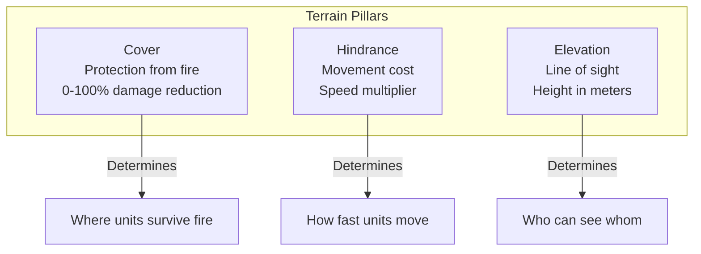

# Chapter 4: World and Terrain Architecture

## 4.1 Introduction: The Stage of Combat

In tactical wargames, terrain is not merely scenery—it is the primary gameplay mechanism. The placement of cover, the elevation of hills, the density of forests, and the layout of buildings fundamentally determine how battles unfold. A well-designed terrain system must answer: How do units move through the environment? What provides protection from fire? Who can see whom? How does the player read tactical opportunities?

This chapter examines how three Close Combat clones approach these questions, revealing sophisticated approaches to one of gamedev's most challenging domains.

## 4.2 Three Philosophies of World Representation

Each clone takes a fundamentally different approach to representing the game world:

```pseudocode
// OPENCOMBAT-SDL: Traditional Tile-Based
World := {
    tiles: Array[Element]     // 10x10 pixel tiles
    elevations: Array<int>    // Per-tile height
    objects: Array<ObjectList> // Linked lists per tile
    megaTiles: Array[12x12]   // Strategic regions
}

// OPENCOMMONBAT: Entity-Component with Spatial Indexing
World := {
    entities: HashMap<EntityId, Entity>
    spatialGrid: GridMap<EntityId>  // Uniform grid indexing
    terrain: Array[TerrainTile]     // Tile-based lookup
    interiors: Array<InteriorZone>  // Polygon regions
}

// CLOSECOMBATFREE: QML-Based Declarative World
World := {
    scenario: QML_Scenario      // Root container
    map: QML_Map {              // Terrain layer
        backgroundImage: Image
        hipsometricImage: Image // Height map
        props: List<Prop>       // Interactive elements
    }
}
```

### 4.2.1 OpenCombat-SDL: The Tiled World

OpenCombat-SDL uses a **hierarchical tile system** with three levels of granularity:

**Base Tile (10x10 pixels)**: The fundamental unit of terrain storage. Each tile contains:
- Terrain type reference (Element index)
- Elevation value (unsigned char, 0-255 meters)
- Linked list of objects occupying the tile
- Building association index

**Mega-Tile (12x12 tiles = 120x120 pixels)**: Strategic regions used for:
- Victory location placement
- Tactical objective designation
- Rendering culling optimization

**World Structure**:
```pseudocode
class Map {
    nBlocksX, nBlocksY: int           // Grid dimensions
    elements: Array<ushort>           // Terrain type per tile
    elevations: Array<uchar>          // Height per tile
    objects: Array<Object*>           // Linked list heads
    buildingIndices: Array<ushort>    // Building references
    buildings: Array<Building*>
}

// Index calculation: tile(i,j) = j * nBlocksX + i
// Parallel arrays provide O(1) access and cache-friendly iteration
```

### 4.2.2 OpenCombat: Entity-Component with Dual Coordinate Systems

OpenCombat employs a **hybrid approach** combining grid-based terrain with continuous physics:

**Dual Coordinate System**:
```pseudocode
WorldPoint := { x: float, y: float }     // Continuous physics space
GridPoint := { x: int, y: int }          // Discrete terrain grid

// Conversion: O(1) operation
WorldPoint.to_grid(tileSize) -> GridPoint {
    return GridPoint(
        x: floor(this.x / tileSize),
        y: floor(this.y / tileSize)
    )
}

GridPoint.to_world(tileSize) -> WorldPoint {
    return WorldPoint(
        x: this.x * tileSize + (tileSize / 2),
        y: this.y * tileSize + (tileSize / 2)
    )
}
```

**Spatial Grid (GridMap)**: A uniform grid spatial index for fast entity queries:
```pseudocode
class GridMap<T> {
    cellSize: float
    cells: HashMap<CellCoord, Array<T>>
    
    insert(entity: T, position: WorldPoint) {
        cell := position.to_cell(cellSize)
        cells[cell].add(entity)
    }
    
    query_radius(center: WorldPoint, radius: float) -> Array<T> {
        // Calculate affected cells
        minCell := (center - radius).to_cell(cellSize)
        maxCell := (center + radius).to_cell(cellSize)
        
        results := []
        for cell in range(minCell, maxCell) {
            for entity in cells[cell] {
                if distance(entity.position, center) <= radius {
                    results.add(entity)
                }
            }
        }
        return results
    }
}
```

### 4.2.3 CloseCombatFree: QML-Based Declarative Terrain

CloseCombatFree takes a **declarative approach** where the world is defined through QML components:

**Component Hierarchy**:
```pseudocode
Scenario {
    gameArea: Flickable {
        zoomArea: Item {
            scale: currentZoom
            
            map: Map {
                backgroundImage: "maps/field.png"
                hipsometricImage: "maps/field_height.png"
                
                // Props as child components
                House { x: 100, y: 200, cover: "great" }
                Tree { x: 300, y: 150, cover: "average" }
                Tree { x: 320, y: 160, cover: "average" }
            }
            
            units: Units { ... }
        }
    }
}
```

**Height Map (Hipsometric) System**:
```pseudocode
// Elevation encoded in RGB values
// Height = (R + G + B) / 10 meters
// Range: 0 (black) to 76.5 meters (white)

getElevationAt(worldX, worldY) -> float {
    scaleX := backgroundWidth / hipsometricWidth
    scaleY := backgroundHeight / hipsometricHeight
    
    pixel := hipsometricImage.pixel(
        worldX / scaleX,
        worldY / scaleY
    )
    
    return (pixel.red + pixel.green + pixel.blue) / 10.0
}
```

## 4.3 The Three Pillars of Terrain

All three games model terrain through three primary attributes that govern tactical gameplay:



### 4.3.1 Cover Systems Compared

**OpenCombat-SDL: Stance-Based Cover**
```pseudocode
class Element {
    // Cover indexed by stance level
    cover: Array<float>[5]  // Prone, Low, Medium, High, Top
    
    // Example: Stone Wall
    cover = [0.93, 0.93, 0.93, 0.93, 0.0]  // Excellent for all stances
    
    // Example: High Grass
    cover = [0.53, 0.53, 0.53, 0.0, 0.0]   // Good for prone, none standing
}

// Damage calculation
calculateDamage(incomingDamage, targetStance, terrain) -> float {
    coverValue := terrain.cover[targetStance]
    return incomingDamage * (1.0 - coverValue)
}
```

**OpenCombat: Binary Coverage with Stance Modifiers**
```pseudocode
struct TerrainTile {
    coverage_stand: Option<float>   // Some(0.8) or None
    coverage_flat: Option<float>    // Some(0.7) or None
}

// Coverage application
calculateDamage(incomingDamage, stance, terrain) -> float {
    coverage := match stance {
        Standing => terrain.coverage_stand.unwrap_or(0.0)
        Prone => terrain.coverage_flat.unwrap_or(0.0)
        Crouch => terrain.coverage_flat.unwrap_or(0.0) * 0.8
    }
    return incomingDamage * (1.0 - coverage)
}
```

**CloseCombatFree: Category-Based Cover**
```pseudocode
// Cover as discrete categories
enum CoverLevel {
    None = 0.0,      // 0% protection
    Poor = 0.25,     // 25% protection
    Average = 0.5,   // 50% protection
    Great = 0.75     // 75% protection
}

Prop {
    property string cover: "none"  // "none" | "poor" | "average" | "great"
}

// Simple lookup table
coverValues := {
    "none": 0.0,
    "poor": 0.25,
    "average": 0.5,
    "great": 0.75
}
```

### 4.3.2 Hindrance and Movement Cost

**OpenCombat-SDL: Percentage-Based Hindrance**
```pseudocode
// Hindrance is percentage of normal speed (100 = full speed)
Element.hindrance: Array<int>[4]  // By stance level

// Movement speed calculation
actualSpeed := baseSpeed * (hindrance / 100.0)

// Examples:
// Grass: hindrance = 100 → full speed
// High Grass: hindrance = 67 → 67% speed
// Mud: hindrance = 40 → 40% speed
// Wall: hindrance = 0 → impassable
```

**OpenCombat: Cost-Based Movement**
```pseudocode
// Pedestrian cost: lower is faster
TerrainType.pedestrian_cost() -> int {
    match this {
        ShortGrass => 10    // Base speed
        Dirt => 11          // ~91% speed
        Mud => 11           // ~91% speed  
        Underbrush => 12    // ~83% speed
        Hedge => 20         // 50% speed
        MiddleWoodLogs => 30 // 33% speed
        BrickWall => 50     // Impassable
    }
}

actualSpeed := baseSpeed / (pedestrianCost / 10.0)
```

**CloseCombatFree: Implicit Through Props**
```pseudocode
// Hindrance primarily through collision detection
// Props block movement via bounding boxes
// No explicit terrain cost system

Unit.movementSpeed := baseSpeed * terrainModifier
// Where terrainModifier determined by:
// - Elevation slope
// - Obstacle proximity
// - Special terrain zones
```

### 4.3.3 Elevation Representation

**OpenCombat-SDL: Per-Tile Elevation**
```pseudocode
// Elevation stored per tile (unsigned char: 0-255 meters)
Array<uchar> elevations  // Parallel to elements array

// Total height at position
totalElevation := baseElevation + elementHeight

// LOS calculation adds eye height
losElevation := (totalElevation + 2) * HEIGHT_MODIFIER  // +2m eye level
```

**OpenCombat: Simulated Elevation**
```pseudocode
// 2D grid with visibility modifiers
// "High ground" represented by terrain types with extended visibility

TerrainType.visibility_bonus() -> int {
    match this {
        HillTop => 10      // See 10 tiles further
        Elevated => 5      // See 5 tiles further
        _ => 0
    }
}
```

**CloseCombatFree: Height Map (Hipsometric)**
```pseudocode
// Continuous height from RGB image
getElevation(x, y) -> float {
    pixel := heightMap.sample(x, y)
    return (pixel.r + pixel.g + pixel.b) / 10.0  // 0-76.5 meters
}

// Elevation affects:
// 1. Line of sight (can see over lower terrain)
// 2. Movement speed (slopes cost more)
// 3. Cover effectiveness (higher ground advantage)
```

## 4.4 Line of Sight Architectures

### 4.4.1 OpenCombat-SDL: 3D Bresenham Algorithm

OpenCombat-SDL uses a **3D extension of Bresenham's line algorithm** for visibility:

```pseudocode
function CalculateLOS(from: Point3D, to: Point3D, world: World) -> bool {
    // Calculate deltas
    dx := to.x - from.x
    dy := to.y - from.y
    dz := to.z - from.z  // Elevation difference
    
    // Determine major axis
    if abs(dx) >= abs(dy) and abs(dx) >= abs(dz) {
        // X is major axis
        return traceXMajor(from, to, dx, dy, dz, world)
    } else if abs(dy) >= abs(dx) and abs(dy) >= abs(dz) {
        // Y is major axis
        return traceYMajor(from, to, dx, dy, dz, world)
    } else {
        // Z (elevation) is major axis
        return traceZMajor(from, to, dx, dy, dz, world)
    }
}

function traceXMajor(from, to, dx, dy, dz, world) -> bool {
    x := from.x
    y := from.y
    z := from.z
    
    x_inc := if dx < 0 then -1 else 1
    y_inc := if dy < 0 then -1 else 1
    z_inc := if dz < 0 then -1 else 1
    
    dx2 := abs(dx) * 2
    dy2 := abs(dy) * 2
    dz2 := abs(dz) * 2
    
    err_y := dy2 - abs(dx)
    err_z := dz2 - abs(dx)
    
    for i from 0 to abs(dx) {
        // Check if current tile blocks LOS
        tileElevation := world.getElevation(x, y)
        if tileElevation > z and world.blocksHeight(x, y) {
            return false  // Blocked!
        }
        
        // Step along line
        if err_y > 0 {
            y := y + y_inc
            err_y := err_y - dx2
        }
        if err_z > 0 {
            z := z + z_inc
            err_z := err_z - dx2
        }
        err_y := err_y + dy2
        err_z := err_z + dz2
        x := x + x_inc
    }
    
    return true  // Clear line of sight
}
```

**Key Design Decisions**:
- **Binary visibility**: Either visible or hidden (no partial visibility)
- **Eye height offset**: +2 meters added to shooter elevation
- **Height modifier**: 1024x scaling for integer precision
- **Blocking condition**: `tile_elevation > line_height AND tile.BlocksHeight == true`

### 4.4.2 OpenCombat: Accumulated Opacity System

OpenCombat uses an **accumulated opacity model** for more nuanced visibility:

```pseudocode
// Core constants
VISIBLE_STARTS_AT := 0.5      // Opacity threshold
VISIBILITY_FIRSTS := 6        // Tiles to ignore at start
VISIBILITY_PIXEL_STEPS := 5   // Sampling resolution

function calculateVisibility(
    from: GridPoint,
    to: GridPoint,
    map: Map,
    weather: Weather,
    time: TimeOfDay
) -> Visibility {
    
    distance := from.distance_to(to)
    
    // Always see immediate vicinity
    if distance <= VISIBILITY_FIRSTS * TILE_SIZE {
        return Visible
    }
    
    // Raycast with opacity sampling
    steps := floor(distance / VISIBILITY_PIXEL_STEPS)
    accumulatedOpacity := 0.0
    
    for i from VISIBILITY_FIRSTS to steps {
        t := i / steps
        point := interpolate(from, to, t)
        grid := point.to_grid()
        
        if tile := map.get_tile(grid) {
            accumulatedOpacity := accumulatedOpacity + tile.opacity
            
            if accumulatedOpacity >= VISIBLE_STARTS_AT {
                return Hidden
            }
        }
    }
    
    return Visible
}

// Example terrain opacities
terrainOpacities := {
    ShortGrass: 0.0,
    MiddleGrass: 0.002,
    HighGrass: 0.1,
    Hedge: 0.25,
    Tree: 0.2,
    Building: 1.0
}
```

**Behavior-Based Visibility Modifiers**:
```pseudocode
visibilityModifiers := {
    IdleStanding: 0.5,      // Moderately visible
    IdleProne: -0.9,        // Very hard to spot
    Moving: 1.0,            // More visible
    Running: 2.0,           // Highly visible
    Sneaking: -0.9,         // Hard to spot
    Hiding: -0.9            // Very hard to spot
}

finalVisibilityScore := baseVisibility + behaviorModifier
if finalVisibilityScore > 0 and accumulatedOpacity < 0.5 {
    return Visible
} else {
    return Hidden
}
```

### 4.4.3 CloseCombatFree: Dual LOS System

CloseCombatFree employs **two complementary visibility checks**:

```pseudocode
// System 1: Elevation-Based LOS
function checkElevationLOS(from: Point, to: Point, map: Map) -> bool {
    distance := from.distance_to(to)
    steps := distance / 10.0  // Check every 10 pixels
    
    originHeight := map.getElevation(from)
    targetHeight := map.getElevation(to)
    
    for i from 0 to steps {
        t := i / steps
        checkPoint := interpolate(from, to, t)
        groundHeight := map.getElevation(checkPoint)
        sightLineHeight := interpolate(originHeight, targetHeight, t)
        
        if groundHeight > sightLineHeight {
            return false  // Terrain blocks view
        }
    }
    
    return true
}

// System 2: Obstacle-Based LOS
function checkObstacleLOS(from: Point, to: Point, world: World) -> bool {
    line := Line(from, to)
    
    for prop in world.getProps() {
        if prop.blocksLOS and line.intersects(prop.boundingBox) {
            return false  // Prop blocks view
        }
    }
    
    return true
}

// Combined visibility check
function isVisible(from: Point, to: Point) -> bool {
    return checkElevationLOS(from, to) and checkObstacleLOS(from, to)
}
```

## 4.5 Building and Interior Systems

### 4.5.1 OpenCombat-SDL: Dual-View Building Architecture

OpenCombat-SDL implements buildings with **two distinct visual representations**:

```pseudocode
class Building {
    position: Point              // Upper-left corner
    boundaryPoints: Array<Point> // Polygon vertices
    tiles: Array<int>            // Tile indices belonging to building
    interiorGraphic: Image       // Floor plan view
}

// Building index population via point-in-polygon
function populateBuildingIndices() {
    for building in buildings {
        // Calculate bounding box in tile coordinates
        minTile := building.position / tileSize
        maxTile := (building.position + building.size) / tileSize
        
        for y from minTile.y to maxTile.y {
            for x from minTile.x to maxTile.x {
                center := tileCenter(x, y)
                if pointInPolygon(center, building.boundaryPoints) {
                    buildingIndices[y * width + x] = building.id
                    building.tiles.add(y * width + x)
                }
            }
        }
    }
}

// Dual-view rendering
function renderBuilding(building, showInterior) {
    if showInterior {
        // Show floor plan, rooms, doorways
        render(building.interiorGraphic, building.position)
    } else {
        // Show walls, roof
        render(building.exteriorGraphic, building.position)
    }
}

// Automatic view switching
showInterior := debugMode or building.hasOccupants()
```

**Gameplay Implications**:
- Buildings provide complete protection (walls block fire)
- Line of sight blocked until entry
- Interior positions provide cover and concealment
- Choke points at doors and windows

### 4.5.2 OpenCombat: Interior Zones

OpenCombat uses **polygon-based interior zones** defined in TMX maps:

```pseudocode
struct InteriorZone {
    id: InteriorId
    boundary: Polygon
    cover: float           // Typically 0.95 for buildings
    opacity: float         // Line of sight blocking
    occupants: Array<SoldierId>
}

class InteriorManager {
    interiors: Array<InteriorZone>
    
    function isInside(position: WorldPoint) -> Option<InteriorId> {
        for interior in interiors {
            if interior.boundary.contains(position) {
                return Some(interior.id)
            }
        }
        return None
    }
    
    function enter(soldier: SoldierId, interior: InteriorId) {
        interior.occupants.add(soldier)
    }
    
    function exit(soldier: SoldierId, interior: InteriorId) {
        interior.occupants.remove(soldier)
    }
    
    function blocksLOS(from: WorldPoint, to: WorldPoint) -> bool {
        for interior in interiors {
            if interior.boundary.intersectsLine(from, to) {
                return true
            }
        }
        return false
    }
}
```

### 4.5.3 CloseCombatFree: QML Prop Buildings

CloseCombatFree implements buildings as **interactive QML components**:

```pseudocode
// HouseBasic_tst.qml
PropRectangle {
    objectName: "house"
    cover: "great"           // 75% protection
    width: 140
    height: 100
    
    Rectangle {              // Floor
        id: floor
        anchors.fill: parent
        anchors.margins: 5
        color: "#4f1708"
    }
    
    Image {                  // Roof (toggleable)
        id: roof
        visible: topVisible
        source: "HouseBasicRoof1.png"
        anchors.fill: parent
    }
    
    // Toggle visibility when occupied
    function toggleRoof() {
        topVisible = !topVisible
    }
}

// Automatic roof hiding
onUnitEntered: {
    if (unit.playerControlled) {
        roof.visible = false  // Show interior
        unit.opacity = 0.5    // Semi-transparent inside
    }
}

onUnitExited: {
    unit.opacity = 1.0
    if (occupants.isEmpty()) {
        roof.visible = true   // Show exterior
    }
}
```

## 4.6 Spatial Partitioning for Performance

### 4.6.1 OpenCombat-SDL: Tile-Linked Object Lists

```pseudocode
class World {
    // Array of linked list heads (one per tile)
    objects: Array<Object*>  // Size: nBlocksX * nBlocksY
    
    function addObject(obj: Object, tileX: int, tileY: int) {
        index := tileY * nBlocksX + tileX
        
        // Insert at head of tile's list
        obj.nextObject := objects[index]
        if obj.nextObject != null {
            obj.nextObject.prevObject := obj
        }
        objects[index] := obj
    }
    
    function moveObject(obj: Object, from: Point, to: Point) {
        oldTile := from / tileSize
        newTile := to / tileSize
        
        if oldTile == newTile {
            return  // Same tile, no update needed
        }
        
        // Remove from old tile
        removeFromTile(obj, oldTile)
        
        // Add to new tile
        addObject(obj, newTile.x, newTile.y)
    }
    
    function queryObjectsInRadius(center: Point, radius: float) -> Array<Object> {
        results := []
        
        // Calculate tile range
        minTile := (center - radius) / tileSize
        maxTile := (center + radius) / tileSize
        
        for y from minTile.y to maxTile.y {
            for x from minTile.x to maxTile.x {
                obj := objects[y * nBlocksX + x]
                while obj != null {
                    if distance(obj.position, center) <= radius {
                        results.add(obj)
                    }
                    obj := obj.nextObject
                }
            }
        }
        
        return results
    }
}
```

**Complexity Analysis**:
- Insertion: O(1)
- Deletion: O(1)  
- Point query: O(1)
- Radius query: O(tiles in radius × average objects per tile)

### 4.6.2 OpenCombat: Uniform Grid Spatial Index

```pseudocode
class SpatialGrid<T> {
    cellSize: float
    cells: HashMap<CellCoord, Array<T>>
    entityCells: HashMap<T, CellCoord>  // Reverse lookup
    
    function insert(entity: T, position: WorldPoint) {
        cell := position.to_cell(cellSize)
        
        // Remove from old cell if present
        if entityCells.contains(entity) {
            oldCell := entityCells[entity]
            cells[oldCell].remove(entity)
        }
        
        // Add to new cell
        if not cells.contains(cell) {
            cells[cell] := []
        }
        cells[cell].add(entity)
        entityCells[entity] := cell
    }
    
    function queryRectangle(min: WorldPoint, max: WorldPoint) -> Array<T> {
        results := []
        
        minCell := min.to_cell(cellSize)
        maxCell := max.to_cell(cellSize)
        
        for y from minCell.y to maxCell.y {
            for x from minCell.x to maxCell.x {
                cell := CellCoord(x, y)
                if cells.contains(cell) {
                    results.extend(cells[cell])
                }
            }
        }
        
        return results
    }
    
    function queryRadius(center: WorldPoint, radius: float) -> Array<T> {
        // Get approximate rectangle
        min := center - Vector2(radius, radius)
        max := center + Vector2(radius, radius)
        
        candidates := queryRectangle(min, max)
        
        // Filter by actual distance
        return candidates.filter(c => 
            distance(c.position, center) <= radius
        )
    }
}
```

### 4.6.3 CloseCombatFree: Scene Graph Spatial Query

```pseudocode
// Leverages Qt's scene graph
class Map {
    // Props are child items in QML scene graph
    props: List<Prop>
    
    function queryObjectsAt(x, y) -> Array<Prop> {
        // Use Qt's childAt for point queries
        return childItems.filter(child => 
            child.contains(x, y)
        )
    }
    
    function queryObjectsInRect(rect) -> Array<Prop> {
        return childItems.filter(child =>
            rect.intersects(child.boundingRect)
        )
    }
    
    // For radius queries, must iterate all props
    function queryObjectsInRadius(center, radius) -> Array<Prop> {
        return childItems.filter(child =>
            distance(child.position, center) <= radius
        )
    }
}

// Performance note: O(n) for radius queries
// Suitable for smaller maps, may need optimization for large battles
```

## 4.7 Destructible Terrain Architecture

While none of the clones implement fully destructible terrain, their architectures support it:

### 4.7.1 OpenCombat-SDL Approach

```pseudocode
class DestructibleTerrainManager {
    damagedTiles: HashMap<TileIndex, DamageLevel>
    
    function applyDamage(position: Point, radius: float, damage: float) {
        affectedTiles := getTilesInRadius(position, radius)
        
        for tile in affectedTiles {
            currentDamage := damagedTiles.get(tile, 0)
            newDamage := currentDamage + damage
            damagedTiles[tile] := newDamage
            
            if newDamage > DESTRUCTION_THRESHOLD {
                destroyTile(tile)
            } else {
                updateTileCover(tile, newDamage)
            }
        }
        
        // Invalidate LOS caches
        invalidateLOSCache()
    }
    
    function updateTileCover(tile, damage) {
        element := getElement(tile)
        damageRatio := damage / DESTRUCTION_THRESHOLD
        
        // Reduce cover as damage increases
        for i in 0..4 {
            element.cover[i] *= (1.0 - damageRatio * 0.5)
        }
    }
}
```

### 4.7.2 OpenCombat Approach

```pseudocode
class DestructibleTerrainSystem {
    terrainModifications: HashMap<GridPoint, TerrainModification>
    
    function modifyTerrain(position: GridPoint, newType: TerrainType) {
        modification := TerrainModification {
            position: position,
            newType: newType,
            timestamp: now()
        }
        
        terrainModifications[position] := modification
        
        // Network sync
        broadcast(TerrainChanged {
            position: position,
            newType: newType
        })
    }
    
    function getTerrainAt(position: GridPoint) -> TerrainType {
        if terrainModifications.contains(position) {
            return terrainModifications[position].newType
        }
        return baseTerrain[position]
    }
}
```

### 4.7.3 CloseCombatFree Approach

```pseudocode
// QML-based destruction
Prop {
    id: wall
    cover: "great"
    health: 100
    
    function takeDamage(amount) {
        health := health - amount
        if health <= 0 {
            destroy()
        } else if health < 50 {
            cover := "average"  // Damaged cover
            sprite.source := "wall_damaged.png"
        }
    }
    
    function destroy() {
        // Replace with rubble prop
        var rubble = Qt.createComponent("Rubble.qml").createObject(parent)
        rubble.position = position
        wall.destroy()
    }
}
```

## 4.8 Comparative Analysis

### 4.8.1 Terrain Representation Summary

| Aspect | OpenCombat-SDL | OpenCombat | CloseCombatFree |
|--------|---------------|------------|-----------------|
| **World Model** | Hierarchical tiles | Entity-Component + Grid | QML declarative |
| **Grid Type** | 10x10px tiles | 5px tiles (TMX) | Free-form |
| **Elevation** | Per-tile integer (0-255m) | Simulated via terrain | Height map (RGB, 0-76.5m) |
| **Cover System** | Stance-based (5 levels) | Binary + stance | Category (4 levels) |
| **Hindrance** | Percentage (0-100%) | Cost-based (10-50) | Implicit collision |
| **Buildings** | Dual-view tiles | Interior zones | Interactive QML props |
| **LOS Algorithm** | 3D Bresenham | Accumulated opacity | Elevation + obstacle raycast |
| **Spatial Query** | Tile-linked lists | Uniform grid | Scene graph iteration |
| **Moddability** | XML data files | TMX + JSON | QML files |

### 4.8.2 Line of Sight Comparison

**Scenario: Can Soldier A see Soldier B?**

```pseudocode
// OpenCombat-SDL: Binary 3D raycast
visible := LineOfSight.check(
    soldierA.position,
    soldierB.position,
    world
)
// Factors: Distance, elevation difference, terrain blocks, building occlusion
// Result: true/false

// OpenCombat: Accumulated opacity
visibility := calculateVisibility(
    soldierA.gridPosition,
    soldierB.gridPosition,
    map,
    soldierA.behavior,  // Affects modifier
    soldierB.behavior   // Affects modifier
)
// Factors: Opacity accumulation, behavior modifiers, stance
// Result: Visible / Partial / Hidden

// CloseCombatFree: Dual check
visible := checkElevationLOS(a, b) and checkObstacleLOS(a, b)
// Factors: Height map profile, prop bounding boxes
// Result: true/false
```

**Most Realistic**: OpenCombat (opacity accumulation models real-world visibility gradients)
**Most Performant**: OpenCombat-SDL (simple Bresenham on fixed grid)
**Most Flexible**: CloseCombatFree (QML props can have custom LOS logic per object)

### 4.8.3 Spatial Query Performance

| Operation | OpenCombat-SDL | OpenCombat | CloseCombatFree |
|-----------|---------------|------------|-----------------|
| **Point query** (at x,y) | O(1) array index | O(1) grid lookup | O(n) prop iteration |
| **Radius query** (within r) | O(k × m) k=tiles, m=objects/tile | O(k + m) k=cells, m=entities | O(n) all props |
| **Line of sight** | O(line length) | O(line length) | O(line length + props) |
| **Pathfinding** | A* on grid | A* on grid | Direct path |

## 4.9 Game Design Implications

### 4.9.1 Cover Density and Tactical Depth

**Lessons from all three games**:

1. **Meaningful cover density**: Too much = stalemates; too little = slaughter
   - Sweet spot: 30-40% of map provides meaningful cover
   
2. **Cover variety**: Mix of light, medium, and heavy cover
   - Creates tactical decision points
   - Enables risk/reward calculations
   
3. **Flanking routes**: Cover should enable movement, not just static defense
   - Multiple paths to objectives
   - No single "perfect" defensive position

### 4.9.2 Line of Sight Design Philosophy

**Binary LOS** (OpenCombat-SDL):
- Simpler for players to understand
- Creates clear "safe" and "danger" zones
- Good for introductory tactical gameplay
- Enables decisive flanking maneuvers

**Opacity-Based LOS** (OpenCombat):
- More realistic visibility gradients
- Creates zones of uncertainty
- Rewards careful positioning and patience
- Discourages rushing across open ground

**Height Map LOS** (CloseCombatFree):
- Natural elevation advantage
- Visual representation matches gameplay
- Easy for map designers to create interesting terrain
- Encourages control of high ground

### 4.9.3 Elevation as Gameplay Driver

All three systems agree: **elevation is crucial for tactical depth**.

- Provides natural tactical objectives
- Creates "king of the hill" scenarios
- Enables realistic spotting mechanics
- Punishes poor positioning

**Design recommendations**:
- Every map should have 2-3 meaningful elevation changes
- High ground should provide clear advantages
- But high ground should also make units more visible
- Flanking routes around elevated positions

## 4.10 Synthesis: Designing World Systems

### 4.10.1 Recommended Hybrid Approach

Based on the analysis, an ideal system would combine:

```pseudocode
World := {
    // Grid-based terrain for performance
    terrainGrid: Array<TerrainTile>
    tileSize: 10  // pixels
    
    // Height map for elevation (editable in image editors)
    heightMap: Image
    
    // Entity-component for game objects
    entities: EntityManager
    spatialIndex: UniformGrid<Entity>
    
    // Dual LOS for gameplay depth
    primaryLOS: AccumulatedOpacity
    secondaryLOS: ElevationRaycast
    
    // Building interiors as polygon zones
    interiors: Array<InteriorZone>
    
    // Data-driven configuration
    terrainTypes: JSON
    mapFormat: TMX
}
```

### 4.10.2 Key Architectural Decisions

1. **Use tile-based terrain** for:
   - Fast O(1) lookups
   - Cache-friendly iteration
   - Easy serialization
   - Proven pathfinding algorithms

2. **Use height maps** for:
   - Intuitive terrain editing
   - Continuous elevation data
   - Natural line of sight
   - Visual representation

3. **Use entity-component** for:
   - Flexible object definitions
   - Data-driven design
   - Easy modding
   - Composition over inheritance

4. **Use accumulated opacity LOS** for:
   - Realistic visibility gradients
   - Meaningful soft cover
   - Dynamic concealment
   - Tactical depth

### 4.10.3 Performance Optimization Strategies

**For large maps (1000x1000 tiles+)**:

```pseudocode
// 1. Hierarchical spatial indexing
spatialTree := QuadTree<Entity>(maxDepth=8, maxObjects=10)

// 2. LOD for terrain
renderTerrainLOD(cameraPosition, zoom) {
    if zoom < 0.5 {
        renderMegaTiles()      // 120x120px blocks
    } else if zoom < 1.0 {
        renderTiles()          // 10x10px tiles
    } else {
        renderDetailed()       // Full detail
    }
}

// 3. Cached LOS
losCache := HashMap<PositionPair, Visibility>

// 4. Dirty region tracking
changedTiles := Array<TileIndex>
onTerrainChange(tile) {
    changedTiles.add(tile)
    invalidateLOSCacheFor(tile)
}
```

### 4.10.4 Modding and Content Creation

For maximum moddability:

1. **Use standard formats**: TMX for maps, JSON for data
2. **Hot-reloadable assets**: Watch files for changes
3. **Visual editing**: Height maps editable in Photoshop/GIMP
4. **Documentation**: Clear schema for terrain properties
5. **Examples**: Template maps demonstrating best practices

## 4.11 Conclusion

The world and terrain systems of the three Close Combat clones reveal different philosophies:

**OpenCombat-SDL**: Proven tile-based approach with sophisticated stance-based cover and dual-view buildings. Best for traditional tactical gameplay with clear tactical positions and deterministic outcomes.

**OpenCombat**: Modern opacity-based visibility with behavioral modifiers. Best for realistic, nuanced tactical decisions where positioning matters at the margin and soft cover creates uncertainty.

**CloseCombatFree**: Flexible height-map and prop-based system with maximum moddability. Best for rapid content creation and experimentation with new terrain concepts.

**Key Insights**:

1. **Cover is king**: All three systems prioritize meaningful protection mechanisms—combat without cover devolves into attrition.

2. **Line of sight drives gameplay**: The LOS algorithm fundamentally shapes tactical decisions, from cautious advances to bold flanking maneuvers.

3. **Elevation creates objectives**: Verticality is essential for interesting tactical maps, providing natural focal points for conflict.

4. **Moddability requires data-driven design**: Terrain properties should be configurable without code changes, enabling community content.

5. **Performance scales with spatial partitioning**: Efficient world queries require spatial indexing—naive O(n) searches fail at scale.

**Recommendation for new projects**:
- Use **tile-based grid** for performance and proven pathfinding
- Implement **opacity-based LOS** for realistic visibility gradients  
- Support **height maps** for easy elevation editing and visual clarity
- Make terrain properties **fully data-driven** (JSON/YAML/XML)
- Integrate with **standard map editors** (Tiled) for workflow efficiency

The terrain is not just where combat happens—it is the primary mechanism that makes tactical combat interesting.
