# Chapter 8: Architectural Patterns for Tactical Wargames

## A Definitive Guide to Design Patterns in Close Combat-Style Games

---

*"The experienced architect does not invent patterns; they recognize them. Patterns are the distillation of countless successful solutions to recurring problems."* — Adapted from Christopher Alexander

---

## 8.1 Pattern Taxonomy

### 8.1.1 The Gang of Four Foundation

The Gang of Four (GoF) categorized design patterns into three fundamental groups:

| Category | Purpose | GoF Examples |
|----------|---------|--------------|
| **Creational** | Object instantiation mechanisms | Factory, Builder, Prototype, Singleton |
| **Structural** | Class and object composition | Adapter, Bridge, Composite, Decorator, Facade, Flyweight, Proxy |
| **Behavioral** | Object interaction and responsibility | Command, Observer, State, Strategy, Template Method, Visitor |

### 8.1.2 Extended Taxonomy for Game Development

Tactical wargames require additional pattern categories that address domain-specific concerns:

| Category | Purpose | Domain Examples |
|----------|---------|-----------------|
| **Simulation** | Deterministic game state management | Lockstep, Spatial Partitioning, Double Buffer |
| **Modding** | Runtime extensibility and content creation | Data-Driven, Hot-Reload, Scripting Bridge |
| **Multiplayer** | Network synchronization and authority | State Replication, Command Relay, Client-Server |

### 8.1.3 Pattern Relationship Map

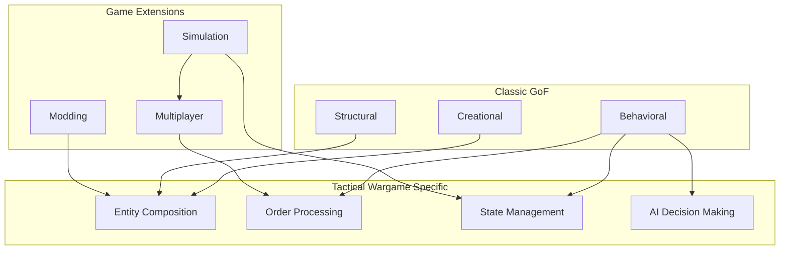
```mermaid
flowchart TB
    subgraph "Classic GoF"
        C[Creational]
        S[Structural]
        B[Behavioral]
    end
    
    subgraph "Game Extensions"
        SIM[Simulation]
        MOD[Modding]
        MP[Multiplayer]
    end
    
    subgraph "Tactical Wargame Specific"
        ENT[Entity Composition]
        ORD[Order Processing]
        ST[State Management]
        AI[AI Decision Making]
    end
    
    C --> ENT
    S --> ENT
    B --> ORD
    B --> ST
    B --> AI
    SIM --> ST
    SIM --> MP
    MOD --> ENT
    MP --> ORD
```

---

## 8.2 Creational Patterns for Wargames

### 8.2.1 Entity Factory Pattern

#### Intent
Create game entities (soldiers, vehicles, squads) without exposing instantiation logic, enabling data-driven content creation and centralized initialization.

#### Problem
- Units require complex initialization (stats, equipment, position)
- Multiple entity types share creation logic
- Content designers need to create units without code changes
- Validation and error handling must be centralized

#### Solution

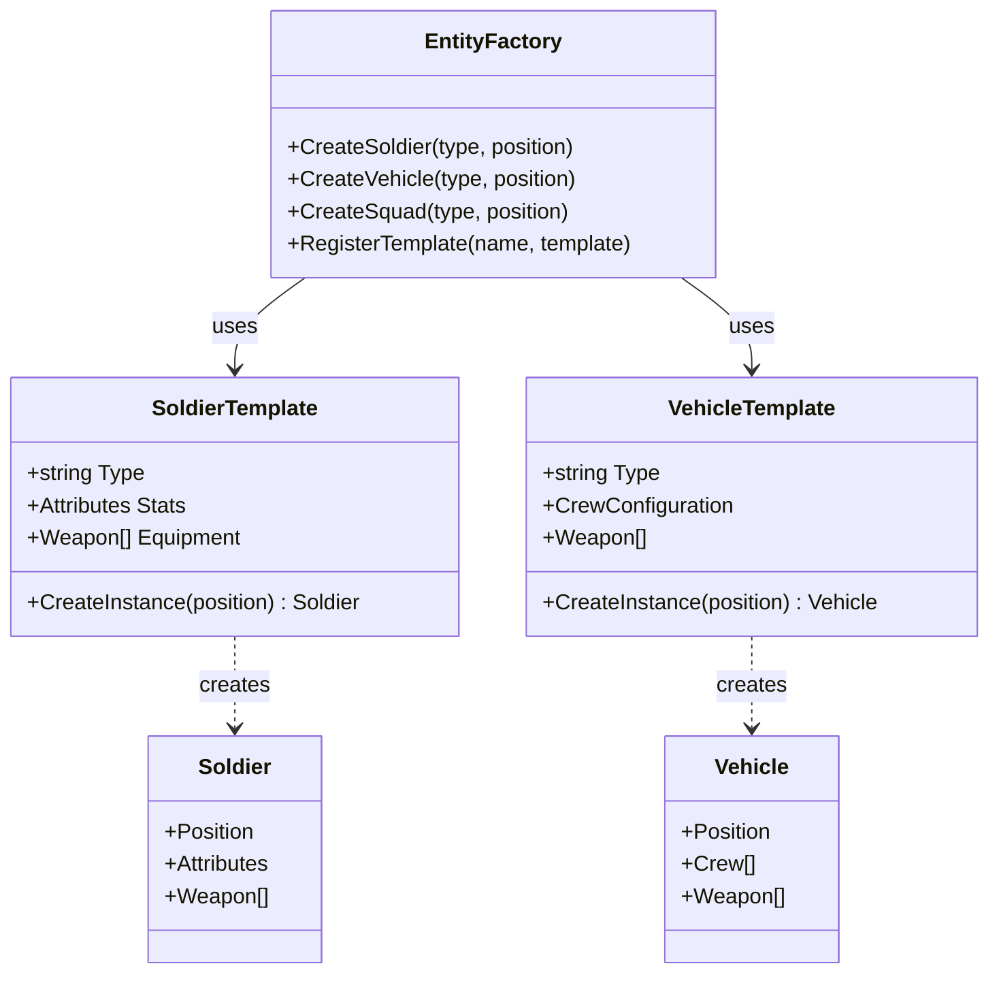
```mermaid
classDiagram
    class EntityFactory {
        +CreateSoldier(type, position)
        +CreateVehicle(type, position)
        +CreateSquad(type, position)
        +RegisterTemplate(name, template)
    }
    
    class SoldierTemplate {
        +string Type
        +Attributes Stats
        +Weapon[] Equipment
        +CreateInstance(position) Soldier
    }
    
    class Soldier {
        +Position
        +Attributes
        +Weapon[]
    }
    
    class VehicleTemplate {
        +string Type
        +CrewConfiguration
        +Weapon[]
        +CreateInstance(position) Vehicle
    }
    
    class Vehicle {
        +Position
        +Crew[]
        +Weapon[]
    }
    
    EntityFactory --> SoldierTemplate : uses
    EntityFactory --> VehicleTemplate : uses
    SoldierTemplate ..> Soldier : creates
    VehicleTemplate ..> Vehicle : creates
```

#### Variations Across Games

**OpenCombat-SDL: Manager Classes**
```cpp
class SoldierManager {
    std::vector<SoldierTemplate*> templates;
public:
    Soldier* CreateSoldier(const std::string& type, Point position) {
        for (auto* temp : templates) {
            if (temp->name == type) {
                Soldier* s = new Soldier();
                s->SetAttributes(temp->attributes);
                s->SetPosition(position);
                return s;
            }
        }
        return nullptr;
    }
};
```

**OpenCombat: Deserialization Factory**
```rust
impl Deployment {
    fn load(path: &Path) -> Result<Self, Error> {
        let file = File::open(path)?;
        let deployment: Deployment = serde_json::from_reader(file)?;
        Ok(deployment)
    }
}

// Usage: entities created from JSON deserialization
let deployment = Deployment::load("assets/mission1.json")?;
```

**CloseCombatFree: QML Component Creation**
```cpp
// Factory using Qt's meta-object system
QQmlComponent component(&engine, QUrl::fromLocalFile("units/Tank.qml"));
QObject* unit = component.create();

// Property initialization
unit->setProperty("x", position.x);
unit->setProperty("y", position.y);
```

#### When to Use
- **Use when**: Multiple entity types with shared initialization logic
- **Use when**: Data-driven content creation is required
- **Use when**: Validation and error handling must be centralized
- **Use when**: Entities require complex construction (equipment, crew, stats)

#### When NOT to Use
- **Don't use when**: Only one entity type exists (overkill)
- **Don't use when**: Runtime entity creation is extremely frequent (consider pooling)
- **Don't use when**: All entity data is hardcoded and never changes

#### Related Patterns
- **Prototype Pattern**: For cloning existing entities
- **Builder Pattern**: For step-by-step entity construction
- **Component Pattern**: Factory creates entities with component composition

---

### 8.2.2 Component Builder Pattern

#### Intent
Construct complex entities step-by-step, allowing different configurations through the same construction process.

#### Problem
- Entities have many optional components (weapons, equipment, modifiers)
- Constructor telescoping: `Soldier(pos, weapon, ammo, health, morale, ...)`
- Different unit variants require different component combinations
- Order of component addition matters (base stats before modifiers)

#### Solution

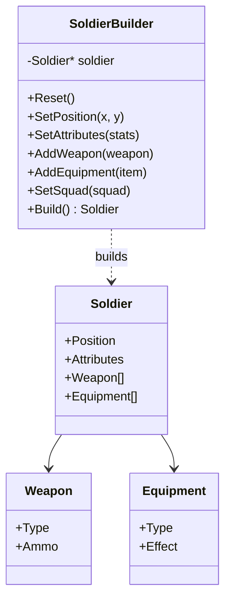
```mermaid
classDiagram
    class SoldierBuilder {
        -Soldier* soldier
        +Reset()
        +SetPosition(x, y)
        +SetAttributes(stats)
        +AddWeapon(weapon)
        +AddEquipment(item)
        +SetSquad(squad)
        +Build() Soldier
    }
    
    class Soldier {
        +Position
        +Attributes
        +Weapon[]
        +Equipment[]
    }
    
    class Weapon {
        +Type
        +Ammo
    }
    
    class Equipment {
        +Type
        +Effect
    }
    
    SoldierBuilder ..> Soldier : builds
    Soldier --> Weapon
    Soldier --> Equipment
```

#### Variations Across Games

**OpenCombat-SDL: XML-Based Building**
```cpp
// Implicit builder through XML parsing
<Soldier Type="Rifleman">
    <Attributes Aggressiveness="High" Morale="Steady"/>
    <Weapon Type="M1_Garand"/>
    <Equipment Type="Grenade" Count="2"/>
</Soldier>

// Parser builds soldier incrementally
Soldier* ParseSoldierElement(xmlNode* node) {
    auto* soldier = new Soldier();
    soldier->SetType(GetAttribute(node, "Type"));
    // Parse child elements...
    return soldier;
}
```

**OpenCombat: Embedded Components**
```rust
struct Soldier {
    transform: Transform,
    health: Health,
    weapon: Option<Weapon>,
    behavior: Behavior,
    gesture: Gesture,
}

// Builder-like construction
fn create_soldier(pos: Vec2, weapon_type: WeaponType) -> Soldier {
    Soldier {
        transform: Transform::at(pos),
        health: Health::full(100),
        weapon: Some(Weapon::new(weapon_type)),
        behavior: Behavior::Idle(Body::Stand),
        gesture: Gesture::Idle,
    }
}
```

**CloseCombatFree: Declarative Composition**
```qml
// QML declarative building
Soldier {
    id: soldier
    x: 100; y: 200
    
    Health { max: 100; current: 100 }
    Weapon { type: "Rifle"; ammo: 80 }
    Equipment { type: "Grenade"; count: 2 }
}
```

#### When to Use
- **Use when**: Entities have many optional components
- **Use when**: Same construction process creates different representations
- **Use when**: You need fine-grained control over construction steps
- **Use when**: Construction order matters

#### When NOT to Use
- **Don't use when**: All entities have identical structure (use Factory)
- **Don't use when**: Performance-critical path (builder adds overhead)
- **Don't use when**: Simple entities with 2-3 fields

#### Related Patterns
- **Factory Pattern**: Builder creates complex objects; Factory decides which to create
- **Composite Pattern**: Built objects often use composite structure

---

### 8.2.3 Unit Prototype Pattern

#### Intent
Create new objects by copying existing ones, using a prototypical instance as template.

#### Problem
- Many similar units with slight variations (veteran vs green soldiers)
- Avoiding subclass explosion (RiflemanVeteran, RiflemanGreen, RiflemanElite)
- Runtime creation of new unit templates
- Preserving complex initialization state

#### Solution

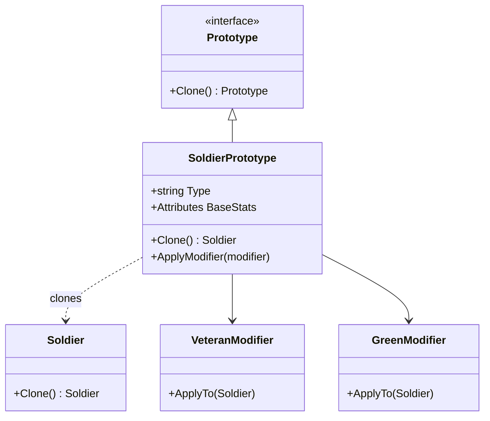
```mermaid
classDiagram
    class Prototype {
        <<interface>>
        +Clone() Prototype
    }
    
    class SoldierPrototype {
        +string Type
        +Attributes BaseStats
        +Clone() Soldier
        +ApplyModifier(modifier)
    }
    
    class VeteranModifier {
        +ApplyTo(Soldier)
    }
    
    class GreenModifier {
        +ApplyTo(Soldier)
    }
    
    class Soldier {
        +Clone() Soldier
    }
    
    Prototype <|-- SoldierPrototype
    SoldierPrototype ..> Soldier : clones
    SoldierPrototype --> VeteranModifier
    SoldierPrototype --> GreenModifier
```

#### Variations Across Games

**OpenCombat-SDL: Template Cloning**
```cpp
class SoldierTemplate {
public:
    Soldier* Clone(Point position) {
        Soldier* s = new Soldier();
        s->SetAttributes(this->attributes);
        s->SetWeapons(this->weapons);
        s->SetPosition(position);
        return s;
    }
};

// Create different variants from base template
Soldier* CreateVeteranRifleman(Point pos) {
    auto* soldier = riflemanTemplate->Clone(pos);
    soldier->ModifyAttribute(Experience, +2);
    soldier->ModifyAttribute(Morale, +1);
    return soldier;
}
```

**OpenCombat: Data-Driven Variants**
```rust
// JSON template with variation parameters
{
    "base_soldier": "rifleman",
    "variations": {
        "veteran": {
            "experience_bonus": 2,
            "morale_bonus": 1
        },
        "green": {
            "experience_bonus": -1,
            "morale_penalty": 1
        }
    }
}

// Clone with modifications
fn create_variant(base: &Soldier, variant: &str) -> Soldier {
    let mut clone = base.clone();
    apply_variation(&mut clone, variant);
    clone
}
```

**CloseCombatFree: QML Inheritance**
```qml
// Base prototype
SoldierPrototype {
    id: baseRifleman
    health: 100
    weapon: "Rifle"
}

// Cloned and modified instances
Soldier {
    id: veteran1
    prototype: baseRifleman
    experience: baseRifleman.experience + 2
    morale: baseRifleman.morale + 1
}
```

#### When to Use
- **Use when**: System should be independent of how products are created
- **Use when**: Classes to instantiate are specified at runtime
- **Use when**: Avoiding hierarchy of factory classes
- **Use when**: State preservation is important

#### When NOT to Use
- **Don't use when**: Objects have circular references (deep copy issues)
- **Don't use when**: Subclassing is simpler and sufficient
- **Don't use when**: Object creation is significantly different from cloning

#### Related Patterns
- **Factory Pattern**: Prototype can be used as factory alternative
- **Memento Pattern**: Preserving state for undo/redo

---

### 8.2.4 Scenario Loader Pattern

#### Intent
Encapsulate scenario/scenario loading logic, enabling multiple data formats and centralized loading pipeline.

#### Problem
- Scenarios come from multiple sources (files, databases, procedural generation)
- Loading involves multiple steps (terrain, units, objectives)
- Error handling and validation must be consistent
- Progress reporting for large scenarios

#### Solution

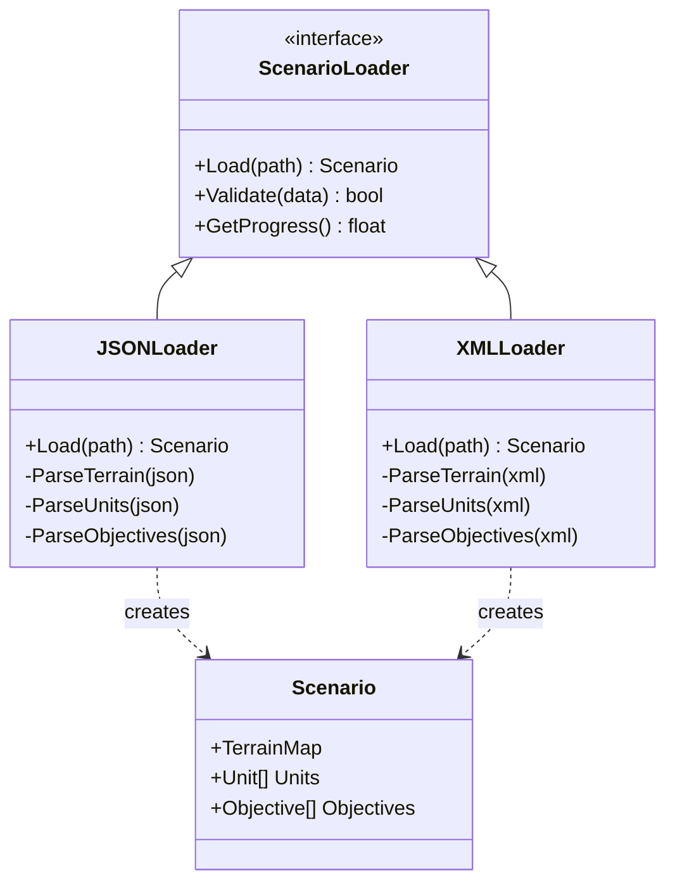
```mermaid
classDiagram
    class ScenarioLoader {
        <<interface>>
        +Load(path) Scenario
        +Validate(data) bool
        +GetProgress() float
    }
    
    class JSONLoader {
        +Load(path) Scenario
        -ParseTerrain(json)
        -ParseUnits(json)
        -ParseObjectives(json)
    }
    
    class XMLLoader {
        +Load(path) Scenario
        -ParseTerrain(xml)
        -ParseUnits(xml)
        -ParseObjectives(xml)
    }
    
    class Scenario {
        +TerrainMap
        +Unit[] Units
        +Objective[] Objectives
    }
    
    ScenarioLoader <|-- JSONLoader
    ScenarioLoader <|-- XMLLoader
    JSONLoader ..> Scenario : creates
    XMLLoader ..> Scenario : creates
```

#### Variations Across Games

**OpenCombat-SDL: XML-Based Loading**
```cpp
class ScenarioLoader {
public:
    Scenario* Load(const std::string& filename) {
        xmlDoc* doc = xmlReadFile(filename.c_str(), nullptr, 0);
        
        Scenario* scenario = new Scenario();
        scenario->terrain = ParseTerrain(doc);
        scenario->soldiers = ParseSoldiers(doc);
        scenario->objectives = ParseObjectives(doc);
        
        if (!Validate(scenario)) {
            delete scenario;
            return nullptr;
        }
        
        return scenario;
    }
};
```

**OpenCombat: Multi-Format Support**
```rust
trait ScenarioLoader {
    fn load(&self, path: &Path) -> Result<Scenario, Error>;
    fn validate(&self, scenario: &Scenario) -> Result<(), Error>;
}

struct JsonLoader;
impl ScenarioLoader for JsonLoader {
    fn load(&self, path: &Path) -> Result<Scenario, Error> {
        let data = std::fs::read_to_string(path)?;
        let deployment: Deployment = serde_json::from_str(&data)?;
        Ok(deployment.into())
    }
}

// Factory to select appropriate loader
fn get_loader(path: &Path) -> Box<dyn ScenarioLoader> {
    match path.extension() {
        Some("json") => Box::new(JsonLoader),
        Some("yaml") => Box::new(YamlLoader),
        _ => Box::new(BinaryLoader),
    }
}
```

**CloseCombatFree: Dynamic QML Loading**
```cpp
class ScenarioLoader : public QObject {
public:
    QObject* Load(const QString& qmlFile) {
        QQmlComponent component(&engine, QUrl::fromLocalFile(qmlFile));
        
        if (component.status() != QQmlComponent::Ready) {
            qDebug() << "Error loading:" << component.errorString();
            return nullptr;
        }
        
        QObject* scenario = component.create();
        
        // Validate required properties
        if (!scenario->property("terrain").isValid()) {
            qDebug() << "Missing terrain property";
            delete scenario;
            return nullptr;
        }
        
        return scenario;
    }
};
```

#### When to Use
- **Use when**: Multiple data formats need support
- **Use when**: Loading process involves complex coordination
- **Use when**: Loading needs to be interruptible or report progress
- **Use when**: Validation logic should be centralized

#### When NOT to Use
- **Don't use when**: Only one format and simple loading
- **Don't use when**: Loading performance is critical (abstraction overhead)

#### Related Patterns
- **Factory Pattern**: Loader is a specialized factory
- **Strategy Pattern**: Different loaders are strategies
- **Template Method Pattern**: Common loading skeleton with customizable steps

---

## 8.3 Structural Patterns

### 8.3.1 Aggregate Pattern (Squad Contains Soldiers)

#### Intent
Compose objects into tree structures to represent part-whole hierarchies, allowing clients to treat individual objects and compositions uniformly.

#### Problem
- Military organization is inherently hierarchical (platoons → squads → soldiers)
- Orders issued to squads must distribute to members
- Squad effectiveness depends on member status
- Loss of members affects squad behavior

#### Solution

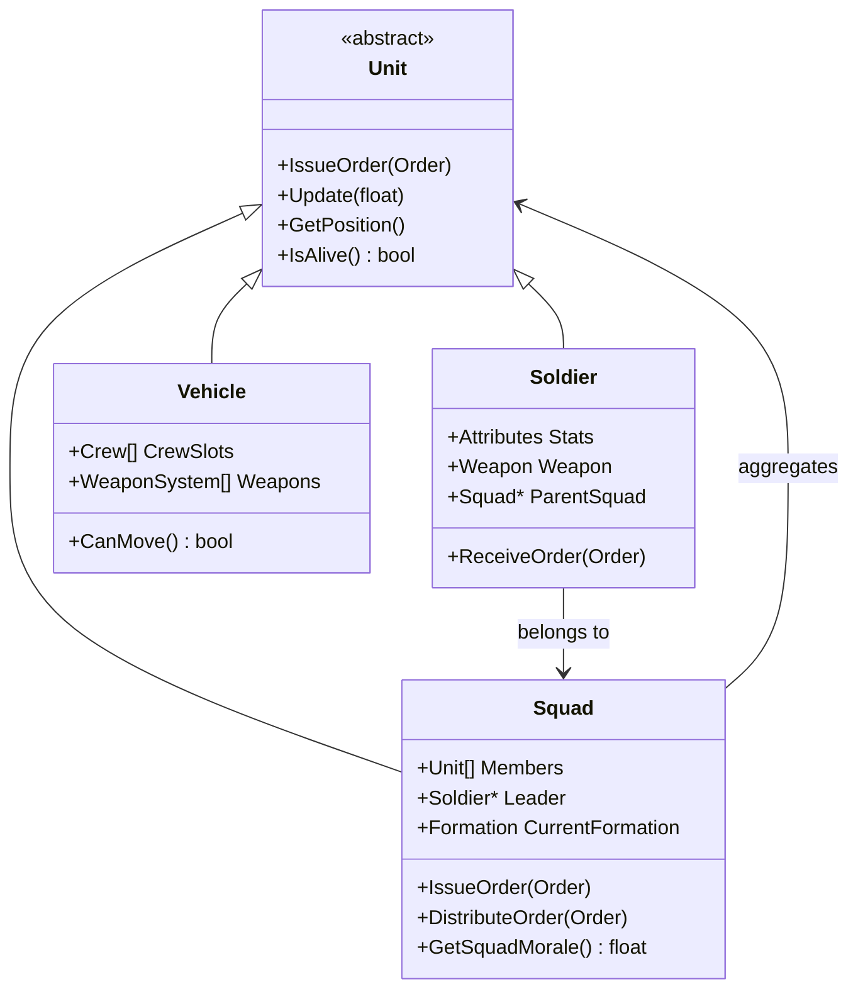
```mermaid
classDiagram
    class Unit {
        <<abstract>>
        +IssueOrder(Order)
        +Update(float)
        +GetPosition()
        +IsAlive() bool
    }
    
    class Squad {
        +Unit[] Members
        +Soldier* Leader
        +Formation CurrentFormation
        +IssueOrder(Order)
        +DistributeOrder(Order)
        +GetSquadMorale() float
    }
    
    class Soldier {
        +Attributes Stats
        +Weapon Weapon
        +Squad* ParentSquad
        +ReceiveOrder(Order)
    }
    
    class Vehicle {
        +Crew[] CrewSlots
        +WeaponSystem[] Weapons
        +CanMove() bool
    }
    
    Unit <|-- Squad
    Unit <|-- Soldier
    Unit <|-- Vehicle
    Squad --> Unit : aggregates
    Soldier --> Squad : belongs to
```

#### Variations Across Games

**OpenCombat-SDL: Object Hierarchy**
```cpp
class Object {
public:
    virtual void Update(float dt) = 0;
    virtual void IssueOrder(Order* order) = 0;
};

class Squad : public Object {
    std::vector<Object*> members;
    Soldier* leader;
public:
    void IssueOrder(Order* order) override {
        // Distribute to members with formation offsets
        for (auto* member : members) {
            auto* memberOrder = AdaptOrderForMember(order, member);
            member->IssueOrder(memberOrder);
        }
    }
    
    void Update(float dt) override {
        // Update all members
        for (auto* member : members) {
            member->Update(dt);
        }
    }
};
```

**OpenCombat: Index-Based Composition**
```rust
struct Squad {
    leader: SoldierIndex,
    members: Vec<SoldierIndex>,
}

impl Squad {
    fn issue_order(&self, order: Order, state: &mut BattleState) {
        for member_idx in &self.members {
            let member = &mut state.soldiers[member_idx.0];
            let adapted = self.adapt_order(order.clone(), member);
            member.behavior = Behavior::from_order(adapted);
        }
    }
    
    fn get_morale(&self, state: &BattleState) -> f32 {
        let total: f32 = self.members.iter()
            .map(|idx| state.soldiers[idx.0].morale)
            .sum();
        total / self.members.len() as f32
    }
}
```

**CloseCombatFree: QML Parent-Child**
```qml
Squad {
    id: squad
    
    Soldier {
        id: leader
        role: "Leader"
        squad: parent
    }
    
    Soldier {
        role: "Rifleman"
        squad: parent
    }
    
    Soldier {
        role: "Rifleman"
        squad: parent
    }
    
    function issueOrder(order) {
        for (var i = 0; i < children.length; i++) {
            if (children[i].isUnit) {
                children[i].receiveOrder(order)
            }
        }
    }
}
```

#### When to Use
- **Use when**: Part-whole hierarchies exist (squads/soldiers, vehicles/crew)
- **Use when**: Clients should treat composites and individuals uniformly
- **Use when**: Hierarchical orders and reporting needed
- **Use when**: Aggregation behavior differs from sum of parts

#### When NOT to Use
- **Don't use when**: Hierarchy is very flat (1-2 levels)
- **Don't use when**: Components never need to be treated uniformly
- **Don't use when**: Parent-child relationships are purely structural (no behavioral aggregation)

#### Related Patterns
- **Iterator Pattern**: To traverse the hierarchy
- **Visitor Pattern**: To perform operations on hierarchy elements
- **Chain of Responsibility**: Order propagation through hierarchy

---

### 8.3.2 Component Pattern (Composition over Inheritance)

#### Intent
Build complex entities by composing reusable components rather than inheriting from monolithic base classes.

#### Problem
- Inheritance hierarchies become rigid and deep
- "Diamond problem" with multiple inheritance
- Hard to create novel combinations (flying tank?)
- Adding new capabilities requires modifying base classes

#### Solution

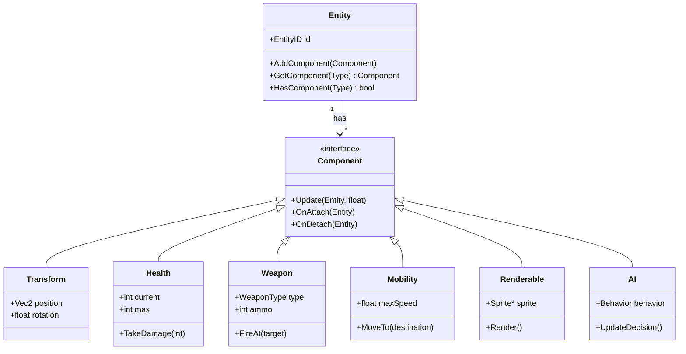
```mermaid
classDiagram
    class Entity {
        +EntityID id
        +AddComponent(Component)
        +GetComponent(Type) Component
        +HasComponent(Type) bool
    }
    
    class Component {
        <<interface>>
        +Update(Entity, float)
        +OnAttach(Entity)
        +OnDetach(Entity)
    }
    
    class Transform {
        +Vec2 position
        +float rotation
    }
    
    class Health {
        +int current
        +int max
        +TakeDamage(int)
    }
    
    class Weapon {
        +WeaponType type
        +int ammo
        +FireAt(target)
    }
    
    class Mobility {
        +float maxSpeed
        +MoveTo(destination)
    }
    
    class Renderable {
        +Sprite* sprite
        +Render()
    }
    
    class AI {
        +Behavior behavior
        +UpdateDecision()
    }
    
    Entity "1" --> "*" Component : has
    Component <|-- Transform
    Component <|-- Health
    Component <|-- Weapon
    Component <|-- Mobility
    Component <|-- Renderable
    Component <|-- AI
```

#### Variations Across Games

**OpenCombat-SDL: Limited Composition**
```cpp
// Partial composition with inheritance base
class Soldier : public Object {
    Transform transform;
    Health health;
    Weapon* weapons[3];  // Fixed array
    State currentState;
    // Behavior hardcoded in Soldier::Update()
};

// Still largely inheritance-based
class Vehicle : public Object {
    Transform transform;
    Health health;
    CrewSlot crew[4];
    Weapon* mountedWeapons[2];
};
```

**OpenCombat: Embedded Components**
```rust
// Components as struct fields (modified ECS)
struct Soldier {
    transform: Transform,
    health: Health,
    weapon: Option<Weapon>,
    behavior: Behavior,
    gesture: Gesture,
}

struct Vehicle {
    transform: Transform,
    health: Health,
    crew: HashMap<OnBoardPlace, SoldierIndex>,
    turret: Option<Turret>,
}

// Systems iterate and update
fn movement_system(soldiers: &mut [Soldier], dt: f32) {
    for soldier in soldiers {
        if let Behavior::MoveTo(paths) = &soldier.behavior {
            move_along_path(&mut soldier.transform, paths, dt);
        }
    }
}
```

**CloseCombatFree: Full QML Composition**
```qml
// Composition through QML children
Unit {
    id: entity
    
    Transform { x: 100; y: 200; rotation: 45 }
    Health { max: 100; current: 100 }
    Weapon { type: "Rifle"; ammo: 80 }
    Mobility { maxSpeed: 2.5 }
    Renderable { sprite: "soldier.png"; layer: 1 }
    AI { behavior: "defensive" }
}

// Different compositions for different unit types
Tank {
    Transform { }
    Health { max: 500 }
    Weapon { type: "Cannon"; ammo: 40 }
    Weapon { type: "MG"; ammo: 500 }
    Mobility { maxSpeed: 4.0; turnRate: 0.5 }
    // No AI - player controlled
}
```

#### When to Use
- **Use when**: Entities have many optional capabilities
- **Use when**: Entity types vary widely but share components
- **Use when**: Runtime composition is needed
- **Use when**: Avoiding deep inheritance hierarchies

#### When NOT to Use
- **Don't use when**: All entities are homogeneous
- **Don't use when**: Component lookup overhead is unacceptable
- **Don't use when**: Simple inheritance models fit perfectly

#### Related Patterns
- **Factory Pattern**: Creates entities with specific component sets
- **Strategy Pattern**: Components often encapsulate strategies
- **Observer Pattern**: Components may observe entity events

---

### 8.3.3 Facade Pattern (Simplified AI Interface)

#### Intent
Provide a simplified interface to a complex subsystem, making it easier to use while hiding internal complexity.

#### Problem
- AI systems have complex interfaces (pathfinding, threat detection, cover evaluation)
- Game logic shouldn't depend on AI implementation details
- Multiple AI systems need consistent interface
- Testing requires mocking complex AI dependencies

#### Solution

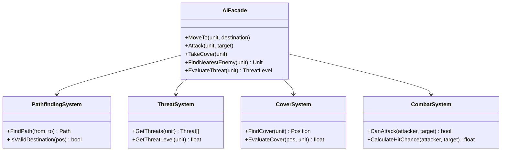
```mermaid
classDiagram
    class AIFacade {
        +MoveTo(unit, destination)
        +Attack(unit, target)
        +TakeCover(unit)
        +FindNearestEnemy(unit) Unit
        +EvaluateThreat(unit) ThreatLevel
    }
    
    class PathfindingSystem {
        +FindPath(from, to) Path
        +IsValidDestination(pos) bool
    }
    
    class ThreatSystem {
        +GetThreats(unit) Threat[]
        +GetThreatLevel(unit) float
    }
    
    class CoverSystem {
        +FindCover(unit) Position
        +EvaluateCover(pos, unit) float
    }
    
    class CombatSystem {
        +CanAttack(attacker, target) bool
        +CalculateHitChance(attacker, target) float
    }
    
    AIFacade --> PathfindingSystem
    AIFacade --> ThreatSystem
    AIFacade --> CoverSystem
    AIFacade --> CombatSystem
```

#### Variations Across Games

**OpenCombat-SDL: Direct Implementation (No Facade)**
```cpp
// Game logic directly accesses AI systems
void Soldier::Update(float dt) {
    // Direct calls to complex subsystems
    if (ai->DetectThreats(this)) {
        auto* cover = world->GetCoverSystem()->FindCover(this);
        auto* path = world->GetPathfinder()->FindPath(position, cover->position);
        FollowPath(path);
    }
}
// Tight coupling, hard to test, complex interface
```

**OpenCombat: Simplified Interface**
```rust
// Facade providing simple interface
impl AIController {
    fn move_to(&self, soldier_idx: SoldierIndex, dest: Vec2) -> bool {
        let soldier = self.state.soldier(soldier_idx);
        if let Some(path) = self.pathfinder.find_path(soldier.position, dest) {
            self.issue_order(soldier_idx, Order::MoveTo(path));
            true
        } else {
            false
        }
    }
    
    fn attack(&self, attacker_idx: SoldierIndex, target_idx: SoldierIndex) {
        if self.combat.can_attack(attacker_idx, target_idx) {
            self.issue_order(attacker_idx, Order::EngageSoldier(target_idx));
        }
    }
    
    fn take_cover(&self, soldier_idx: SoldierIndex) -> bool {
        let soldier = self.state.soldier(soldier_idx);
        if let Some(cover) = self.cover_system.find_cover(soldier) {
            self.move_to(soldier_idx, cover.position);
            true
        } else {
            false
        }
    }
}

// Game logic uses simple facade
fn process_ai(state: &mut BattleState, ai: &AIController) {
    for idx in state.soldier_indices() {
        if ai.evaluate_threat(idx) > THREAT_THRESHOLD {
            ai.take_cover(idx);
        }
    }
}
```

**CloseCombatFree: QML Property Interface**
```cpp
// Facade exposing simple QML interface
class AIFacade : public QObject {
    Q_OBJECT
public:
    Q_INVOKABLE bool moveTo(QObject* unit, qreal x, qreal y);
    Q_INVOKABLE bool attack(QObject* attacker, QObject* target);
    Q_INVOKABLE bool takeCover(QObject* unit);
    Q_INVOKABLE QObject* findNearestEnemy(QObject* unit);
    
private:
    Pathfinder* pathfinder;
    ThreatSystem* threatSystem;
    CoverSystem* coverSystem;
};

// QML usage
Soldier {
    id: soldier
    
    function onUnderFire() {
        aiFacade.takeCover(soldier)
    }
}
```

#### When to Use
- **Use when**: Complex subsystem needs simpler interface
- **Use when**: Layering is desired (decouple from implementation)
- **Use when**: Multiple similar subsystems need unified interface
- **Use when**: Testing requires mocking complex dependencies

#### When NOT to Use
- **Don't use when**: Direct access is simple and sufficient
- **Don't use when**: Performance-critical (facade adds indirection)
- **Don't use when**: Flexibility is more important than simplicity

#### Related Patterns
- **Adapter Pattern**: Facade simplifies; Adapter converts interfaces
- **Mediator Pattern**: Both simplify communication, but Mediator adds behavior
- **Singleton Pattern**: Facades often implemented as singletons

---

### 8.3.4 Proxy Pattern (Network Multiplayer)

#### Intent
Provide a surrogate or placeholder for another object to control access to it, especially across network boundaries.

#### Problem
- Network multiplayer requires remote object access
- Latency and packet loss must be hidden from game logic
- Server authority needs to control client access
- Bandwidth optimization requires filtering updates

#### Solution

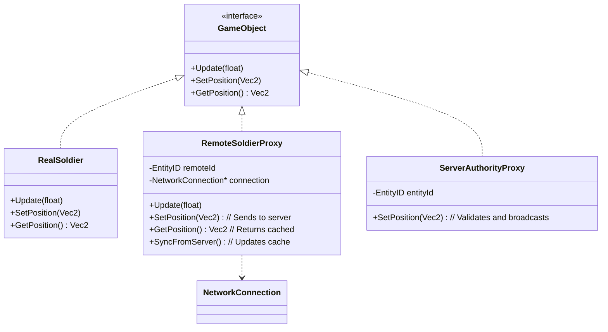
```mermaid
classDiagram
    class GameObject {
        <<interface>>
        +Update(float)
        +SetPosition(Vec2)
        +GetPosition() Vec2
    }
    
    class RealSoldier {
        +Update(float)
        +SetPosition(Vec2)
        +GetPosition() Vec2
    }
    
    class RemoteSoldierProxy {
        -EntityID remoteId
        -NetworkConnection* connection
        +Update(float)
        +SetPosition(Vec2)  // Sends to server
        +GetPosition() Vec2  // Returns cached
        +SyncFromServer()  // Updates cache
    }
    
    class ServerAuthorityProxy {
        -EntityID entityId
        +SetPosition(Vec2)  // Validates and broadcasts
    }
    
    GameObject <|.. RealSoldier
    GameObject <|.. RemoteSoldierProxy
    GameObject <|.. ServerAuthorityProxy
    RemoteSoldierProxy ..> NetworkConnection
```

#### Variations Across Games

**OpenCombat-SDL: Single Player (No Proxy)**
```cpp
// Direct access only - no multiplayer
class Soldier {
    Point position;
public:
    void SetPosition(Point p) { position = p; }
    Point GetPosition() const { return position; }
};
```

**OpenCombat: Full Network Proxy**
```rust
// Client-side proxy for remote soldiers
struct RemoteSoldier {
    soldier_id: SoldierIndex,
    cached_position: Vec2,
    last_update: u64,
    connection: Arc<ClientConnection>,
}

impl RemoteSoldier {
    fn set_position(&mut self, pos: Vec2) {
        // Send to server, don't apply locally
        self.connection.send(
            ClientMessage::RequestMove(self.soldier_id, pos)
        );
    }
    
    fn get_position(&self) -> Vec2 {
        // Return cached position
        self.cached_position
    }
    
    fn sync_from_server(&mut self, update: ServerUpdate) {
        // Update cache from server authority
        if update.soldier_id == self.soldier_id {
            self.cached_position = update.position;
            self.last_update = update.timestamp;
        }
    }
}

// Server-side authority proxy
struct ServerSoldier {
    soldier_id: SoldierIndex,
    position: Vec2,
    clients: Vec<ClientId>,
}

impl ServerSoldier {
    fn set_position(&mut self, pos: Vec2, requester: ClientId) {
        // Validate request
        if !self.can_move(requester) {
            return;  // Reject
        }
        
        // Apply and broadcast
        self.position = pos;
        self.broadcast_update();
    }
}
```

**CloseCombatFree: Local Only (No Proxy)**
```qml
// Single player only
Soldier {
    id: soldier
    x: 100  // Direct property
    y: 200
    // No network considerations
}
```

#### When to Use
- **Use when**: Remote access to objects needed
- **Use when**: Server authority must control state
- **Use when**: Bandwidth optimization required
- **Use when**: Latency hiding is necessary

#### When NOT to Use
- **Don't use when**: Single-player only (unnecessary complexity)
- **Don't use when**: Real-time synchronization not required
- **Don't use when**: Direct P2P with minimal latency

#### Related Patterns
- **Decorator Pattern**: Both wrap objects, but Decorator adds functionality
- **Observer Pattern**: Proxies often use Observer for updates
- **Command Pattern**: Network commands often use proxies

---

## 8.4 Behavioral Patterns

### 8.4.1 Command Pattern (for Orders)

#### Intent
Encapsulate a request as an object, allowing queuing, logging, undo/redo, and deferred execution.

#### Problem
- Player orders need to be queued and executed over time
- Undo/redo functionality required
- Replay recording needs command log
- Network multiplayer needs command serialization
- Different order types require different handling

#### Solution

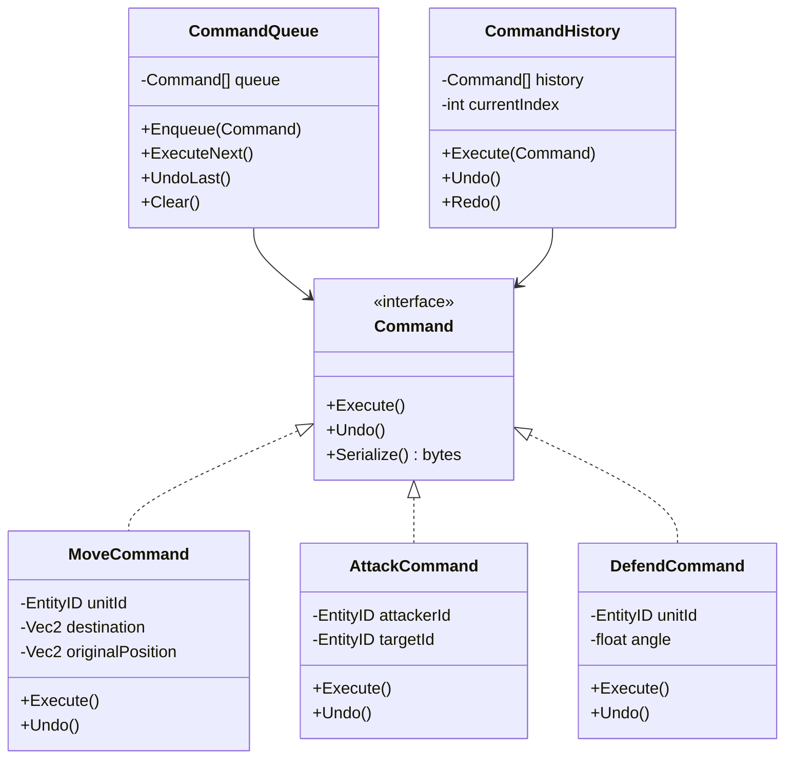
```mermaid
classDiagram
    class Command {
        <<interface>>
        +Execute()
        +Undo()
        +Serialize() bytes
    }
    
    class MoveCommand {
        -EntityID unitId
        -Vec2 destination
        -Vec2 originalPosition
        +Execute()
        +Undo()
    }
    
    class AttackCommand {
        -EntityID attackerId
        -EntityID targetId
        +Execute()
        +Undo()
    }
    
    class DefendCommand {
        -EntityID unitId
        -float angle
        +Execute()
        +Undo()
    }
    
    class CommandQueue {
        -Command[] queue
        +Enqueue(Command)
        +ExecuteNext()
        +UndoLast()
        +Clear()
    }
    
    class CommandHistory {
        -Command[] history
        -int currentIndex
        +Execute(Command)
        +Undo()
        +Redo()
    }
    
    Command <|.. MoveCommand
    Command <|.. AttackCommand
    Command <|.. DefendCommand
    CommandQueue --> Command
    CommandHistory --> Command
```

#### Variations Across Games

**OpenCombat-SDL: Order Classes as Commands**
```cpp
class Order {
public:
    virtual void Execute(Object* target) = 0;
    virtual void Undo() { /* Not implemented */ }
    virtual ~Order() = default;
};

class MoveOrder : public Order {
    Point destination;
    Point originalPosition;
    Object* target;
public:
    void Execute(Object* obj) override {
        target = obj;
        originalPosition = obj->GetPosition();
        obj->MoveTo(destination);
    }
    
    void Undo() override {
        if (target) {
            target->SetPosition(originalPosition);
        }
    }
};

class FireOrder : public Order {
    Object* target;
public:
    void Execute(Object* obj) override {
        obj->FireAt(target);
    }
};

// Command queue in Object
class Object {
    std::deque<Order*> orders;
public:
    void AddOrder(Order* order) {
        orders.push_back(order);
    }
    
    void ProcessOrders() {
        if (!orders.empty()) {
            orders.front()->Execute(this);
            orders.pop_front();
        }
    }
};
```

**OpenCombat: Messages as Commands**
```rust
// All state changes are commands/messages
enum BattleStateMessage {
    Soldier(SoldierIndex, SoldierMessage),
    SetPhase(Phase),
    PushBulletFire(BulletFire),
}

enum SoldierMessage {
    SetBehavior(Behavior),
    SetGesture(Gesture),
    TakeDamage(i32),
}

// Execution
impl BattleState {
    fn apply(&mut self, msg: BattleStateMessage) {
        match msg {
            BattleStateMessage::Soldier(idx, soldier_msg) => {
                self.update_soldier(idx, soldier_msg);
            }
            BattleStateMessage::SetPhase(phase) => {
                self.phase = phase;
            }
            // ...
        }
    }
}

// Command queue enables replay
struct CommandLog {
    messages: Vec<(u64, BattleStateMessage)>,  // (tick, message)
}

impl CommandLog {
    fn replay(&self, state: &mut BattleState) {
        for (tick, msg) in &self.messages {
            state.current_tick = *tick;
            state.apply(msg.clone());
        }
    }
}
```

**CloseCombatFree: Simple Order Queue**
```cpp
// QML-side order queue
class CcfQmlBaseUnit : public QQuickItem {
    Q_OBJECT
    Q_PROPERTY(QStringList orders READ orders NOTIFY ordersChanged)
    
public slots:
    void moveTo(qreal x, qreal y);
    void attack(QObject* target);
    void defend(qreal angle);
    void undoLastOrder();  // Could be added
    
private:
    QStringList m_orders;
    void processQueue();
    
signals:
    void ordersChanged();
    void actionFinished(int unitId, qreal x, qreal y);
};

// QML usage
Unit {
    id: unit
    
    function issueOrders() {
        moveTo(100, 200)
        attack(enemy1)
        defend(45)
    }
}
```

#### When to Use
- **Use when**: Queuing and deferred execution needed
- **Use when**: Undo/redo functionality required
- **Use when**: Replay recording needed
- **Use when**: Network command serialization needed
- **Use when**: Different requests need different handling

#### When NOT to Use
- **Don't use when**: Simple immediate execution is sufficient
- **Don't use when**: Memory overhead is a concern (commands are objects)
- **Don't use when**: Performance-critical tight loops

#### Related Patterns
- **Memento Pattern**: For storing state for undo
- **Prototype Pattern**: For copying commands
- **Chain of Responsibility**: For command routing

---

### 8.4.2 State Pattern (Unit States)

#### Intent
Allow an object to alter its behavior when its internal state changes, appearing as if the object changed its class.

#### Problem
- Units have multiple states (idle, moving, firing, reloading, suppressed)
- Behavior varies dramatically by state
- State transitions need to be explicit and validated
- Adding new states shouldn't require modifying existing code

#### Solution

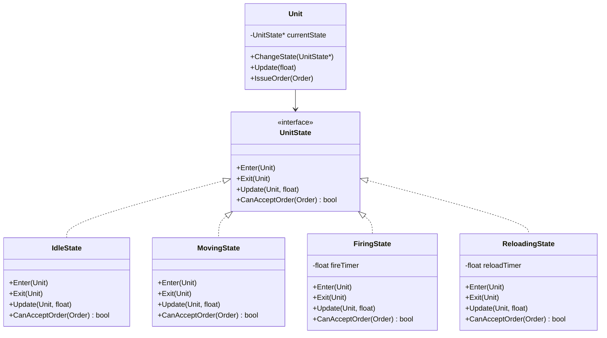
```mermaid
classDiagram
    class UnitState {
        <<interface>>
        +Enter(Unit)
        +Exit(Unit)
        +Update(Unit, float)
        +CanAcceptOrder(Order) bool
    }
    
    class IdleState {
        +Enter(Unit)
        +Exit(Unit)
        +Update(Unit, float)
        +CanAcceptOrder(Order) bool
    }
    
    class MovingState {
        +Enter(Unit)
        +Exit(Unit)
        +Update(Unit, float)
        +CanAcceptOrder(Order) bool
    }
    
    class FiringState {
        -float fireTimer
        +Enter(Unit)
        +Exit(Unit)
        +Update(Unit, float)
        +CanAcceptOrder(Order) bool
    }
    
    class ReloadingState {
        -float reloadTimer
        +Enter(Unit)
        +Exit(Unit)
        +Update(Unit, float)
        +CanAcceptOrder(Order) bool
    }
    
    class Unit {
        -UnitState* currentState
        +ChangeState(UnitState*)
        +Update(float)
        +IssueOrder(Order)
    }
    
    UnitState <|.. IdleState
    UnitState <|.. MovingState
    UnitState <|.. FiringState
    UnitState <|.. ReloadingState
    Unit --> UnitState
```

#### Variations Across Games

**OpenCombat-SDL: Bitfield State (Partial Implementation)**
```cpp
// Not full State pattern, but state-based behavior
class State {
    unsigned long long bits;
public:
    bool IsSet(unsigned int state);
    void Set(unsigned int state);
    void UnSet(unsigned int state);
};

class Soldier {
    State _currentState;
public:
    void Simulate(float dt, World* world) {
        // Behavior determined by state checks
        if (_currentState.IsSet(SoldierState::Firing)) {
            ProcessFiring(dt);
        } else if (_currentState.IsSet(SoldierState::Moving)) {
            ProcessMovement(dt);
        } else if (_currentState.IsSet(SoldierState::Reloading)) {
            ProcessReloading(dt);
        }
        // ...
    }
};
```

**OpenCombat: Enum-Based State (Closer to State Pattern)**
```rust
// State hierarchy with behavior
enum Behavior {
    MoveTo(WorldPaths),
    Defend(Angle),
    EngageSoldier(SoldierIndex),
    Idle(Body),
    Hide(Angle),
    Dead,
}

enum Gesture {
    Idle,
    Reloading(u64),  // completion frame
    Aiming(u64),
    Firing(u64),
}

fn tick_soldier(soldier: &mut Soldier) {
    match soldier.behavior {
        Behavior::MoveTo(paths) => process_movement(soldier, paths),
        Behavior::Defend(angle) => process_defense(soldier, angle),
        Behavior::EngageSoldier(target) => process_engagement(soldier, target),
        Behavior::Idle(body) => process_idle(soldier, body),
        Behavior::Hide(angle) => process_hiding(soldier, angle),
        Behavior::Dead => {}  // No processing
    }
    
    // Process gesture
    match soldier.gesture {
        Gesture::Idle => {},
        Gesture::Reloading(end_frame) => {
            if current_frame() >= end_frame {
                soldier.gesture = Gesture::Idle;
                soldier.weapon.as_mut().unwrap().reload();
            }
        }
        // ...
    }
}
```

**CloseCombatFree: String-Based Status**
```cpp
// Runtime status string
class CcfQmlBaseUnit : public QQuickItem {
    Q_OBJECT
    Q_PROPERTY(QString unitStatus READ unitStatus WRITE setUnitStatus NOTIFY unitStatusChanged)
    
public:
    void setUnitStatus(const QString& status) {
        if (_status != status) {
            _status = status;
            emit unitStatusChanged(status);
            onStateEnter(status);
        }
    }
    
private:
    void onStateEnter(const QString& newStatus) {
        if (newStatus == "MOVING") {
            playAnimation("walk");
        } else if (newStatus == "AIMING") {
            playAnimation("aim");
        } else if (newStatus == "FIRING") {
            playAnimation("fire");
            spawnProjectile();
        }
    }
};
```

#### When to Use
- **Use when**: Object behavior depends on state that changes at runtime
- **Use when**: States have distinct, well-defined behaviors
- **Use when**: Adding new states without modifying existing code
- **Use when**: State transitions need to be explicit and controlled

#### When NOT to Use
- **Don't use when**: Only 2-3 simple states (use boolean or enum)
- **Don't use when**: State logic is trivial
- **Don't use when**: Creating many small state classes adds overhead

#### Related Patterns
- **Singleton Pattern**: State objects often implemented as singletons
- **Strategy Pattern**: Similar structure, but State manages transitions
- **Flyweight Pattern**: If many units share same state objects

---

### 8.4.3 Observer Pattern (Event System)

#### Intent
Define a one-to-many dependency between objects so that when one object changes state, all its dependents are notified and updated automatically.

#### Problem
- Game events need to affect multiple systems (UI, audio, AI, scoring)
- Direct coupling between systems creates maintenance nightmare
- Dynamic registration/unregistration of event handlers needed
- Event filtering based on type or source

#### Solution

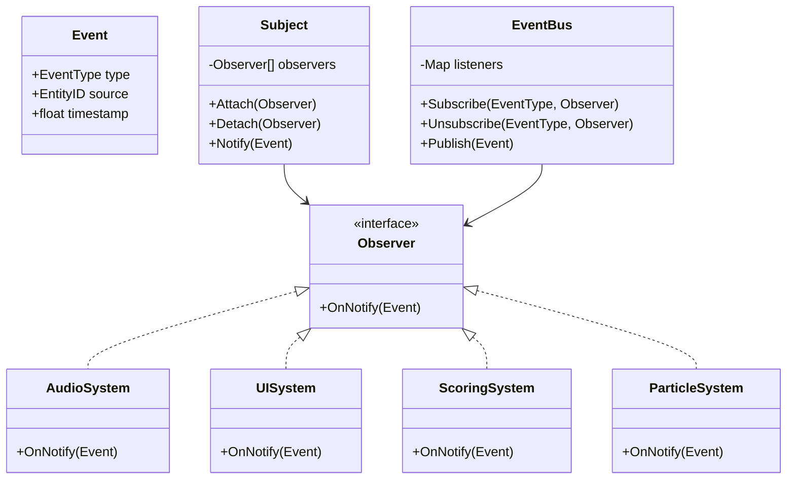
```mermaid
classDiagram
    class Event {
        +EventType type
        +EntityID source
        +float timestamp
    }
    
    class Subject {
        -Observer[] observers
        +Attach(Observer)
        +Detach(Observer)
        +Notify(Event)
    }
    
    class Observer {
        <<interface>>
        +OnNotify(Event)
    }
    
    class AudioSystem {
        +OnNotify(Event)
    }
    
    class UISystem {
        +OnNotify(Event)
    }
    
    class ScoringSystem {
        +OnNotify(Event)
    }
    
    class ParticleSystem {
        +OnNotify(Event)
    }
    
    class EventBus {
        -Map<EventType, Observer[]> listeners
        +Subscribe(EventType, Observer)
        +Unsubscribe(EventType, Observer)
        +Publish(Event)
    }
    
    Subject --> Observer
    Observer <|.. AudioSystem
    Observer <|.. UISystem
    Observer <|.. ScoringSystem
    Observer <|.. ParticleSystem
    EventBus --> Observer
```

#### Variations Across Games

**OpenCombat-SDL: Direct Calls (No Observer)**
```cpp
// Tight coupling - direct method calls
void Soldier::TakeDamage(int damage) {
    health -= damage;
    
    // Direct calls to all systems
    world->GetAudio()->PlaySound("hit");
    world->GetUI()->ShowDamageIndicator(this);
    world->GetParticleSystem()->SpawnBlood(position);
    
    if (health <= 0) {
        world->GetScoring()->RegisterKill(attacker, this);
        world->GetAI()->OnUnitDestroyed(this);
    }
}
// Hard to maintain, systems tightly coupled
```

**OpenCombat: Message-Based Observer**
```rust
// Event system via message passing
trait EventHandler {
    fn handle_event(&mut self, event: &GameEvent);
}

struct EventBus {
    handlers: HashMap<EventType, Vec<Box<dyn EventHandler>>>,
}

impl EventBus {
    fn subscribe(&mut self, event_type: EventType, handler: Box<dyn EventHandler>) {
        self.handlers.entry(event_type).or_default().push(handler);
    }
    
    fn publish(&mut self, event: GameEvent) {
        if let Some(handlers) = self.handlers.get_mut(&event.event_type) {
            for handler in handlers {
                handler.handle_event(&event);
            }
        }
    }
}

// Usage
enum GameEvent {
    UnitDamaged { unit: SoldierIndex, damage: i32 },
    UnitDestroyed { unit: SoldierIndex, killer: Option<SoldierIndex> },
    WeaponFired { shooter: SoldierIndex, weapon: WeaponType },
}

// Systems subscribe to events
impl EventHandler for AudioSystem {
    fn handle_event(&mut self, event: &GameEvent) {
        match event {
            GameEvent::WeaponFired { weapon, .. } => {
                self.play_sound(weapon.fire_sound());
            }
            GameEvent::UnitDestroyed { .. } => {
                self.play_sound("death");
            }
            _ => {}
        }
    }
}
```

**CloseCombatFree: Qt Signals/Slots (Built-in Observer)**
```cpp
// Qt's signals/slots ARE the Observer pattern
class CcfQmlBaseUnit : public QQuickItem {
    Q_OBJECT
    
signals:
    void unitStatusChanged(const QString& newStatus);
    void positionChanged(qreal x, qreal y);
    void healthChanged(int newHealth);
    void unitDestroyed();
    
public:
    void setHealth(int health) {
        if (_health != health) {
            _health = health;
            emit healthChanged(health);  // Notify all observers
            
            if (health <= 0) {
                emit unitDestroyed();
            }
        }
    }
};

// UI elements observe via slots
// QML side
Unit {
    onUnitStatusChanged: {
        console.log("Status: " + newStatus);
        updateStatusIcon(newStatus);
    }
    
    onHealthChanged: {
        updateHealthBar(newHealth);
        if (newHealth < 30) {
            playWarningSound();
        }
    }
    
    onUnitDestroyed: {
        showDeathAnimation();
        playDeathSound();
        updateScore();
    }
}
```

#### When to Use
- **Use when**: Changes to one object need to notify multiple others
- **Use when**: Decoupling is needed between event source and handlers
- **Use when**: Dynamic registration of handlers required
- **Use when**: One-to-many relationships change dynamically

#### When NOT to Use
- **Don't use when**: Single handler and tight coupling acceptable
- **Don't use when**: Performance-critical (notification overhead)
- **Don't use when**: Event order must be strictly controlled

#### Related Patterns
- **Mediator Pattern**: Observer distributes; Mediator centralizes
- **Command Pattern**: Events can be commands
- **Singleton Pattern**: Event bus often a singleton

---

### 8.4.4 Strategy Pattern (AI Behaviors)

#### Intent
Define a family of algorithms, encapsulate each one, and make them interchangeable. Strategy lets the algorithm vary independently from clients that use it.

#### Problem
- Different AI behaviors needed (aggressive, defensive, stealth)
- AI should be swappable at runtime (morale changes behavior)
- Avoiding massive switch statements for behavior selection
- Testing individual AI behaviors in isolation

#### Solution

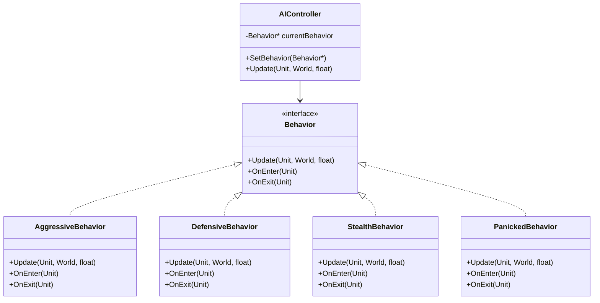
```mermaid
classDiagram
    class Behavior {
        <<interface>>
        +Update(Unit, World, float)
        +OnEnter(Unit)
        +OnExit(Unit)
    }
    
    class AggressiveBehavior {
        +Update(Unit, World, float)
        +OnEnter(Unit)
        +OnExit(Unit)
    }
    
    class DefensiveBehavior {
        +Update(Unit, World, float)
        +OnEnter(Unit)
        +OnExit(Unit)
    }
    
    class StealthBehavior {
        +Update(Unit, World, float)
        +OnEnter(Unit)
        +OnExit(Unit)
    }
    
    class PanickedBehavior {
        +Update(Unit, World, float)
        +OnEnter(Unit)
        +OnExit(Unit)
    }
    
    class AIController {
        -Behavior* currentBehavior
        +SetBehavior(Behavior*)
        +Update(Unit, World, float)
    }
    
    Behavior <|.. AggressiveBehavior
    Behavior <|.. DefensiveBehavior
    Behavior <|.. StealthBehavior
    Behavior <|.. PanickedBehavior
    AIController --> Behavior
```

#### Variations Across Games

**OpenCombat-SDL: Hardcoded Behaviors (Partial Strategy)**
```cpp
// Behavior hardcoded in soldier class
class Soldier {
    AIBehavior behavior;
public:
    void SetBehavior(AIBehavior b) { behavior = b; }
    
    void UpdateAI(World* world) {
        switch (behavior) {
            case AI_AGGRESSIVE:
                // Aggressive logic
                if (CanSeeEnemy()) {
                    AttackNearestEnemy();
                } else {
                    MoveTowardEnemy();
                }
                break;
            case AI_DEFENSIVE:
                // Defensive logic
                if (IsUnderFire()) {
                    SeekCover();
                }
                break;
        }
    }
};
// Not true Strategy - behaviors not encapsulated
```

**OpenCombat: Enum with Function Dispatch**
```rust
// Behavior as enum with associated data
enum Behavior {
    MoveTo(WorldPaths),
    Defend(Angle),
    EngageSoldier(SoldierIndex),
    Hide(Angle),
    Idle(Body),
}

// Strategy execution through pattern matching
fn execute_behavior(soldier: &mut Soldier, behavior: &Behavior, world: &World) {
    match behavior {
        Behavior::MoveTo(paths) => {
            follow_path(soldier, paths);
            if path_complete(soldier) {
                soldier.behavior = Behavior::Idle(Body::Stand);
            }
        }
        Behavior::Defend(angle) => {
            if let Some(enemy) = find_visible_enemy(soldier, world) {
                // Switch to engagement strategy
                soldier.behavior = Behavior::EngageSoldier(enemy);
            }
        }
        Behavior::EngageSoldier(target) => {
            if can_fire(soldier, *target, world) {
                fire_at(soldier, *target);
            } else {
                move_to_optimal_range(soldier, *target);
            }
        }
        // ... other strategies
    }
}

// Behavior change based on morale
fn update_ai(soldier: &mut Soldier, world: &World) {
    if soldier.morale < PANIC_THRESHOLD {
        soldier.behavior = Behavior::Hide(calculate_retreat_direction(soldier));
    }
}
```

**CloseCombatFree: Property-Based Behavior**
```qml
// Behavior as property
Soldier {
    id: soldier
    property string behavior: "defensive"  // Can change at runtime
    
    function updateAI() {
        switch(behavior) {
        case "aggressive":
            if (canSeeEnemy()) {
                attack(nearestEnemy())
            }
            break
        case "defensive":
            if (underFire) {
                takeCover()
            }
            break
        case "stealth":
            if (enemyNearby()) {
                hide()
            } else {
                moveSneaky()
            }
            break
        }
    }
    
    // Behavior changes with morale
    onMoraleChanged: {
        if (morale < 20) {
            behavior = "panicked"
        }
    }
}
```

#### When to Use
- **Use when**: Multiple variants of algorithm/behavior needed
- **Use when**: Algorithm needs to change at runtime
- **Use when**: Avoiding massive switch statements
- **Use when**: Testing algorithms in isolation

#### When NOT to Use
- **Don't use when**: Only one algorithm and it rarely changes
- **Don't use when**: Performance-critical (virtual call overhead)
- **Don't use when**: Simple if/else is clearer

#### Related Patterns
- **State Pattern**: Both encapsulate behavior, but State manages transitions
- **Template Method Pattern**: Strategy varies entire algorithm; Template varies steps
- **Factory Pattern**: Factory creates appropriate strategies

---

### 8.4.5 Template Method Pattern (Order Execution)

#### Intent
Define the skeleton of an algorithm in an operation, deferring some steps to subclasses. Template Method lets subclasses redefine certain steps without changing the algorithm structure.

#### Problem
- Order execution follows common pattern (validate → pathfind → execute → complete)
- Specific order types customize certain steps
- Common error handling and cleanup needed
- Algorithm structure must remain consistent

#### Solution

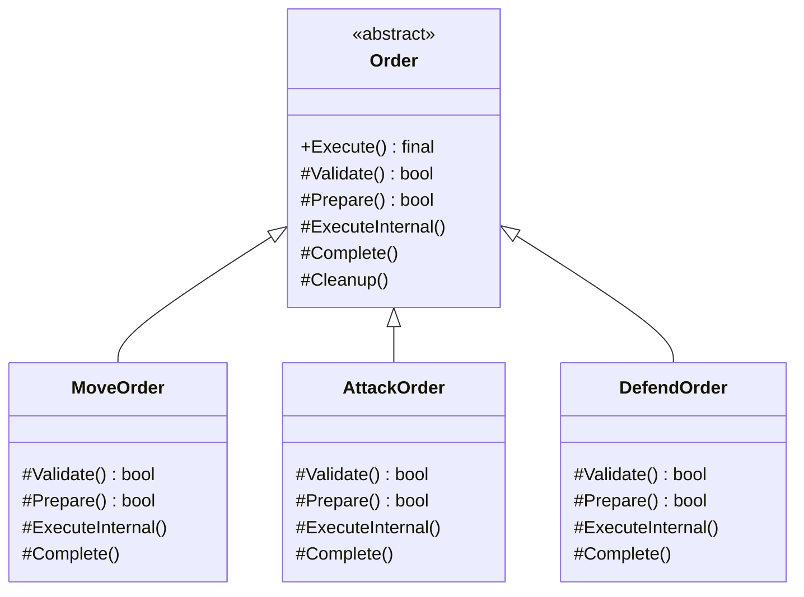
```mermaid
classDiagram
    class Order {
        <<abstract>>
        +Execute() final
        #Validate() bool
        #Prepare() bool
        #ExecuteInternal()
        #Complete()
        #Cleanup()
    }
    
    class MoveOrder {
        #Validate() bool
        #Prepare() bool
        #ExecuteInternal()
        #Complete()
    }
    
    class AttackOrder {
        #Validate() bool
        #Prepare() bool
        #ExecuteInternal()
        #Complete()
    }
    
    class DefendOrder {
        #Validate() bool
        #Prepare() bool
        #ExecuteInternal()
        #Complete()
    }
    
    Order <|-- MoveOrder
    Order <|-- AttackOrder
    Order <|-- DefendOrder
```

#### Variations Across Games

**OpenCombat-SDL: Partial Template Method**
```cpp
class Order {
public:
    // Template method
    void Execute(Object* target) {
        if (!Validate(target)) {
            OnValidationFailed();
            return;
        }
        
        if (!Prepare(target)) {
            OnPreparationFailed();
            return;
        }
        
        ExecuteInternal(target);
        Complete(target);
        Cleanup(target);
    }
    
protected:
    virtual bool Validate(Object* target) = 0;
    virtual bool Prepare(Object* target) { return true; }
    virtual void ExecuteInternal(Object* target) = 0;
    virtual void Complete(Object* target) {}
    virtual void Cleanup(Object* target) {}
    
    virtual void OnValidationFailed() {}
    virtual void OnPreparationFailed() {}
};

class MoveOrder : public Order {
    Point destination;
    Path path;
    
protected:
    bool Validate(Object* target) override {
        return target != nullptr && target->IsMovable();
    }
    
    bool Prepare(Object* target) override {
        path = world->GetPathfinder()->FindPath(target->GetPosition(), destination);
        return path.IsValid();
    }
    
    void ExecuteInternal(Object* target) override {
        target->FollowPath(path);
    }
    
    void Complete(Object* target) override {
        target->OnOrderComplete();
    }
};

class AttackOrder : public Order {
    Object* targetEntity;
    
protected:
    bool Validate(Object* attacker) override {
        return attacker != nullptr && 
               targetEntity != nullptr && 
               attacker->HasWeapon();
    }
    
    void ExecuteInternal(Object* attacker) override {
        attacker->FireAt(targetEntity);
    }
};
```

**OpenCombat: Functional Composition**
```rust
// Template method through function composition
type OrderResult = Result<(), OrderError>;

fn execute_order(soldier_idx: SoldierIndex, order: &Order, state: &mut BattleState) -> OrderResult {
    // Template steps
    validate_order(soldier_idx, order, state)?;
    prepare_order(soldier_idx, order, state)?;
    execute_internal(soldier_idx, order, state)?;
    complete_order(soldier_idx, order, state)?;
    cleanup_order(soldier_idx, order, state)?;
    Ok(())
}

// Specific implementations
fn validate_move_order(soldier_idx: SoldierIndex, dest: Vec2, state: &BattleState) -> OrderResult {
    let soldier = state.soldier(soldier_idx);
    if soldier.is_dead() {
        return Err(OrderError::UnitDead);
    }
    if !state.map.is_valid_position(dest) {
        return Err(OrderError::InvalidDestination);
    }
    Ok(())
}

fn execute_move_internal(soldier_idx: SoldierIndex, path: &WorldPaths, state: &mut BattleState) {
    let soldier = &mut state.soldiers[soldier_idx.0];
    soldier.behavior = Behavior::MoveTo(path.clone());
}

// Template with specific implementations
fn execute_move_order(soldier_idx: SoldierIndex, dest: Vec2, state: &mut BattleState) -> OrderResult {
    validate_move_order(soldier_idx, dest, state)?;
    
    let path = state.pathfinder.find_path(state.soldier(soldier_idx).position, dest)
        .ok_or(OrderError::NoPathFound)?;
    
    execute_move_internal(soldier_idx, &path, state);
    
    Ok(())
}
```

**CloseCombatFree: Implicit Template**
```cpp
// Order processing follows implicit template
void CcfQmlBaseUnit::processOrder(QObject* order) {
    // Template: Validate -> Prepare -> Execute
    
    // Step 1: Validate
    if (!canAcceptOrder(order)) {
        setUnitStatus("ORDER_REJECTED");
        return;
    }
    
    // Step 2: Prepare (set status)
    QString orderType = order->property("type").toString();
    if (orderType == "Move") {
        setUnitStatus("MOVING");
    } else if (orderType == "Attack") {
        setUnitStatus("AIMING");
    }
    
    // Step 3: Execute (animation-driven)
    startOrderAnimation(order);
    
    // Step 4: Complete callback
    connect(this, &CcfQmlBaseUnit::animationFinished, 
            this, &CcfQmlBaseUnit::onOrderComplete);
}
```

#### When to Use
- **Use when**: Algorithm has invariant structure with variant steps
- **Use when**: Code reuse across similar algorithms
- **Use when**: Common error handling and cleanup needed
- **Use when**: Controlling subclass extensions (hook methods)

#### When NOT to Use
- **Don't use when**: Algorithm steps vary too much
- **Don't use when**: Flexibility more important than structure
- **Don't use when**: Strategy Pattern is sufficient

#### Related Patterns
- **Strategy Pattern**: Template varies steps; Strategy varies entire algorithm
- **Factory Method Pattern**: Often used with Template Method
- **Hook Method Pattern**: Template methods define hooks for customization

---

## 8.5 Simulation Patterns

### 8.5.1 Deterministic Lockstep Pattern

#### Intent
Ensure all simulation participants (clients) maintain identical game state by executing the same inputs at the same simulation steps.

#### Problem
- Multiplayer requires all clients to see identical game state
- Floating-point and timing differences cause desynchronization
- Network latency creates input timing differences
- Replay requires exact reproducibility

#### Solution

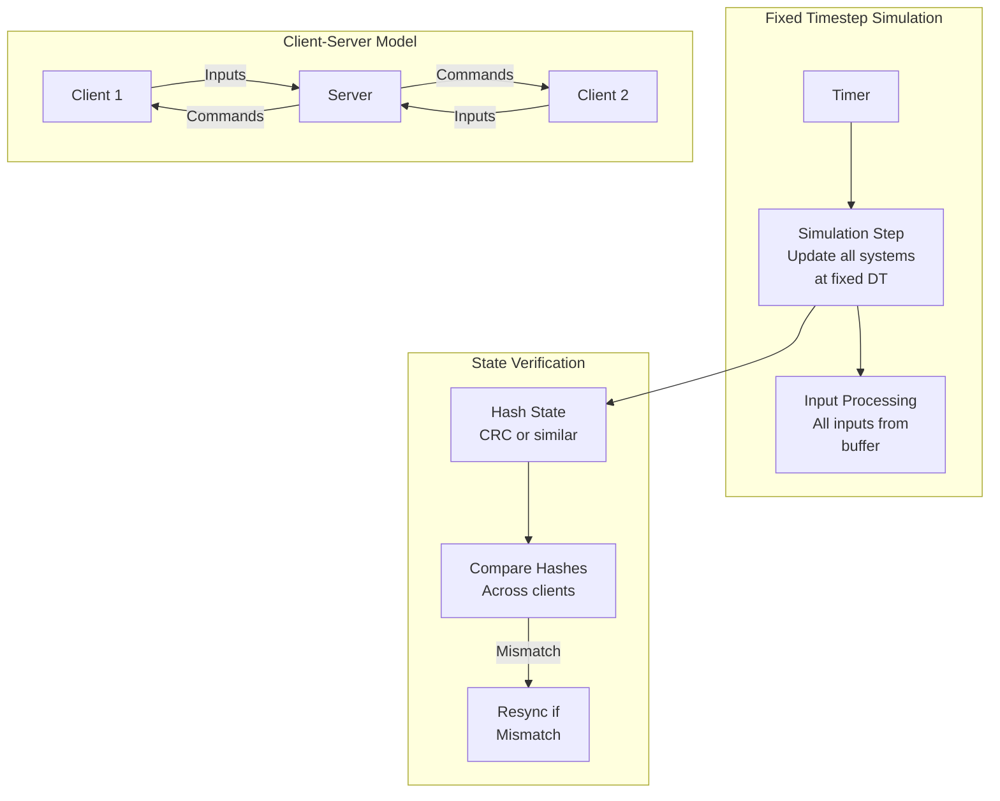
```mermaid
flowchart TB
    subgraph "Fixed Timestep Simulation"
        T[Timer]
        S[Simulation Step
        Update all systems
        at fixed DT]
        I[Input Processing
        All inputs from
        buffer]
    end
    
    subgraph "Client-Server Model"
        C1[Client 1]
        C2[Client 2]
        SRV[Server]
        
        C1 -->|Inputs| SRV
        C2 -->|Inputs| SRV
        SRV -->|Commands| C1
        SRV -->|Commands| C2
    end
    
    subgraph "State Verification"
        H[Hash State
        CRC or similar]
        V[Compare Hashes
        Across clients]
        R[Resync if
        Mismatch]
    end
    
    T --> S
    S --> I
    S --> H
    H --> V
    V -->|Mismatch| R
```

#### Variations Across Games

**OpenCombat-SDL: Not Deterministic**
```cpp
// Uses real time - not suitable for multiplayer
void Game::Update() {
    float dt = GetDeltaTime();  // Variable dt
    world->Update(dt);          // Non-deterministic
}
// Not suitable for multiplayer or replay
```

**OpenCombat: Fully Deterministic**
```rust
// Fixed timestep
const DT: f32 = 1.0 / 60.0;  // 60 Hz

pub struct Simulation {
    current_tick: u64,
    state: BattleState,
    rng: SeededRng,
}

impl Simulation {
    pub fn tick(&mut self, inputs: &[PlayerInput]) {
        // Process all inputs for this tick
        for input in inputs {
            self.apply_input(input);
        }
        
        // Update systems at fixed DT
        update_physics(&mut self.state, DT);
        update_ai(&mut self.state, DT);
        update_combat(&mut self.state, DT, &mut self.rng);
        
        self.current_tick += 1;
    }
    
    pub fn verify_state(&self) -> u64 {
        // Hash state for verification
        self.state.hash()
    }
}

// Network synchronization
pub struct Server {
    clients: Vec<Client>,
    simulation: Simulation,
}

impl Server {
    fn tick(&mut self) {
        // Collect inputs from all clients
        let inputs = self.collect_inputs();
        
        // Run simulation step
        self.simulation.tick(&inputs);
        
        // Broadcast state hash for verification
        let hash = self.simulation.verify_state();
        self.broadcast_state_hash(hash);
    }
}
```

**CloseCombatFree: Not Applicable**
```qml
// Single-player only, animation-driven
// Not deterministic, not multiplayer
```

#### When to Use
- **Use when**: Multiplayer synchronization required
- **Use when**: Replay recording needed
- **Use when**: Competitive play requires fairness
- **Use when**: Debugging requires reproducibility

#### When NOT to Use
- **Don't use when**: Single-player only (overhead not justified)
- **Don't use when**: Real-time accuracy more important than determinism
- **Don't use when**: Variable timestep acceptable

#### Related Patterns
- **Command Pattern**: Commands are the inputs to lockstep
- **State Pattern**: State must be serializable for verification
- **Observer Pattern**: For broadcasting state hashes

---

### 8.5.2 Spatial Partitioning Pattern

#### Intent
Efficiently organize entities in world space to enable fast spatial queries without checking every entity.

#### Problem
- Naive O(N) spatial queries don't scale (500 units = 250,000 checks)
- "Find all enemies within 100 meters" is common operation
- Line of sight requires sampling along rays
- Collision detection needs nearby object queries

#### Solution

```mermaid
flowchart TB
    subgraph "Spatial Partitioning Options"
        G[Uniform Grid
        Fixed cell size
        O(1) insertion
        O(k) query]
        
        Q[Quadtree
        Adaptive subdivision
        O(log n) operations
        Good for uneven distribution]
        
        H[Spatial Hash
        Hash map buckets
        Good for sparse worlds]
    end
    
    subgraph "Grid Implementation"
        W[World Grid
        Cell size = 100m]
        
        C[Cell Array
        Linked lists per cell]
        
        I[Insertion
        Hash position to cell
        Add to list]
        
        Q2[Query Radius
        Calculate cell range
        Check all in range]
    end
    
    W --> C
    C --> I
    C --> Q2
```

#### Variations Across Games

**OpenCombat-SDL: Linked Lists Per Tile**
```cpp
class World {
    // One linked list head per tile
    std::vector<Object*> tileObjects;
    int tilesX, tilesY;
    
public:
    void AddObject(Object* obj, int tileX, int tileY) {
        int index = tileY * tilesX + tileX;
        
        // Add to front of linked list
        obj->nextInTile = tileObjects[index];
        if (tileObjects[index]) {
            tileObjects[index]->prevInTile = obj;
        }
        tileObjects[index] = obj;
        obj->currentTile = index;
    }
    
    void RemoveObject(Object* obj) {
        int index = obj->currentTile;
        
        if (tileObjects[index] == obj) {
            tileObjects[index] = obj->nextInTile;
        }
        
        if (obj->prevInTile) {
            obj->prevInTile->nextInTile = obj->nextInTile;
        }
        if (obj->nextInTile) {
            obj->nextInTile->prevInTile = obj->prevInTile;
        }
    }
    
    std::vector<Object*> QueryRadius(Point center, float radius) {
        std::vector<Object*> results;
        
        int minX = (center.x - radius) / TILE_SIZE;
        int maxX = (center.x + radius) / TILE_SIZE;
        int minY = (center.y - radius) / TILE_SIZE;
        int maxY = (center.y + radius) / TILE_SIZE;
        
        for (int y = minY; y <= maxY; y++) {
            for (int x = minX; x <= maxX; x++) {
                int index = y * tilesX + x;
                Object* obj = tileObjects[index];
                while (obj) {
                    if (Distance(center, obj->position) <= radius) {
                        results.push_back(obj);
                    }
                    obj = obj->nextInTile;
                }
            }
        }
        
        return results;
    }
};
```

**OpenCombat: Grid-Based Queries**
```rust
pub struct SpatialIndex {
    cell_size: f32,
    cells: HashMap<CellCoord, Vec<EntityId>>,
}

impl SpatialIndex {
    pub fn insert(&mut self, entity: EntityId, pos: Vec2) {
        let cell = self.world_to_cell(pos);
        self.cells.entry(cell).or_default().push(entity);
    }
    
    pub fn query_radius(&self, center: Vec2, radius: f32) -> Vec<EntityId> {
        let mut results = Vec::new();
        
        let min_cell = self.world_to_cell(center - Vec2::splat(radius));
        let max_cell = self.world_to_cell(center + Vec2::splat(radius));
        
        for y in min_cell.y..=max_cell.y {
            for x in min_cell.x..=max_cell.x {
                if let Some(entities) = self.cells.get(&CellCoord { x, y }) {
                    for &entity in entities {
                        if distance(center, self.get_position(entity)) <= radius {
                            results.push(entity);
                        }
                    }
                }
            }
        }
        
        results
    }
    
    pub fn update_entity(&mut self, entity: EntityId, old_pos: Vec2, new_pos: Vec2) {
        let old_cell = self.world_to_cell(old_pos);
        let new_cell = self.world_to_cell(new_pos);
        
        if old_cell != new_cell {
            // Remove from old cell
            if let Some(entities) = self.cells.get_mut(&old_cell) {
                entities.retain(|&e| e != entity);
            }
            // Add to new cell
            self.cells.entry(new_cell).or_default().push(entity);
        }
    }
}
```

**CloseCombatFree: Visual Tree (Limited)**
```qml
// QML parent-child provides some spatial organization
// But not optimized for queries
Item {
    id: world
    
    Soldier { x: 100; y: 200 }
    Soldier { x: 150; y: 250 }
    Tank { x: 300; y: 400 }
    
    // Queries iterate all children
    function findNearby(pos, radius) {
        var nearby = []
        for (var i = 0; i < children.length; i++) {
            var child = children[i]
            var dist = Math.sqrt(
                Math.pow(child.x - pos.x, 2) + 
                Math.pow(child.y - pos.y, 2)
            )
            if (dist <= radius) {
                nearby.push(child)
            }
        }
        return nearby
    }
}
// O(N) - not scalable
```

#### When to Use
- **Use when**: Spatial queries are frequent
- **Use when**: Entity count > 100
- **Use when**: Query radius much smaller than world size
- **Use when**: Even entity distribution expected

#### When NOT to Use
- **Don't use when**: Entity count < 50 (overhead not justified)
- **Don't use when**: Spatial queries rare
- **Don't use when**: Entities extremely unevenly distributed (use Quadtree)

#### Related Patterns
- **Iterator Pattern**: To traverse spatial query results
- **Visitor Pattern**: To perform operations on queried entities
- **Observer Pattern**: Entities notify spatial index of movement

---

### 8.5.3 Double Buffer Pattern (State Updates)

#### Intent
Prevent state corruption during updates by reading from one buffer while writing to another, then swapping.

#### Problem
- Systems read and write to same state (race conditions)
- Partial updates create inconsistent state
- Parallel processing requires isolated buffers
- Physics and game logic need consistent snapshots

#### Solution

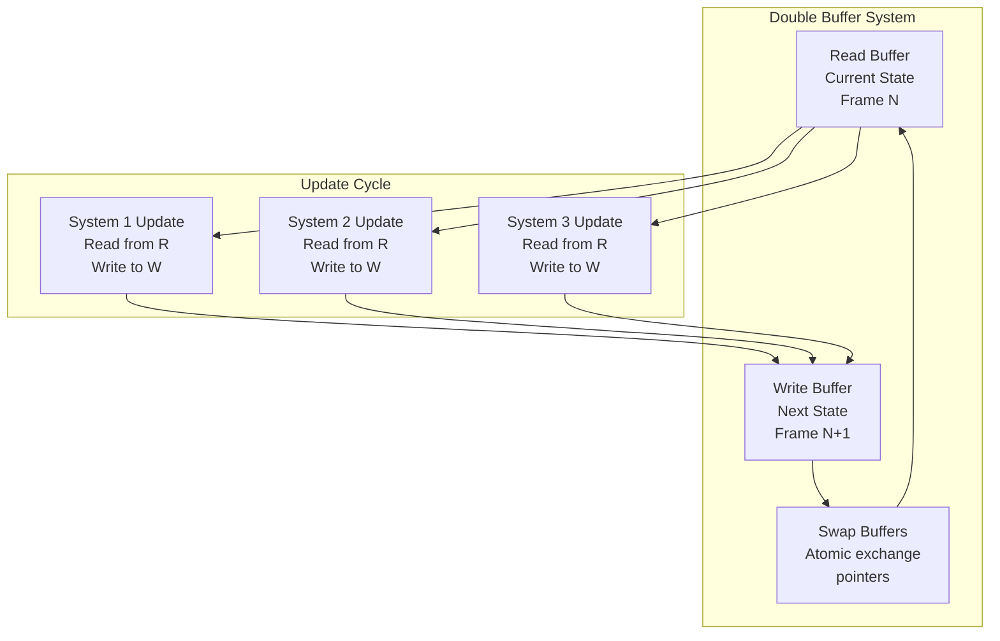
```mermaid
flowchart TB
    subgraph "Double Buffer System"
        R[Read Buffer
        Current State
        Frame N]
        
        W[Write Buffer
        Next State
        Frame N+1]
        
        S[Swap Buffers
        Atomic exchange
        pointers]
    end
    
    subgraph "Update Cycle"
        U1[System 1 Update
        Read from R
        Write to W]
        U2[System 2 Update
        Read from R
        Write to W]
        U3[System 3 Update
        Read from R
        Write to W]
    end
    
    R --> U1
    R --> U2
    R --> U3
    U1 --> W
    U2 --> W
    U3 --> W
    W --> S
    S --> R
```

#### Variations Across Games

**OpenCombat-SDL: Single Buffer (No Double Buffer)**
```cpp
// Updates happen immediately
void World::Update(float dt) {
    for (auto* obj : objects) {
        obj->Update(dt);  // Modifies state immediately
    }
}
// Risk of reading partial updates
```

**OpenCombat: Current State + Messages**
```rust
// Implicit double buffer through messages
pub struct BattleState {
    soldiers: Vec<Soldier>,        // Current state (read)
    pending_messages: Vec<Message>, // Changes to apply (write buffer)
}

impl BattleState {
    pub fn tick(&mut self) {
        // Process all messages (apply write buffer)
        for msg in self.pending_messages.drain(..) {
            self.apply_message(msg);
        }
    }
    
    pub fn queue_message(&mut self, msg: Message) {
        self.pending_messages.push(msg);
    }
}

// Systems read current state, queue changes
fn combat_system(state: &mut BattleState) {
    for i in 0..state.soldiers.len() {
        let soldier = &state.soldiers[i];
        if soldier.can_fire() {
            // Queue change, don't apply immediately
            state.queue_message(Message::Fire {
                soldier: SoldierIndex(i),
                target: soldier.target,
            });
        }
    }
}
```

**CloseCombatFree: QML Property Binding**
```cpp
// QML handles buffering internally
// Property changes queued and applied
void setProperty(const char* name, const QVariant& value) {
    // Qt queues property changes
    // Applied at next event loop iteration
}

// Explicit state buffering not needed
// Qt's declarative system handles it
```

#### When to Use
- **Use when**: Systems read and write same data structures
- **Use when**: Parallel processing of systems
- **Use when**: Consistent snapshots required mid-frame
- **Use when**: Physics and game logic must be decoupled

#### When NOT to Use
- **Don't use when**: Memory constrained (2x memory)
- **Don't use when**: Systems don't conflict
- **Don't use when**: Simple single-threaded update sufficient

#### Related Patterns
- **Buffer Pool Pattern**: For managing multiple buffers
- **State Pattern**: Often used with double buffering
- **Command Pattern**: Commands can be queued in write buffer

---

### 8.5.4 Update Method Pattern (Game Loop)

#### Intent
Centralize and sequence game system updates to ensure consistent, timely processing of game logic.

#### Problem
- Multiple systems need regular updates (AI, physics, rendering, input)
- Update order matters (input before AI, AI before physics)
- Fixed timestep needed for determinism
- Variable rendering rate vs fixed simulation rate

#### Solution

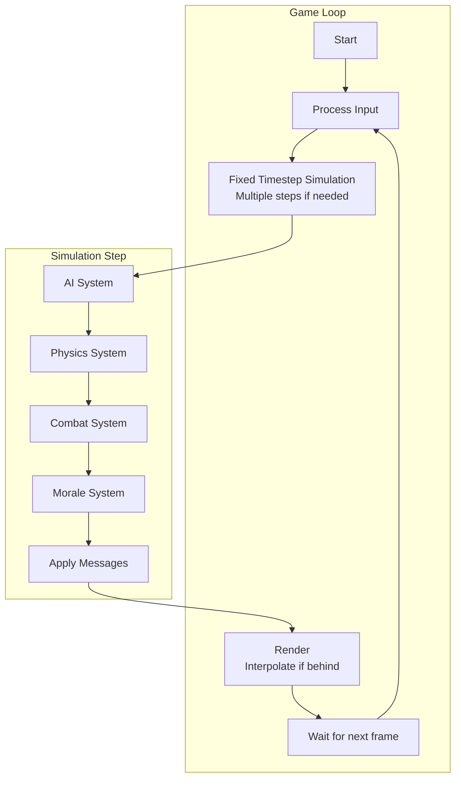
```mermaid
flowchart TB
    subgraph "Game Loop"
        S[Start]
        I[Process Input]
        SIM[Fixed Timestep Simulation
        Multiple steps if needed]
        R[Render
        Interpolate if behind]
        V[Wait for next frame]
    end
    
    subgraph "Simulation Step"
        AI[AI System]
        PHY[Physics System]
        COM[Combat System]
        MOR[Morale System]
        MSG[Apply Messages]
    end
    
    S --> I
    I --> SIM
    SIM --> AI
    AI --> PHY
    PHY --> COM
    COM --> MOR
    MOR --> MSG
    MSG --> R
    R --> V
    V --> I
```

#### Variations Across Games

**OpenCombat-SDL: Simple Loop**
```cpp
void Game::Run() {
    while (running) {
        float dt = GetDeltaTime();
        
        ProcessInput();
        world->Update(dt);
        renderer->Render(world);
        
        SwapBuffers();
    }
}
// Variable timestep - simple but not deterministic
```

**OpenCombat: Fixed Timestep with Interpolation**
```rust
const DT: f32 = 1.0 / 60.0;  // Fixed 60 Hz simulation
const MAX_DT: f32 = 0.25;    // Prevent spiral of death

pub struct GameLoop {
    accumulator: f32,
    last_time: Instant,
}

impl GameLoop {
    pub fn run(&mut self, state: &mut BattleState) {
        let current_time = Instant::now();
        let mut frame_time = current_time.duration_since(self.last_time).as_secs_f32();
        
        if frame_time > MAX_DT {
            frame_time = MAX_DT;  // Prevent spiral of death
        }
        
        self.last_time = current_time;
        self.accumulator += frame_time;
        
        // Fixed timestep simulation
        while self.accumulator >= DT {
            self.update(state, DT);
            self.accumulator -= DT;
        }
        
        // Interpolation factor for smooth rendering
        let alpha = self.accumulator / DT;
        self.render(state, alpha);
    }
    
    fn update(&mut self, state: &mut BattleState, dt: f32) {
        // Ordered update
        process_input(state);
        update_ai(state, dt);
        update_physics(state, dt);
        update_combat(state, dt);
        apply_messages(state);
    }
    
    fn render(&self, state: &BattleState, alpha: f32) {
        // Interpolate positions for smooth rendering
        for soldier in &state.soldiers {
            let pos = soldier.transform.position * alpha + 
                     soldier.transform.prev_position * (1.0 - alpha);
            render_soldier(soldier, pos);
        }
    }
}
```

**CloseCombatFree: Event-Driven (Animation-Based)**
```cpp
// Qt's event loop drives updates
void CcfEngine::run() {
    QTimer* gameTimer = new QTimer(this);
    connect(gameTimer, &QTimer::timeout, this, &CcfEngine::update);
    gameTimer->start(16);  // ~60 FPS
}

void CcfEngine::update() {
    // Process QML animations (Qt handles timing)
    // Check order completion
    // Update game state
    
    for (auto* unit : units) {
        if (unit->isOrderComplete()) {
            unit->processNextOrder();
        }
    }
}
// Less precise timing, animation-driven
```

#### When to Use
- **Use when**: Multiple systems need coordinated updates
- **Use when**: Fixed timestep required for determinism
- **Use when**: Update order is critical
- **Use when**: Smooth rendering with fixed simulation needed

#### When NOT to Use
- **Don't use when**: Event-driven sufficient (simple games)
- **Don't use when**: Platform provides game loop (browser, some frameworks)

#### Related Patterns
- **Game Loop Pattern**: Update Method is part of Game Loop
- **Double Buffer Pattern**: Often used within update cycle
- **State Pattern**: State changes triggered in update

---

## 8.6 Modding Patterns

### 8.6.1 Data-Driven Pattern

#### Intent
Separate game logic from game data, allowing content modification without code changes.

#### Problem
- Hardcoded values require recompilation for changes
- Designers need to tune without programmer involvement
- Content creators shouldn't need to understand code
- Multiple variants of similar content (weapons, units)

#### Solution

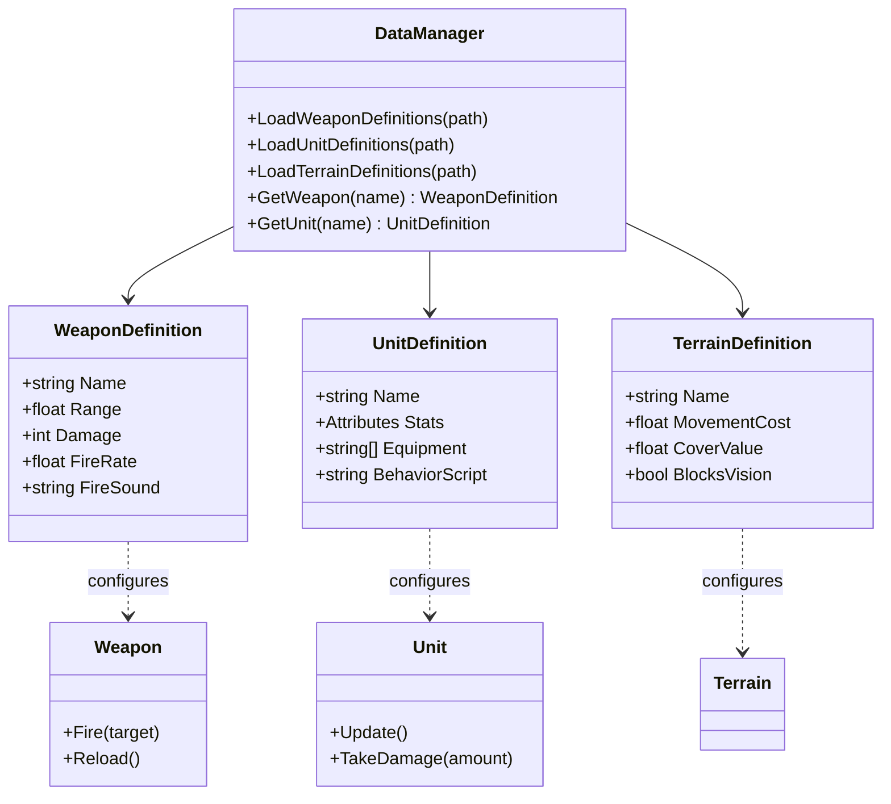
```mermaid
classDiagram
    class DataManager {
        +LoadWeaponDefinitions(path)
        +LoadUnitDefinitions(path)
        +LoadTerrainDefinitions(path)
        +GetWeapon(name) WeaponDefinition
        +GetUnit(name) UnitDefinition
    }
    
    class WeaponDefinition {
        +string Name
        +float Range
        +int Damage
        +float FireRate
        +string FireSound
    }
    
    class UnitDefinition {
        +string Name
        +Attributes Stats
        +string[] Equipment
        +string BehaviorScript
    }
    
    class TerrainDefinition {
        +string Name
        +float MovementCost
        +float CoverValue
        +bool BlocksVision
    }
    
    class Weapon {
        +Fire(target)
        +Reload()
    }
    
    class Unit {
        +Update()
        +TakeDamage(amount)
    }
    
    DataManager --> WeaponDefinition
    DataManager --> UnitDefinition
    DataManager --> TerrainDefinition
    WeaponDefinition ..> Weapon : configures
    UnitDefinition ..> Unit : configures
    TerrainDefinition ..> Terrain : configures
```

#### Variations Across Games

**OpenCombat-SDL: XML Data Files**
```xml
<!-- Weapons.xml -->
<Weapon Name="M1_Garand">
    <Range>300</Range>
    <Damage>45</Damage>
    <FireRate>0.5</FireRate>
    <MagazineSize>8</MagazineSize>
    <FireSound>sounds/garand_fire.wav</FireSound>
    <ReloadTime>3.5</ReloadTime>
</Weapon>

<!-- Units.xml -->
<SoldierType Name="Rifleman">
    <Attributes Aggressiveness="Steady" Morale="Steady"/>
    <DefaultWeapon>M1_Garand</DefaultWeapon>
    <Equipment>Grenade</Equipment>
    <Equipment>Grenade</Equipment>
</SoldierType>

<!-- Terrain.xml -->
<Element Name="StoneWall">
    <MovementCost>1000</MovementCost>  <!-- Impassable -->
    <Cover Standing="0.8" Prone="0.95"/>
    <BlocksVision>true</BlocksVision>
</Element>
```

```cpp
class DataManager {
    std::map<std::string, WeaponTemplate*> weapons;
    std::map<std::string, SoldierTemplate*> soldierTypes;
    
public:
    void LoadFromXML(const std::string& filename) {
        xmlDoc* doc = xmlReadFile(filename.c_str(), nullptr, 0);
        // Parse and populate maps
    }
    
    WeaponTemplate* GetWeapon(const std::string& name) {
        return weapons[name];
    }
};
```

**OpenCombat: JSON Definitions**
```json
// weapons.json
{
    "m1_garand": {
        "name": "M1 Garand",
        "range": 300,
        "damage": 45,
        "fire_rate": 0.5,
        "magazine_size": 8,
        "reload_time": 3.5,
        "fire_sound": "sounds/garand_fire.wav",
        "accuracy": 0.85,
        "suppression": 15
    },
    "mg42": {
        "name": "MG42",
        "range": 800,
        "damage": 55,
        "fire_rate": 20.0,
        "magazine_size": 250,
        "reload_time": 8.0,
        "fire_sound": "sounds/mg42_fire.wav",
        "accuracy": 0.65,
        "suppression": 50
    }
}

// units.json
{
    "rifleman": {
        "name": "Rifleman",
        "attributes": {
            "health": 100,
            "speed": 2.5,
            "experience": 1
        },
        "default_weapon": "m1_garand",
        "equipment": ["grenade", "grenade"]
    }
}
```

```rust
pub struct DataManager {
    weapons: HashMap<String, WeaponDefinition>,
    units: HashMap<String, UnitDefinition>,
}

impl DataManager {
    pub fn load_from_json(&mut self, path: &Path) -> Result<(), Error> {
        let file = File::open(path)?;
        let weapons: HashMap<String, WeaponDefinition> = serde_json::from_reader(file)?;
        self.weapons.extend(weapons);
        Ok(())
    }
    
    pub fn get_weapon(&self, name: &str) -> Option<&WeaponDefinition> {
        self.weapons.get(name)
    }
}
```

**CloseCombatFree: QML Declarative Data**
```qml
// Weapons.qml
WeaponDefinition {
    name: "M1 Garand"
    range: 300
    damage: 45
    fireRate: 0.5
    magazineSize: 8
    fireSound: "sounds/garand_fire.wav"
}

// Units.qml
UnitDefinition {
    name: "Rifleman"
    health: 100
    speed: 2.5
    defaultWeapon: garandDefinition
    equipment: [grenade, grenade]
}

// Terrain.qml
TerrainDefinition {
    name: "Stone Wall"
    movementCost: 1000
    coverStanding: 0.8
    coverProne: 0.95
    blocksVision: true
}
```

#### When to Use
- **Use when**: Designers need to tune without programmers
- **Use when**: Multiple variants of similar content
- **Use when**: Modding support desired
- **Use when**: Content changes frequently

#### When NOT to Use
- **Don't use when**: Content never changes
- **Don't use when**: Performance-critical (data lookup overhead)
- **Don't use when**: Simple hardcoded values sufficient

#### Related Patterns
- **Factory Pattern**: Uses data definitions to create instances
- **Prototype Pattern**: Data definitions are prototypes
- **Component Pattern**: Data drives component composition

---

### 8.6.2 Hot-Reload Pattern

#### Intent
Enable modification of game data and scripts at runtime without restarting, dramatically improving iteration speed.

#### Problem
- Traditional cycle: Edit → Recompile (minutes) → Restart → Navigate → Test
- Iteration speed kills creative flow
- Designers waste hours waiting for builds
- Rapid prototyping impossible with long cycles

#### Solution


```mermaid
flowchart TB
    subgraph "Hot Reload System"
        W[File Watcher
        Monitor directories
        OS-level notifications]
        
        V[Validation
        Parse new file
        Schema validation
        Error handling]
        
        H[Hot Apply
        Update game state
        Refresh entities
        Preserve running state]
        
        F[Fallback
        On error:
        - Log issue
        - Keep old version
        - Notify user]
    end
    
    subgraph "Example Flow"
        E1[Edit weapons.json
        Save file]
        E2[File watcher detects
        change]
        E3[Validate JSON
        Check schema]
        E4[Update WeaponManager
        Hot-swap definitions]
        E5[Existing weapons
        updated with new stats]
        E6[Test immediately!
        No restart needed]
    end
    
    E1 --> E2 --> E3 --> E4 --> E5 --> E6
    
    W --> V --> H --> F
```

#### Variations Across Games

**OpenCombat-SDL: No Hot Reload**
```cpp
// Data loaded once at startup
void Game::Initialize() {
    dataManager.LoadFromXML("data/weapons.xml");
    dataManager.LoadFromXML("data/units.xml");
    // Changes require restart
}
```

**OpenCombat: Partial Hot Reload**
```rust
pub struct HotReloadManager {
    watchers: HashMap<PathBuf, FileWatcher>,
    reload_handlers: HashMap<PathBuf, Box<dyn Fn() + Send>>,
}

impl HotReloadManager {
    pub fn watch_file<F>(&mut self, path: &Path, handler: F)
    where F: Fn() + Send + 'static {
        let watcher = FileWatcher::new(path);
        self.watchers.insert(path.to_path_buf(), watcher);
        self.reload_handlers.insert(path.to_path_buf(), Box::new(handler));
    }
    
    pub fn check_and_reload(&mut self) {
        for (path, watcher) in &self.watchers {
            if watcher.has_changed() {
                if let Some(handler) = self.reload_handlers.get(path) {
                    handler();
                }
            }
        }
    }
}

// Usage
let mut hot_reload = HotReloadManager::new();
hot_reload.watch_file("config/weapons.json", || {
    if let Err(e) = data_manager.reload_weapons() {
        error!("Failed to reload weapons: {}", e);
    } else {
        info!("Weapons reloaded successfully");
    }
});

// Check in main loop
loop {
    hot_reload.check_and_reload();
    // ... game loop
}
```

**CloseCombatFree: Native Hot Reload (QML)**
```cpp
// QML supports hot reload naturally
class HotReloadManager : public QObject {
    Q_OBJECT
    
public slots:
    void reloadScenario(const QString& file) {
        // Clear current scenario
        clearCurrentScenario();
        
        // Load new version
        QQmlComponent component(&engine, QUrl::fromLocalFile(file));
        
        if (component.status() == QQmlComponent::Ready) {
            QObject* newScenario = component.create();
            
            // Replace current
            setCurrentScenario(newScenario);
            
            // Preserve player progress if possible
            restorePlayerProgress();
        } else {
            qDebug() << "Reload error:" << component.errorString();
            // Keep old scenario running
        }
    }
    
    void reloadUnitDefinition(const QString& file) {
        QQmlComponent component(&engine, QUrl::fromLocalFile(file));
        
        if (component.status() == QQmlComponent::Ready) {
            QObject* definition = component.create();
            
            // Update existing units with new definition
            for (auto* unit : activeUnits) {
                if (unit->definitionFile() == file) {
                    unit->applyNewDefinition(definition);
                }
            }
        }
    }
};

// File watcher triggers reload
void FileWatcher::onFileChanged(const QString& path) {
    if (path.endsWith(".qml")) {
        if (isScenarioFile(path)) {
            hotReloadManager->reloadScenario(path);
        } else if (isUnitDefinition(path)) {
            hotReloadManager->reloadUnitDefinition(path);
        }
    }
}
```

#### When to Use
- **Use when**: Iteration speed is critical
- **Use when**: Designers create/modify content
- **Use when**: Rapid prototyping needed
- **Use when**: Long compile times (C++, Rust)

#### When NOT to Use
- **Don't use when**: Runtime stability more important than iteration
- **Don't use when**: Memory leaks from reloading acceptable
- **Don't use when**: State preservation is impossible

#### Related Patterns
- **Observer Pattern**: File watcher observes file system
- **Factory Pattern**: Recreates objects with new data
- **Prototype Pattern**: Clones updated prototypes

---

### 8.6.3 Scripting Bridge Pattern

#### Intent
Provide a clean interface between high-performance engine code and flexible scripting languages for moddable behaviors.

#### Problem
- Engine code needs maximum performance (C++, Rust)
- Modders need accessible scripting (Lua, Python)
- Type safety across language boundary
- Error handling and sandboxing
- Debugging across languages

#### Solution

```mermaid
classDiagram
    class ScriptEngine {
        +Initialize()
        +LoadScript(path)
        +CallFunction(name, args)
        +RegisterFunction(name, callback)
        +SetGlobal(name, value)
    }
    
    class ScriptBridge {
        +ExposeEntity(entity)
        +ExposeWorld(world)
        +ExposeCombatSystem(system)
        +CreateSandbox()
    }
    
    class LuaEngine {
        +lua_State* L
        +Execute(script)
        +GetGlobal(name)
        +PushValue(value)
    }
    
    class WrenEngine {
        +WrenVM* vm
        +Interpret(script)
        +Call(method)
    }
    
    class AIScript {
        +onUpdate(entity, dt)
        +onEnterState(entity, state)
        +onExitState(entity, state)
    }
    
    ScriptEngine <|-- LuaEngine
    ScriptEngine <|-- WrenEngine
    ScriptBridge --> ScriptEngine
    ScriptEngine --> AIScript : executes
```

#### Variations Across Games

**OpenCombat-SDL: No Scripting**
```cpp
// All AI hardcoded in C++
void Soldier::UpdateAI() {
    // Cannot be modified without recompilation
    if (DetectEnemies()) {
        AttackNearest();
    } else {
        FollowOrders();
    }
}
```

**OpenCombat: Planned Scripting (Rust + Lua)**
```rust
// Planned but not fully implemented
pub struct ScriptBridge {
    lua: Lua,
    entity_wrappers: HashMap<EntityId, EntityWrapper>,
}

impl ScriptBridge {
    pub fn new() -> Self {
        let lua = Lua::new();
        
        // Expose safe functions to Lua
        lua.globals().set("findEnemiesInRange", lua.create_function(
            |_, (pos, range): (Vec2, f32)| {
                Ok(find_enemies(pos, range))
            }
        ).unwrap());
        
        lua.globals().set("moveTo", lua.create_function(
            |_, (entity_id, dest): (EntityId, Vec2)| {
                Ok(queue_move(entity_id, dest))
            }
        ).unwrap());
        
        Self { lua, entity_wrappers: HashMap::new() }
    }
    
    pub fn load_behavior(&mut self, path: &Path) -> Result<Behavior, Error> {
        let script = std::fs::read_to_string(path)?;
        self.lua.load(&script).exec()?;
        Ok(Behavior::Scripted(path.to_string_lossy().to_string()))
    }
    
    pub fn update_behavior(&mut self, entity_id: EntityId, dt: f32) {
        if let Some(wrapper) = self.entity_wrappers.get(&entity_id) {
            let on_update: Function = self.lua.globals().get("onUpdate").unwrap();
            on_update.call::<_, ()>((wrapper, dt)).unwrap();
        }
    }
}

// Lua script (planned)
-- behaviors/defensive.lua
function onUpdate(entity, dt)
    if entity:isUnderFire() then
        local cover = findNearestCover(entity.position, 50)
        if cover then
            entity:moveTo(cover)
        end
    elseif entity:hasValidTarget() then
        entity:engageTarget()
    else
        entity:executeOrder()
    end
end
```

**CloseCombatFree: JavaScript/QML Scripting**
```qml
// QML/JavaScript for behaviors
Soldier {
    id: soldier
    
    // JavaScript functions for AI
    function evaluateThreat() {
        var enemies = findEnemiesInRange(position, viewDistance);
        var threat = 0;
        for (var i = 0; i < enemies.length; i++) {
            threat += calculateThreat(enemies[i]);
        }
        return threat;
    }
    
    function onUnderFire() {
        var cover = findNearestCover(position, 100);
        if (cover) {
            moveTo(cover);
        } else {
            goProne();
        }
    }
    
    function updateAI() {
        if (underFire) {
            onUnderFire();
        } else if (evaluateThreat() > threatThreshold) {
            takeCover();
        } else {
            executeCurrentOrder();
        }
    }
}
```

#### When to Use
- **Use when**: Moddable AI/behaviors required
- **Use when**: Designers create content without programmers
- **Use when**: Rapid iteration on game logic
- **Use when**: Sandboxing untrusted code

#### When NOT to Use
- **Don't use when**: Performance-critical path
- **Don't use when**: Debugging complexity unacceptable
- **Don't use when**: Team lacks scripting expertise

#### Related Patterns
- **Facade Pattern**: Script bridge is a facade to engine
- **Adapter Pattern**: Adapts engine types to script types
- **Proxy Pattern**: Script proxies for engine objects

---

### 8.6.4 Mod Composition Pattern

#### Intent
Enable multiple mods to coexist and interact safely, with clear dependency management and conflict resolution.

#### Problem
- Multiple mods may modify same content
- Mod dependencies need to be resolved
- Load order matters for overrides
- Conflicts need detection and resolution
- Mods should be hot-swappable

#### Solution

```mermaid
classDiagram
    class ModManager {
        +LoadMod(path)
        +UnloadMod(modId)
        +ResolveDependencies()
        +CheckConflicts()
        +GetMergedData(type) Data
    }
    
    class Mod {
        +string Id
        +string Name
        +Version Version
        +string[] Dependencies
        +DataFiles Files
        +int Priority
    }
    
    class DataFile {
        +string Type
        +string Path
        +MergeStrategy Strategy
    }
    
    class MergeStrategy {
        <<interface>>
        +Merge(base, override) Data
    }
    
    class OverrideStrategy {
        +Merge(base, override) Data
    }
    
    class AdditiveStrategy {
        +Merge(base, override) Data
    }
    
    class PatchStrategy {
        +Merge(base, override) Data
    }
    
    ModManager --> Mod
    Mod --> DataFile
    DataFile --> MergeStrategy
    MergeStrategy <|.. OverrideStrategy
    MergeStrategy <|.. AdditiveStrategy
    MergeStrategy <|.. PatchStrategy
```

#### Variations Across Games

**OpenCombat-SDL: No Mod System**
```cpp
// No formal mod support
// Users can replace data files
// No conflict resolution
```

**OpenCombat: Basic Override System**
```rust
pub struct Mod {
    id: String,
    name: String,
    version: Version,
    dependencies: Vec<String>,
    data_files: Vec<PathBuf>,
    priority: i32,
}

pub struct ModManager {
    mods: Vec<Mod>,
    loaded_data: HashMap<String, Value>,
}

impl ModManager {
    pub fn load_mod(&mut self, path: &Path) -> Result<(), Error> {
        let mod_manifest = self.read_manifest(path)?;
        
        // Check dependencies
        for dep in &mod_manifest.dependencies {
            if !self.has_mod(dep) {
                return Err(ModError::MissingDependency(dep.clone()));
            }
        }
        
        self.mods.push(mod_manifest);
        self.resolve_load_order()?;
        self.reload_data()?;
        
        Ok(())
    }
    
    fn resolve_load_order(&mut self) -> Result<(), Error> {
        // Sort by priority, check for circular dependencies
        self.mods.sort_by_key(|m| m.priority);
        Ok(())
    }
    
    fn reload_data(&mut self) -> Result<(), Error> {
        self.loaded_data.clear();
        
        // Load base game data first
        self.load_base_data()?;
        
        // Apply mod overrides in order
        for mod_manifest in &self.mods {
            for file in &mod_manifest.data_files {
                self.apply_mod_data(file)?;
            }
        }
        
        Ok(())
    }
    
    fn apply_mod_data(&mut self, path: &Path) -> Result<(), Error> {
        let data: Value = serde_json::from_reader(File::open(path)?)?;
        
        // Simple override: mod data replaces base data
        if let Some(obj) = data.as_object() {
            for (key, value) in obj {
                self.loaded_data.insert(key.clone(), value.clone());
            }
        }
        
        Ok(())
    }
}
```

**CloseCombatFree: QML Mod System**
```cpp
class ModManager : public QObject {
    Q_OBJECT
    
public:
    struct Mod {
        QString id;
        QString name;
        QString version;
        QStringList dependencies;
        QStringList qmlFiles;
        int loadOrder;
    };
    
    bool loadMod(const QString& path) {
        QDir modDir(path);
        
        // Read mod.json
        QFile manifestFile(modDir.filePath("mod.json"));
        if (!manifestFile.open(QIODevice::ReadOnly)) {
            return false;
        }
        
        QJsonDocument doc = QJsonDocument::fromJson(manifestFile.readAll());
        QJsonObject manifest = doc.object();
        
        Mod mod;
        mod.id = manifest["id"].toString();
        mod.name = manifest["name"].toString();
        mod.version = manifest["version"].toString();
        
        QJsonArray deps = manifest["dependencies"].toArray();
        for (const auto& dep : deps) {
            mod.dependencies.append(dep.toString());
        }
        
        // Check dependencies
        for (const auto& dep : mod.dependencies) {
            if (!isModLoaded(dep)) {
                qWarning() << "Missing dependency:" << dep;
                return false;
            }
        }
        
        // Load QML files
        mod.qmlFiles = modDir.entryList({"*.qml"}, QDir::Files);
        
        // Add to mod list
        mods.append(mod);
        
        // Sort by load order
        std::sort(mods.begin(), mods.end(), 
                  [](const Mod& a, const Mod& b) { return a.loadOrder < b.loadOrder; });
        
        // Reload scenario with new mod data
        reloadScenario();
        
        return true;
    }
    
    void checkConflicts() {
        QMultiMap<QString, QString> fileToMod;
        
        for (const auto& mod : mods) {
            for (const auto& file : mod.qmlFiles) {
                fileToMod.insert(file, mod.id);
            }
        }
        
        // Report conflicts
        for (auto it = fileToMod.begin(); it != fileToMod.end(); ++it) {
            QStringList modList = fileToMod.values(it.key());
            if (modList.size() > 1) {
                qWarning() << "Conflict:" << it.key() 
                           << "overridden by" << modList;
            }
        }
    }
};
```

#### When to Use
- **Use when**: Community modding expected
- **Use when**: Multiple mods need to coexist
- **Use when**: Clear dependency management needed
- **Use when**: Mods modify same content types

#### When NOT to Use
- **Don't use when**: No modding planned
- **Don't use when**: Simple override sufficient
- **Don't use when**: Complexity not justified

#### Related Patterns
- **Plugin Pattern**: Mods are plugins
- **Strategy Pattern**: Different merge strategies
- **Chain of Responsibility**: Mods applied in sequence

---

## 8.7 Pattern Selection Guide

### 8.7.1 Decision Matrix

| Problem | Primary Pattern | Secondary Pattern | Example |
|---------|----------------|-------------------|---------|
| Create units from data | Factory | Prototype | OpenCombat-SDL's SoldierManager |
| Complex unit construction | Builder | Component | OpenCombat's Soldier struct |
| Swap AI at runtime | Strategy | State | Behavior enum dispatch |
| Order queuing/undo | Command | Template Method | OpenCombat's message system |
| Multiplayer sync | Deterministic Lockstep | Command | OpenCombat's simulation |
| Decouple systems | Observer | Mediator | CloseCombatFree's signals |
| Spatial queries | Spatial Partitioning | Iterator | Grid-based indexing |
| State-based behavior | State | Strategy | Three-tier hierarchy |
| Simplify complex subsystem | Facade | Adapter | AI controller interface |
| Enable modding | Data-Driven | Hot-Reload | JSON + file watcher |
| Network object access | Proxy | Observer | Remote soldier proxy |
| Entity composition | Component | Aggregate | Modified ECS |

### 8.7.2 Pattern Combinations

#### Combination 1: ECS + Command + Event Sourcing
Best for: Multiplayer tactical games with replay

```mermaid
flowchart TB
    subgraph "Entity System"
        E[Entities: IDs only]
        C[Components: Data]
        S[Systems: Logic]
    end
    
    subgraph "Command System"
        CMD[Commands: Player actions]
        QUE[Command Queue]
    end
    
    subgraph "Event Sourcing"
        EVT[Events: State changes]
        LOG[Event Log]
    end
    
    CMD --> QUE --> EVT --> LOG
    S --> C
    C --> E
```

**Usage**:
- ECS for entity management and cache efficiency
- Commands for player input serialization
- Event sourcing for replay and determinism

#### Combination 2: Factory + Component + Data-Driven
Best for: Moddable single-player games

```mermaid
flowchart TB
    subgraph "Data Layer"
        JSON[JSON Definitions]
        HOT[Hot Reload]
    end
    
    subgraph "Creation Layer"
        FAC[Factory]
        BUI[Builder]
    end
    
    subgraph "Entity Layer"
        COMP[Component Composition]
        ENT[Entities]
    end
    
    JSON --> FAC --> BUI --> COMP --> ENT
    HOT --> JSON
```

**Usage**:
- JSON for moddable content
- Factory for entity creation
- Component for flexible composition
- Hot reload for rapid iteration

#### Combination 3: State + Strategy + Observer
Best for: Complex AI with reactive behaviors

```mermaid
flowchart TB
    subgraph "AI System"
        ST[State Machine]
        STR[Strategy Pattern]
        OBS[Observer]
    end
    
    subgraph "Behaviors"
        AGG[Aggressive]
        DEF[Defensive]
        STL[Stealth]
        PAN[Panicked]
    end
    
    subgraph "Events"
        DMG[Damage Event]
        VIS[Enemy Spotted]
        ORD[Order Received]
    end
    
    ST --> STR
    STR --> AGG
    STR --> DEF
    STR --> STL
    STR --> PAN
    DMG --> OBS --> ST
    VIS --> OBS --> ST
    ORD --> OBS --> ST
```

**Usage**:
- State machine for high-level AI states
- Strategy for swappable behaviors
- Observer for reactive event handling

### 8.7.3 When to Use / When NOT to Use Summary

#### Creational Patterns

| Pattern | Use When | Don't Use When |
|---------|----------|----------------|
| Factory | Multiple entity types, data-driven | Single entity type, simple construction |
| Builder | Complex construction, optional parts | Simple entities, performance-critical |
| Prototype | Runtime variant creation, cloning | No variation needed, construction differs |
| Scenario Loader | Multiple formats, complex loading | Single format, simple loading |

#### Structural Patterns

| Pattern | Use When | Don't Use When |
|---------|----------|----------------|
| Aggregate | Part-whole hierarchies, tree structures | Flat structure, no behavioral aggregation |
| Component | Flexible composition, avoiding inheritance | Homogeneous entities, simple structure |
| Facade | Complex subsystem needs simple interface | Direct access sufficient, performance-critical |
| Proxy | Remote access, server authority | Single-player, no network needs |

#### Behavioral Patterns

| Pattern | Use When | Don't Use When |
|---------|----------|----------------|
| Command | Queuing, undo, replay, network | Simple immediate execution |
| State | Multiple distinct behaviors, runtime change | Only 2-3 simple states |
| Observer | One-to-many notification, decoupling | Single handler, tight coupling acceptable |
| Strategy | Multiple algorithms, runtime selection | Single algorithm, rarely changes |
| Template Method | Algorithm skeleton with variant steps | Steps vary too much |

#### Simulation Patterns

| Pattern | Use When | Don't Use When |
|---------|----------|----------------|
| Deterministic Lockstep | Multiplayer, replay, determinism | Single-player, variable timestep acceptable |
| Spatial Partitioning | Many entities, spatial queries | <50 entities, queries rare |
| Double Buffer | Read/write conflicts, parallel processing | Memory constrained, simple updates |
| Update Method | Multiple systems, fixed timestep | Event-driven sufficient |

#### Modding Patterns

| Pattern | Use When | Don't Use When |
|---------|----------|----------------|
| Data-Driven | Designers tune, multiple variants | Content never changes |
| Hot Reload | Rapid iteration, long compile times | Runtime stability critical |
| Scripting Bridge | Moddable AI, sandboxed code | Performance-critical, no modding |
| Mod Composition | Community mods, dependencies | No modding planned |

### 8.7.4 Implementation Priority

For a new Close Combat clone, implement patterns in this order:

```mermaid
flowchart LR
    subgraph "Priority 1: Foundation"
        P1[Factory<br/>Entity creation]
        P2[Component<br/>Composition]
        P3[Update Method<br/>Game loop]
    end
    
    subgraph "Priority 2: Core Gameplay"
        P4[Command<br/>Orders]
        P5[State<br/>Unit states]
        P6[Observer<br/>Events]
    end
    
    subgraph "Priority 3: Advanced"
        P7[Spatial Partitioning<br/>Performance]
        P8[Strategy<br/>AI]
        P9[Template Method<br/>Order execution]
    end
    
    subgraph "Priority 4: Polish"
        P10[Deterministic Lockstep<br/>Multiplayer]
        P11[Data-Driven<br/>Modding]
        P12[Hot Reload<br/>Iteration]
    end
    
    P1 --> P4 --> P7 --> P10
    P2 --> P5 --> P8 --> P11
    P3 --> P6 --> P9 --> P12
```

1. **Foundation** (Weeks 1-4): Factory, Component, Update Method
2. **Core Gameplay** (Weeks 5-8): Command, State, Observer
3. **Advanced** (Weeks 9-12): Spatial Partitioning, Strategy, Template Method
4. **Polish** (Weeks 13+): Deterministic Lockstep, Data-Driven, Hot Reload

---

## 8.8 Conclusion

### 8.8.1 Patterns as Vocabulary

The patterns presented in this chapter form a vocabulary for discussing tactical wargame architecture. When you say "we use a Three-Tier State Hierarchy with Command Pattern for orders," other developers immediately understand the structural implications.

The three Close Combat clones demonstrate that patterns are not one-size-fits-all solutions but rather a menu of proven approaches:

- **OpenCombat-SDL** used classical OOP patterns: Factory, Command (Orders), and partial State
- **OpenCombat** employed modern patterns: Deterministic Simulation, Observer (messages), and modified ECS
- **CloseCombatFree** leveraged declarative patterns: Component (QML composition), Observer (signals/slots), and Data-Driven

### 8.8.2 Key Insights

1. **Composition over Inheritance**: Modern games favor Component and Aggregate patterns over deep inheritance
2. **Explicit Dependencies**: Dependency injection and Service Locator aid testing and modularity
3. **Event sourcing enables replay**: Message-driven architectures support debugging and multiplayer
4. **Data-driven design enables modding**: Separating data from code is essential for community content
5. **Patterns solve problems, not create them**: Don't use patterns for their own sake

### 8.8.3 Final Recommendations

For a new Close Combat clone in 2026+, we recommend:

**Core Architecture**:
- **Modified ECS** (OpenCombat style) for entity management
- **Three-Tier State Hierarchy** for deterministic simulation
- **Command Pattern** with **Event Sourcing** for orders and replay
- **Observer/Event Bus** for decoupled communication
- **Spatial Partitioning** for performance

**Modding Support**:
- **Data-Driven Pattern** with JSON/YAML definitions
- **Hot Reload** for rapid iteration
- **Scripting Bridge** (Lua or Wren) for AI behaviors
- **Mod Composition** for community content

**Multiplayer**:
- **Deterministic Lockstep** for synchronization
- **Proxy Pattern** for network entities
- **Command Pattern** for input serialization

### 8.8.4 Pattern Evolution

The patterns in this chapter are not static—they evolve with technology and game design:

- **ECS** has evolved from academic research to industry standard
- **Data-Oriented Design** emerged from cache-conscious programming
- **Scripting bridges** became practical with high-performance VMs
- **Hot reload** is now expected in modern engines

As you build your tactical wargame, adapt these patterns to your context. The goal is not pattern purity but working, maintainable code that serves your players.

---

**End of Chapter 8**

---

*This chapter synthesizes patterns from three Close Combat clone implementations: OpenCombat-SDL (2005-2008), CloseCombatFree (2011-2012), and OpenCombat (2020-2024). May it serve as a definitive reference for tactical wargame architects.*