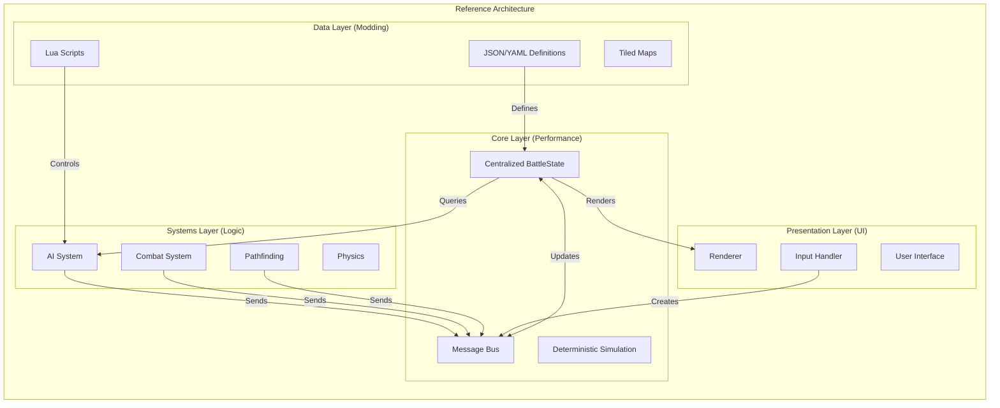

# Chapter 10: Architectural Recommendations for Tactical Wargames

## The Answer Key: What to Do and Why

---

*After analyzing three distinct implementations spanning nearly two decades, this chapter provides concrete, actionable recommendations for building your own Close Combat-inspired tactical wargame. This is not theory—it is the distillation of what worked, what didn't, and what you should do differently.*

---

## 10.1 Decision Framework by Game Type

The architecture you choose must serve your game's primary purpose. Different game types demand different architectural commitments.

### 10.1.1 Competitive Multiplayer → Use OpenCombat Patterns

**Why**: Competitive multiplayer demands determinism, fairness, and anti-cheat. Players will exploit any ambiguity in game state.

**Required Patterns**:
- **Server-authoritative simulation**: Server validates all state changes
- **Deterministic lockstep**: Fixed timestep, seeded RNG, reproducible physics
- **Three-tier state hierarchy**: Phase → Behavior → Gesture for clear state relationships
- **Message-driven updates**: All state changes flow through messages (enables replay and sync)
- **Type-safe indices**: Compile-time prevention of entity reference bugs

**Technology Choices**:
```
Language: Rust (memory safety) or C++17 (performance, ecosystem)
Networking: ZeroMQ, ENet, or custom UDP with reliability layer
State Sync: Event sourcing (messages) not snapshots
Physics: Fixed-point or deterministic floating-point
```

**Example: Deterministic State Update**
```rust
// OpenCombat pattern: All changes via messages
enum BattleStateMessage {
    Soldier(SoldierIndex, SoldierMessage),
    SetPhase(Phase),
    PushBulletFire(BulletFire),
}

fn tick(state: &mut BattleState, messages: &[BattleStateMessage]) {
    for msg in messages {
        state.apply(msg);  // Deterministic application
    }
}
```

### 10.1.2 Single-Player Immersive → Use OpenCombat-SDL Patterns

**Why**: Single-player games prioritize simulation depth, emergent behavior, and the "feel" of combat over synchronization. You want rich interactions, not message passing overhead.

**Recommended Patterns**:
- **Bitfield state system**: 64 orthogonal states for emergent capability combinations
- **Automatic prerequisite chaining**: Actions declare requirements, system finds prerequisites
- **Deep inheritance hierarchies**: Natural modeling of "Soldier IS-A Object"
- **Direct method calls**: Simple, synchronous, intuitive

**Technology Choices**:
```
Language: C++17 (performance, control, ecosystem)
Graphics: SDL2, Raylib, or SFML
Physics: Box2D (if needed) or custom deterministic
Pathfinding: A* with custom heuristics
```

**Example: Automatic Prerequisite Chain**
```cpp
// OpenCombat-SDL pattern: Declarative action requirements
void Soldier::AddAction(Action* action) {
    // Check what state we need
    int prereq = CheckRequirements(action->Index, &_currentState);
    
    // Automatically insert prerequisite actions
    while (prereq != -1) {
        Action* prereqAction = new Action(prereq);
        _actionQueue.push_front(prereqAction);  // Insert before
        prereq = CheckRequirements(prereqAction, &_currentState);
    }
    
    _actionQueue.push_back(action);
}

// Example: Prone soldier ordered to run
// Automatically inserts: StandUp → RunTo
// No player micromanagement required
```

### 10.1.3 Modding-Focused → Use CloseCombatFree Patterns

**Why**: If your community creates content, you need runtime flexibility. Recompilation is a barrier that kills creativity.

**Recommended Patterns**:
- **Declarative composition**: QML-style entity definitions
- **Runtime instantiation**: Load units/scenarios from data files
- **Hot reload**: File watcher detects changes, updates game without restart
- **Property binding**: Reactive UI that IS the game logic

**Technology Choices**:
```
Language: C++17/Qt5 (QML) or C# (Unity) or JavaScript/Electron
Scripting: Lua, Wren, or QML itself
Data: JSON, YAML, or XML
Hot Reload: File watching + dynamic reloading
```

**Example: Runtime Unit Creation**
```qml
// CloseCombatFree pattern: Declarative unit definition
Tank {
    id: tank
    unitType: "Custom Tank"
    maxSpeed: 15
    
    Hull { id: hull }
    Turret { id: turret }
    
    Soldier { role: "Commander" }
    Soldier { role: "Gunner" }
    Soldier { role: "Driver" }
}
```

### 10.1.4 Hybrid/Commercial → Synthesize All Three

**The Recommended Architecture for 2026+**:

```
┌─────────────────────────────────────────────────────────────┐
│                    HYBRID ARCHITECTURE                     │
├─────────────────────────────────────────────────────────────┤
│                                                             │
│  CORE SIMULATION (OpenCombat patterns)                     │
│  ├── Deterministic game loop                               │
│  ├── Message-driven state updates                          │
│  ├── Server-authoritative (even for single-player)         │
│  └── Fixed timestep physics                                │
│                                                             │
│  ENTITY DEFINITIONS (CloseCombatFree patterns)           │
│  ├── JSON/YAML data files                                  │
│  ├── Lua scripting for behaviors                           │
│  ├── Hot reload for rapid iteration                        │
│  └── Component composition over inheritance                │
│                                                             │
│  SIMULATION DEPTH (OpenCombat-SDL patterns)               │
│  ├── Bitfield capability tracking                          │
│  ├── Automatic prerequisite resolution                     │
│  └── Rich state interactions                               │
│                                                             │
└─────────────────────────────────────────────────────────────┘
```

**Why this synthesis works**:
1. **Core simulation** uses deterministic patterns for multiplayer capability
2. **Entity definitions** use declarative patterns for modding
3. **Simulation depth** uses bitfield patterns for emergent behavior
4. You get determinism AND moddability AND depth

---

## 10.2 Core Architecture Recommendations

For each system, here are the concrete recommendations derived from comparative analysis:

### 10.2.1 State Management

**Recommendation**: Use State Hierarchy with Bitfield Overlay

```
Three-Tier Hierarchy for Timescale Separation:
├── Phase (Game level: Deployment, Battle, End)
├── Behavior (Tactical: MoveTo, Defend, Engage)
└── Gesture (Physical: Idle, Aiming, Firing with completion time)

Bitfield for Orthogonal Capabilities:
├── CanMove, CanFire, CanSee
├── IsProne, IsSuppressed, IsInBuilding
└── IsCrewMember, IsVehicleOccupant
```

**Why**: Hierarchy provides clear relationships and timescale separation. Bitfield provides efficient capability queries. Combined, they solve both organizational and performance needs.

**Implementation Pattern**:
```cpp
struct UnitState {
    // Hierarchy (from OpenCombat)
    Phase phase;           // Global game phase
    Behavior behavior;     // Current tactical behavior
    Gesture gesture;       // Immediate physical action
    
    // Bitfield overlay (from OpenCombat-SDL)
    uint64_t capabilities; // CanMove | CanFire | IsProne
    uint64_t conditions;   // IsSuppressed | IsWounded
};

// Query capabilities efficiently
bool canFire = (state.capabilities & CAN_FIRE) == CAN_FIRE;
```

**Language-Specific Implementations**:

**C++**:
```cpp
enum class Capability : uint64_t {
    CanMove = 1 << 0,
    CanFire = 1 << 1,
    IsProne = 1 << 4,
    IsSuppressed = 1 << 6,
};

constexpr uint64_t operator|(Capability a, Capability b) {
    return static_cast<uint64_t>(a) | static_cast<uint64_t>(b);
}
```

**Rust**:
```rust
bitflags! {
    struct Capabilities: u64 {
        const CAN_MOVE = 1 << 0;
        const CAN_FIRE = 1 << 1;
        const IS_PRONE = 1 << 4;
    }
}
```

**C#**:
```csharp
[Flags]
public enum Capabilities : ulong {
    CanMove = 1 << 0,
    CanFire = 1 << 1,
    IsProne = 1 << 4,
}
```

### 10.2.2 Unit Model

**Recommendation**: Use Component Composition with Aggregate Pattern for Squads

**Why**: 
- Inheritance creates rigid hierarchies
- Composition enables novel unit types (flying tanks, crewed artillery)
- Aggregate pattern naturally models squad relationships

**Universal Pattern**:
```pseudocode
Entity Unit {
    uuid: EntityId
    components: Map<ComponentType, Component>
    
    // Aggregation (not inheritance)
    parentSquad: Option<EntityReference>
    children: List<EntityReference>
}

Component Transform {
    position: Vec2
    rotation: float
    scale: Vec2
}

Component Health {
    current: int
    max: int
}

Component SquadMembership {
    squadId: SquadId
    role: Role  // Leader, Rifleman, MachineGunner
}

Aggregate Squad {
    leader: EntityReference
    members: List<EntityReference>
    formation: FormationType
    
    function issueOrder(order: Order) {
        // Distribute to members based on role
        for member in members {
            roleOrder = adaptOrderForRole(order, member.role)
            member.addOrder(roleOrder)
        }
    }
}
```

**Implementation Pattern (C++)**:
```cpp
// Type-safe indices instead of pointers
struct SoldierIndex { size_t value; };
struct VehicleIndex { size_t value; };

struct Soldier {
    Transform transform;
    Health health;
    Behavior behavior;
    Weapon weapon;
    SquadId squad;  // Reference, not ownership
};

struct Squad {
    SoldierIndex leader;
    std::vector<SoldierIndex> members;
    FormationType formation;
};
```

**Implementation Pattern (Rust)**:
```rust
pub struct Soldier {
    pub transform: Transform,
    pub health: Health,
    pub behavior: Behavior,
    pub weapon: Option<Weapon>,
    pub squad: Option<SquadId>,
}

pub struct Squad {
    pub leader: SoldierIndex,
    pub members: Vec<SoldierIndex>,
    pub formation: FormationType,
}
```

### 10.2.3 Order System

**Recommendation**: Use Two-Tier (Orders→Actions) with Prerequisite Chain

**Why**:
- Two tiers (Orders→Actions) balance player control with automation
- Prerequisite chain eliminates micromanagement
- Data-driven action definitions enable modding

**Universal Pattern**:
```pseudocode
// Tier 1: Orders (player intent)
enum Order {
    MoveTo(destination, speed),
    Defend(position, facing),
    Engage(target),
    Ambush(position, arc),
    Stop,
}

// Tier 2: Actions (physical execution)
enum Action {
    StandUp,
    LieDown,
    WalkTo(destination),
    RunTo(destination),
    CrawlTo(destination),
    AimAt(target),
    FireAt(target),
    Reload,
}

// Action requirements (data-driven)
table ActionRequirements {
    StandUp: { requires: [], adds: [Standing], removes: [Prone, Crouching] }
    StandingFire: { requires: [Standing, Reloaded], adds: [Firing], removes: [Reloaded] }
    LieDown: { requires: [Standing], adds: [Prone], removes: [Standing] }
}

function queueAction(unit, action) {
    // Automatic prerequisite resolution
    currentState = unit.getCurrentState()
    requiredState = action.getRequiredState()
    
    while currentState != requiredState {
        prereqAction = findActionThatAchieves(requiredState)
        unit.actionQueue.push_front(prereqAction)
        currentState = prereqAction.getResultState()
    }
    
    unit.actionQueue.push_back(action)
}
```

**Example Flow**:
```
Player issues: "Fire at enemy"
Soldier state: Prone, Empty magazine

System automatically inserts:
1. StandUp (prerequisite for firing)
2. Reload (prerequisite for having ammo)
3. FireAtTarget (the requested action)

Player sees smooth, intelligent behavior without micromanagement
```

### 10.2.4 AI System

**Recommendation**: Use Reactive Behavior System with Optional Proactive Planning

**Why**:
- Reactive AI handles immediate threats (survival first)
- Behavior trees provide clear, debuggable logic
- GOAP (Goal-Oriented Action Planning) can be added for squad-level tactics

**Universal Pattern (Behavior Tree)**:
```pseudocode
// Priority-ordered behavior tree
Selector Root [
    // Priority 1: Survival (cannot be overridden)
    Sequence [
        Condition: IsUnderHeavyFire
        Selector [
            Sequence [
                Condition: HasNearbyCover
                Action: MoveToCover
            ]
            Action: ReturnFire
        ]
    ]
    
    // Priority 2: Engage threats
    Sequence [
        Condition: CanSeeEnemy
        Action: EngageTarget
    ]
    
    // Priority 3: Follow orders
    Sequence [
        Condition: HasPendingOrder
        Action: ExecuteOrder
    ]
    
    // Priority 4: Idle
    Action: IdleScan
]
```

**Data-Driven Configuration**:
```yaml
# behaviors/infantry_standard.yaml
behavior_tree:
  type: selector
  children:
    - type: sequence
      name: "Survival Response"
      children:
        - type: condition
          check: "under_fire > DANGER_THRESHOLD"
        - type: selector
          children:
            - type: sequence
              children:
                - type: condition
                  check: "has_cover_within(20)"
                - type: action
                  execute: "move_to_cover"
            - type: action
              execute: "return_fire"
    
    - type: sequence
      name: "Combat Response"
      children:
        - type: condition
          check: "visible_enemies.count > 0"
        - type: action
          execute: "engage_best_target"
```

### 10.2.5 World and Terrain System

**Recommendation**: Use Entity-Based World with Spatial Hashing

**Why**:
- Tile-based grids are fast but inflexible
- Pure entity systems are flexible but slow
- Spatial hashing provides O(1) queries with flexibility

**Universal Pattern**:
```pseudocode
struct World {
    // Entity storage (contiguous for cache efficiency)
    soldiers: Vec<Soldier>
    vehicles: Vec<Vehicle>
    props: Vec<Prop>
    
    // Spatial index for queries
    spatialHash: SpatialHash<EntityId>
    
    // Terrain data (grid-based for pathfinding)
    terrainGrid: Grid<TerrainType>
    elevationGrid: Grid<float>
}

struct SpatialHash {
    cellSize: float = 100.0
    cells: Map<uint64_t, List<EntityId>>
    
    function hash(position: Vec2) -> uint64_t {
        x = position.x / cellSize
        y = position.y / cellSize
        return (x << 32) | y
    }
    
    function queryRadius(center: Vec2, radius: float) -> List<EntityId> {
        results = []
        radiusInCells = radius / cellSize + 1
        
        for dy in -radiusInCells..radiusInCells {
            for dx in -radiusInCells..radiusInCells {
                cellHash = hash(center + Vec2(dx, dy) * cellSize)
                for entityId in cells[cellHash] {
                    if distance(center, getPosition(entityId)) <= radius {
                        results.add(entityId)
                    }
                }
            }
        }
        
        return results
    }
}
```

**Terrain Representation**:
```json
{
    "terrain_types": [
        {
            "id": "tall_grass",
            "cover": { "standing": 0.1, "prone": 0.5 },
            "hindrance": { "pedestrian": 0.67, "vehicle": 0.5 },
            "opacity": 0.3,
            "passable": true
        },
        {
            "id": "stone_wall",
            "cover": { "standing": 0.8, "prone": 0.9 },
            "hindrance": { "pedestrian": 0.0, "vehicle": 0.0 },
            "opacity": 1.0,
            "passable": false
        }
    ]
}
```

### 10.2.6 Modding System

**Recommendation**: Use Data-Driven JSON + Optional Scripting

**Why**:
- JSON/YAML for structure (schemas, validation)
- Lua/Wren for behavior (performance, sandboxing)
- Hot reload for iteration (file watching)
- Mod manager for dependencies (load order, conflicts)

**Universal Pattern**:
```
mods/
├── mod_name/
│   ├── mod.json           # Metadata
│   ├── dependencies.json  # Required mods
│   ├── data/
│   │   ├── units/
│   │   ├── weapons/
│   │   └── vehicles/
│   ├── scripts/
│   │   ├── ai/
│   │   └── behaviors/
│   ├── maps/
│   └── assets/
│       ├── images/
│       └── audio/
```

**Mod Metadata (mod.json)**:
```json
{
    "name": "Elite Units Pack",
    "version": "1.2.0",
    "author": "ModderName",
    "description": "Adds special forces with unique abilities",
    "game_version": ">= 1.0.0",
    "dependencies": [
        { "name": "base_game", "version": ">= 1.0.0" }
    ],
    "conflicts": ["incompatible_mod"],
    "load_order": 100
}
```

**Data-Driven Unit Definition**:
```yaml
# data/units/sniper_team.yaml
entity_type: infantry
name: Sniper Team

components:
  visual:
    sprite: sprites/sniper_team.png
  
  squad:
    max_size: 2
    roles: [spotter, sniper]
  
  equipment:
    spotter: [binoculars, rifle]
    sniper: [sniper_rifle]
  
  ai:
    script: ai/sniper_team.lua

attributes:
  camouflage: 0.9
  range: 300
  accuracy: 0.95
```

**Scriptable Behavior (Lua)**:
```lua
-- scripts/ai/sniper_team.lua
function onInit(team)
    team.state = "HIDDEN"
    team.target = nil
end

function onUpdate(team, dt, world)
    -- Find targets
    if not team.target then
        team.target = world.findTarget(team, {
            maxRange = team.attributes.range,
            visibleOnly = true
        })
    end
    
    -- Engage if target found
    if team.target and team.state ~= "FIRING" then
        if world.hasLineOfSight(team.spotter, team.target) then
            team.state = "AIMING"
            team.sniper:aimAt(team.target)
            
            -- Wait for aim
            world.schedule(2.0, function()
                team.state = "FIRING"
                team.sniper:fire()
            end)
        end
    end
    
    -- Relocate if compromised
    if team.isUnderFire then
        team.state = "RELOCATING"
        local newPos = world.findConcealedPosition(team)
        team:moveTo(newPos)
    end
end
```

---

## 10.3 Technology-Agnostic Patterns

The following patterns are abstract—implement them in any language using appropriate constructs.

### 10.3.1 Pattern: Type-Safe Entity References

**Problem**: Pointers/references create lifetime and ownership issues
**Solution**: Use type-safe indices with central storage

**Universal Concept**:
```pseudocode
// Instead of pointers
Soldier* soldier;  // Dangerous: dangling, null, ownership unclear

// Use indices
SoldierIndex idx;  // Just a number
Soldier& soldier = world.soldiers[idx.value];  // Access via central storage
```

**Language Implementations**:

**C++**:
```cpp
struct SoldierIndex { 
    size_t value; 
    explicit SoldierIndex(size_t v) : value(v) {}
};

struct VehicleIndex { 
    size_t value; 
    explicit VehicleIndex(size_t v) : value(v) {}
};

// Compile-time type safety
void healSoldier(SoldierIndex idx);      // OK
void healSoldier(VehicleIndex idx);      // Compile error!
```

**Rust**:
```rust
#[derive(Debug, Clone, Copy)]
pub struct SoldierIndex(pub usize);

#[derive(Debug, Clone, Copy)]
pub struct VehicleIndex(pub usize);

// Type safety at compile time
let soldier = &world.soldiers[soldier_idx.0];  // OK
let soldier = &world.soldiers[vehicle_idx.0];  // Compile error!
```

**C#**:
```csharp
public readonly struct SoldierIndex {
    public readonly int Value;
    public SoldierIndex(int value) => Value = value;
}

// Cannot accidentally mix up indices
public void HealSoldier(SoldierIndex idx) { }
public void RepairVehicle(VehicleIndex idx) { }
```

**TypeScript**:
```typescript
type SoldierIndex = { readonly kind: 'soldier'; readonly value: number };
type VehicleIndex = { readonly kind: 'vehicle'; readonly value: number };

const createSoldierIndex = (value: number): SoldierIndex => 
    ({ kind: 'soldier', value });

// Type system prevents mixing
```

### 10.3.2 Pattern: Message-Driven State Updates

**Problem**: Direct mutation makes debugging, replay, and networking difficult
**Solution**: All changes flow through messages

**Universal Concept**:
```pseudocode
// Instead of direct mutation
soldier.health -= damage;  // Who changed this? When? Why?

// Use messages
message SoldierDamaged {
    soldierId: SoldierIndex
    damage: int
    attacker: EntityReference
}

bus.publish(SoldierDamaged(soldierIdx, 10, attacker));
// Later: battleState.apply(message)
```

**Benefits**:
1. **Debugging**: Log shows all state changes
2. **Replay**: Reprocess message log to recreate any game
3. **Networking**: Messages serialize naturally
4. **Determinism**: Same messages + same initial state = same result

### 10.3.3 Pattern: Spatial Partitioning

**Problem**: Finding entities in radius is O(n)
**Solution**: Spatial hash for O(1) insertion, O(cells_in_radius) query

**Universal Concept**:
```pseudocode
struct SpatialHash {
    cellSize: float
    
    // Insert entity at position
    insert(entityId, position) {
        cell = position / cellSize
        cells[hash(cell)].add(entityId)
    }
    
    // Query entities within radius
    queryRadius(center, radius) -> List<EntityId> {
        results = []
        for cell in cellsOverlapping(center, radius) {
            for entityId in cells[hash(cell)] {
                if distance(center, getPosition(entityId)) <= radius {
                    results.add(entityId)
                }
            }
        }
        return results
    }
}
```

### 10.3.4 Pattern: Component Composition

**Problem**: Inheritance creates rigid hierarchies
**Solution**: Compose entities from reusable components

**Universal Concept**:
```pseudocode
// Instead of inheritance
class Sniper : public Soldier { ... }  // Rigid

// Use composition
Entity soldier {
    Transform { x, y, rotation }
    Health { current, max }
    Weapon { type: "sniper_rifle" }
    AI { behavior: "sniper_ai.lua" }
}

// Query entities with specific components
for entity in world.query([Transform, Weapon, AI]) {
    // Process sniper AI
}
```

---

## 10.4 The Hybrid Reference Architecture

After analyzing all three Close Combat clones, here is the synthesized reference architecture for a modern tactical wargame:

### 10.4.1 Architecture Overview



### 10.4.2 Key Design Decisions

| System | Pattern | Implementation |
|--------|---------|----------------|
| **State Management** | Three-tier hierarchy + Bitfield | Phase→Behavior→Gesture + Capability flags |
| **Entity Model** | Component composition | Entities are bags of components |
| **Entity References** | Type-safe indices | SoldierIndex, VehicleIndex wrappers |
| **Order System** | Two-tier with prerequisites | Orders→Actions + automatic chain |
| **AI** | Behavior trees | Reactive + optional GOAP |
| **World** | Entity-based + Spatial hash | Contiguous storage + spatial index |
| **Modding** | JSON + Lua | Data definitions + scripting |
| **Networking** | Message-driven | Event sourcing for sync |
| **Determinism** | Fixed timestep | Seeded RNG, no floating-point accumulation |

### 10.4.3 Technology Stack Recommendations

**For Maximum Performance (AAA/Competitive)**:
```
Language: C++20 or Rust
Graphics: Custom Vulkan/DirectX12 or wgpu
Physics: Custom deterministic or Jolt Physics
Networking: Custom UDP with reliability layer
Scripting: LuaJIT or Wren (optional, not hot path)
Build: CMake or Cargo
```

**For Rapid Development (Indie/First Game)**:
```
Language: C# (Unity/Godot) or C++ (SDL2/Raylib)
Graphics: Unity/Godot engine or SDL2
Physics: Unity Physics2D or Box2D
Networking: Mirror (Unity) or custom
Scripting: Lua or C# (hot reload)
Build: Editor-based or simple Makefile
```

**For Maximum Moddability (Community-Focused)**:
```
Language: C++17/Qt5 or C# (Unity)
Graphics: Qt/QML or Unity
Physics: Qt's built-in or Unity
Networking: Qt Network or Photon (Unity)
Scripting: QML or Lua (full modding API)
Build: qmake or Unity
```

### 10.4.4 Directory Structure

```
my-tactical-game/
├── src/
│   ├── core/              # Core systems (world, entities, messages)
│   ├── simulation/        # Game logic (combat, orders, AI)
│   ├── ai/                # Behavior trees, GOAP
│   ├── graphics/          # Rendering (or use engine)
│   ├── input/             # Input handling
│   ├── network/           # Multiplayer (optional)
│   └── main.cpp
├── include/               # Public headers
├── data/
│   ├── units/             # Unit definitions (JSON)
│   ├── weapons/           # Weapon data (JSON)
│   ├── behaviors/         # AI behaviors (YAML/JSON)
│   └── scenarios/         # Mission definitions (JSON)
├── scripts/
│   ├── ai/                # Lua AI scripts
│   └── behaviors/           # Unit behavior scripts
├── maps/                  # Tiled TMX files
├── assets/
│   ├── images/            # Sprites, textures
│   ├── audio/             # Sound effects, music
│   └── fonts/
├── mods/                  # Mods directory
├── docs/                  # Documentation
├── tests/                 # Unit tests
├── CMakeLists.txt        # Build configuration
└── README.md
```

---

## 10.5 Checklist for New Projects

### 10.5.1 Pre-Development Questions

Before writing a single line of code, answer these questions:

**Game Design**:
- [ ] Single-player, multiplayer, or both?
- [ ] Competitive multiplayer (requires determinism)?
- [ ] Modding support needed?
- [ ] Target audience (hardcore wargamers vs casual)?
- [ ] Scale (max units on screen)?

**Technical**:
- [ ] Target platforms (PC, mobile, console)?
- [ ] Team size and expertise?
- [ ] Timeline (rapid prototype vs long-term)?
- [ ] Performance constraints (mobile vs desktop)?
- [ ] Budget (engine licensing costs)?

**Architecture Decisions**:
- [ ] Language (based on team and performance needs)?
- [ ] State management pattern (hierarchy vs bitfield vs hybrid)?
- [ ] Entity model (inheritance vs composition vs ECS)?
- [ ] Modding approach (data-only vs scripting)?
- [ ] Networking model (client-authoritative vs server-authoritative)?

### 10.5.2 Architecture Validation Checklist

**State Management**:
- [ ] Can a unit be in multiple orthogonal states simultaneously?
- [ ] Can you serialize and deserialize game state completely?
- [ ] Can you query "what is this unit doing?" easily?
- [ ] Are state transitions explicit (not scattered in code)?
- [ ] Can two clients stay synchronized (determinism check)?

**Entity System**:
- [ ] Can you add new unit types without code changes?
- [ ] Are entity references type-safe (can't mix Soldier/Vehicle)?
- [ ] Is memory layout cache-friendly (contiguous arrays)?
- [ ] Can entities be composed of reusable components?
- [ ] Does the system scale to target entity count?

**Order System**:
- [ ] Can players issue orders without micromanagement?
- [ ] Are prerequisites handled automatically?
- [ ] Can AI override orders appropriately (survival > orders)?
- [ ] Is the order queue visible and debuggable?
- [ ] Can orders be chained/composed?

**AI System**:
- [ ] Does AI react to threats immediately?
- [ ] Can AI show initiative (not pure obedience)?
- [ ] Is AI behavior configurable/scriptable?
- [ ] Can you debug why an AI made a decision?
- [ ] Does AI use cover and tactical positioning?

**World System**:
- [ ] Can you query entities in radius efficiently?
- [ ] Is line-of-sight realistic (accumulated opacity)?
- [ ] Does terrain affect movement meaningfully?
- [ ] Can cover be evaluated and used by AI?
- [ ] Is the world representation moddable?

**Modding**:
- [ ] Can modders add new units without recompilation?
- [ ] Can modders add new behaviors/script AI?
- [ ] Is there a mod manager (dependencies, load order)?
- [ ] Can modders create new scenarios/maps?
- [ ] Is hot reload supported for rapid iteration?

### 10.5.3 Testing Requirements

**Unit Tests** (Required):
```cpp
TEST(StateManagement, CanCombineOrthogonalStates) {
    State s;
    s.set(Prone);
    s.set(Reloading);
    s.set(Suppressed);
    
    EXPECT_TRUE(s.isSet(Prone));
    EXPECT_TRUE(s.isSet(Reloading));
    EXPECT_TRUE(s.isSet(Suppressed));
}

TEST(OrderSystem, PrerequisiteChainAutomatic) {
    World world;
    Soldier soldier = world.createSoldier();
    soldier.setState(Prone);
    soldier.weapon.ammo = 0;
    
    // Order soldier to fire
    soldier.addOrder(FireAt(enemy));
    
    // System should automatically queue: StandUp, Reload, Fire
    EXPECT_EQ(soldier.actionQueue.size(), 3);
    EXPECT_EQ(soldier.actionQueue[0].type, StandUp);
    EXPECT_EQ(soldier.actionQueue[1].type, Reload);
    EXPECT_EQ(soldier.actionQueue[2].type, Fire);
}

TEST(Determinism, SameInputsProduceSameOutputs) {
    // Run simulation twice with same seed
    State state1 = runSimulation(seed, inputs);
    State state2 = runSimulation(seed, inputs);
    
    EXPECT_EQ(hash(state1), hash(state2));
}
```

**Integration Tests** (Required):
- [ ] Full scenario playthrough (no crashes)
- [ ] AI behavior validation (takes cover when fired upon)
- [ ] Mod loading and hot reload
- [ ] Network synchronization (if multiplayer)
- [ ] Save/load roundtrip (state survives serialization)

**Performance Tests** (Required):
- [ ] 100 units at 60 FPS (minimum)
- [ ] 500 units at 30 FPS (target)
- [ ] Spatial query benchmark (radius search)
- [ ] Pathfinding benchmark (A* with terrain)
- [ ] Memory usage under load

### 10.5.4 Milestone Checklist

**Phase 1: Foundation (Months 1-3)**
- [ ] Basic rendering (SDL2/engine)
- [ ] Entity system with type-safe indices
- [ ] State management (hierarchy + bitfield)
- [ ] Simple terrain (Tiled integration)
- [ ] One soldier moves on screen

**Phase 2: Gameplay (Months 4-6)**
- [ ] Order system with prerequisites
- [ ] Combat (shooting, damage)
- [ ] Terrain effects (cover, LOS)
- [ ] Basic AI (reactive behaviors)
- [ ] Squad command hierarchy

**Phase 3: Content (Months 7-9)**
- [ ] Data-driven unit definitions
- [ ] JSON scenario system
- [ ] Lua scripting support
- [ ] Mod loading system
- [ ] Hot reload implementation

**Phase 4: Polish (Months 10-12)**
- [ ] UI/UX improvements
- [ ] Sound effects and music
- [ ] Visual effects
- [ ] Performance optimization
- [ ] 500 units at 60 FPS

**Phase 5: Multiplayer (Optional, Months 13-15)**
- [ ] Deterministic simulation verified
- [ ] Network message system
- [ ] Client-server architecture
- [ ] Lag compensation
- [ ] Replay recording

---

## 10.6 Conclusion: The Path Forward

After analyzing three implementations across nearly two decades, certain truths emerge:

**What Always Works**:
1. **Separation of concerns** (Orders vs Behaviors vs Gestures)
2. **Type safety** (indices over pointers, enums over strings where possible)
3. **Data-driven design** (JSON/YAML over hardcoded values)
4. **Spatial partitioning** (essential for performance)
5. **Message-driven updates** (enables replay, debugging, networking)

**What Depends on Context**:
1. **Inheritance vs Composition** (inheritance for simple games, composition for complex)
2. **Determinism overhead** (worth it for multiplayer, unnecessary for single-player)
3. **Scripting complexity** (Lua for deep modding, JSON for simple data)
4. **State representation** (bitfields for capabilities, hierarchy for timescales)

**Final Recommendations**:

**For Your First Tactical Game**:
- Start with OpenCombat-SDL patterns (simpler, intuitive)
- Use C++ with SDL2 or C# with Unity
- Focus on single-player with rich simulation
- Add modding later if community forms

**For a Commercial Multiplayer Game**:
- Use OpenCombat patterns (deterministic, server-authoritative)
- Invest in Rust or C++ with custom networking
- Build multiplayer from day one (hard to retrofit)
- Prioritize replay and anti-cheat

**For a Community-Driven Modding Platform**:
- Use CloseCombatFree patterns (declarative, hot reload)
- Invest in QML or Unity with extensive scripting API
- Build mod manager and dependency system
- Documentation and examples are as important as features

**The Universal Truth**:

There is no single "right" architecture—only trade-offs. The Close Combat clones demonstrate that the same game concept can be implemented successfully with radically different approaches. Your job is to understand the trade-offs and choose based on your specific constraints.

**The patterns in this book provide the vocabulary. The recommendations in this chapter provide the guidance. Your execution determines the result.**

Choose wisely. Build carefully. Ship bravely.

---

**End of Chapter 10**

---

*This chapter synthesizes patterns from three Close Combat clone implementations: OpenCombat-SDL (2005-2008), CloseCombatFree (2011-2012), and OpenCombat (2020-2024). The recommendations represent the distilled wisdom of nearly two decades of tactical wargame development.*

*Version: 2.0 (February 2026)*
*Status: Final Recommendation Document*
