# Chapter 11: The Close Combat Pattern Language

## A Catalog of Universal Design Patterns for Tactical Wargames

---

*"A pattern is not an invention, but a discovery. It names a recurring solution that has been applied successfully in different contexts."* — Christopher Alexander

---

## 11.1 Introduction: Toward a Pattern Language

Over the preceding ten chapters, we dissected three distinct implementations of Close Combat-inspired tactical wargames. Each project—spanning nearly two decades of game development evolution—solved the same fundamental problems using different architectural approaches. Yet beneath the surface differences in language and framework, universal patterns emerge.

This chapter synthesizes those patterns into a formal catalog, structured in the tradition of the Gang of Four's *Design Patterns*. Each pattern includes:

- **Name and Intent**: What the pattern accomplishes
- **Problem**: The forces that make this pattern necessary
- **Solution**: The structural and behavioral approach
- **Mermaid Diagram**: Visual representation of the pattern
- **Variations**: How each of the three games implements it
- **Consequences**: Tradeoffs and design considerations
- **Related Patterns**: Connections to other patterns in this catalog

We also provide a **Decision Framework** at the end—guidance for choosing between pattern variations based on your project's specific constraints.

---

## 11.2 Pattern Catalog Overview

The patterns are organized into five categories:

| Category | Patterns | Purpose |
|----------|----------|---------|
| **Entity Patterns** | Soldier/Squad Aggregate, Weapon Team, Component Composition | How units are structured and related |
| **State Patterns** | State Hierarchy, Order Queue, Stance System, Morale Cascade | How unit behavior is modeled |
| **Command Patterns** | Command Abstraction, Formation Control, Prerequisite Chain | How player intent flows to action |
| **Perception Patterns** | Line of Sight, Threat Assessment, Cover Evaluation | How units perceive the world |
| **System Patterns** | Spatial Partitioning, Message Bus, Deterministic Simulation | Infrastructure patterns |

---

## 11.3 Entity Patterns

### Pattern 1: Soldier/Squad Aggregate Pattern

#### Intent
Model the hierarchical relationship between individual soldiers and their organizational squad, enabling both autonomous individual behavior and coordinated group action.

#### Problem
Tactical wargames require control at multiple granularities:
- Individual soldiers have unique attributes (health, ammo, morale)
- Squads must move and fight as coordinated units
- Orders issued to squads must distribute to members appropriately
- Loss of squad members affects squad effectiveness

Without clear aggregation, code becomes complex with manual synchronization.

#### Solution

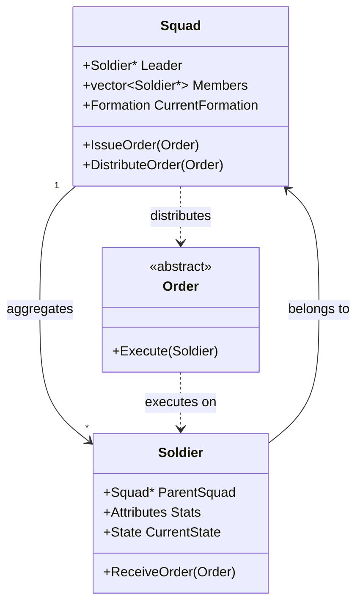

**Key Elements:**
1. **Bidirectional references**: Squad knows its members; soldiers know their squad
2. **Leader designation**: One member is the "point man" for pathfinding
3. **Order distribution**: Squad receives orders, adapts them for members
4. **Formation positions**: Members calculate positions relative to leader

#### Variations

**OpenCombat-SDL**: Deep inheritance with `Squad : public Object`
- Squad inherits from Object base class
- Orders stored in `Object::_orders` queue
- `Squad::Simulate()` delegates to members
- Formation positions calculated in `HandleMoveOrder()`

**OpenCombat**: Index-based composition
```rust
struct Squad {
    leader: SoldierIndex,
    members: Vec<SoldierIndex>,
}
```
- Lightweight struct with indices
- Dynamic leader promotion when leader dies
- No inheritance overhead

**CloseCombatFree**: QML parent-child hierarchy
```qml
Squad {
    Soldier { squad: parent; role: "leader" }
    Soldier { squad: parent; role: "rifleman" }
}
```
- Visual tree IS the squad hierarchy
- Parent property provides automatic relationship

#### Consequences

**Benefits:**
- Natural military hierarchy mapping
- Squad-level commands simplify player control
- Formation system enables tactical coordination
- Morale can propagate through squad

**Tradeoffs:**
- Bidirectional references complicate memory management
- Formation calculations add overhead
- Leader death requires handling

**When to Use:** Any game with group-based unit control

#### Related Patterns
- **Formation Control Pattern**: Squad uses formations
- **Command Abstraction Pattern**: Orders flow through squad
- **State Hierarchy Pattern**: Squad state aggregates member states

---

### Pattern 2: Weapon Team Pattern

#### Intent
Model weapon systems that require multiple crew members to operate, where each crew position has distinct responsibilities and the weapon cannot function without essential crew.

#### Problem
Some military assets require crews:
- Tanks need driver, gunner, loader, commander
- Machine gun teams need gunner and ammo bearer
- Mortar squads need multiple soldiers

The game must model:
- Crew positions with specific roles
- Weapon effectiveness based on crew competence
- Crew casualties affecting weapon capability
- Crew abandoning destroyed vehicles

#### Solution

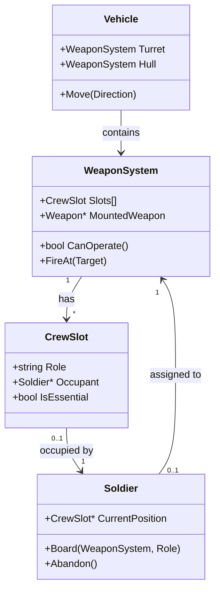

**Key Elements:**
1. **Crew slots**: Defined positions with roles (driver, gunner, etc.)
2. **Essential flag**: Some positions required for operation
3. **Competence modifiers**: Crew skill affects weapon performance
4. **Abandon protocol**: Crew evacuates when system destroyed

#### Variations

**OpenCombat-SDL**: Vehicle class with crew array
```cpp
class Vehicle : public Object {
    struct CrewSlot {
        Soldier* CrewMember;
        Weapon* MountedWeapon;
    };
    std::vector<CrewSlot> CrewSlots;
    
    bool CanMove() { return HasCrewInRole("Driver"); }
    bool CanFire() { return HasCrewInRole("Gunner"); }
};
```

**OpenCombat**: Bidirectional boarding maps
```rust
struct BattleState {
    soldiers_on_board: HashMap<SoldierIndex, (VehicleIndex, OnBoardPlace)>,
    vehicle_board: HashMap<VehicleIndex, HashMap<OnBoardPlace, SoldierIndex>>,
}
```
- O(1) lookup: "What vehicle is this soldier in?"
- O(1) lookup: "Who is in this vehicle position?"

**CloseCombatFree**: QML composition
```qml
Tank {
    Soldier { role: "Commander"; id: commander }
    Soldier { role: "Gunner"; id: gunner }
    Soldier { role: "Loader"; id: loader }
    Soldier { role: "Driver"; id: driver }
    
    function canFire() {
        return gunner !== null && loader !== null;
    }
}
```

#### Consequences

**Benefits:**
- Realistic crew modeling
- Tactical depth (kill driver to stop tank)
- Skill differentiation (veteran gunner = better accuracy)
- Natural damage model (crew casualties)

**Tradeoffs:**
- Complex state management
- Crew AI for abandoned vehicles
- UI complexity showing crew positions

**When to Use:** Games with crewed vehicles or heavy weapons

#### Related Patterns
- **Component Composition Pattern**: Crew slots as components
- **State Hierarchy Pattern**: Crew states aggregate to vehicle state

---

### Pattern 3: Component Composition Pattern

#### Intent
Build complex entities by composing simple, reusable components rather than using deep inheritance hierarchies.

#### Problem
Inheritance-based entity design becomes rigid:
- "Diamond problem" with multiple inheritance
- Deep hierarchies are fragile
- Adding new behaviors requires modifying base classes
- Hard to create novel combinations (flying tank?)

#### Solution

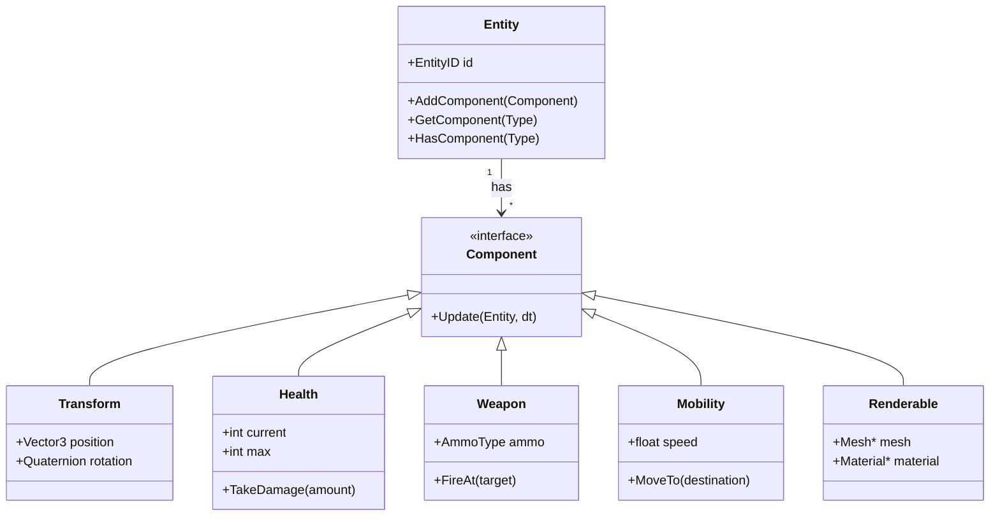

**Key Elements:**
1. **Entity as container**: Just an ID with component list
2. **Components as data**: Pure data or data+behavior
3. **Composition over inheritance**: Mix and match components
4. **System processing**: Systems iterate over entities with specific components

#### Variations

**OpenCombat-SDL**: Limited composition via attributes
- Soldier has Weapon* array (max 3)
- Attributes struct for stats
- Mostly inheritance-based

**OpenCombat**: Modified ECS with embedded components
```rust
struct Soldier {
    transform: Transform,
    health: Health,
    weapon: Option<Weapon>,
    behavior: Behavior,
}
```
- Components as struct fields
- Type-safe at compile time
- Good cache locality

**CloseCombatFree**: Full QML composition
```qml
Unit {
    Transform { x: 100; y: 200 }
    Health { max: 100; current: 100 }
    Weapon { type: "Rifle" }
    Mobility { maxSpeed: 2.5 }
    Renderable { sprite: "soldier.png" }
}
```
- Visual and logic unified
- Declarative composition
- Runtime modifiable

#### Consequences

**Benefits:**
- Flexible entity creation
- No inheritance fragility
- Easy to add new capabilities
- Data-driven entity definitions

**Tradeoffs:**
- Component lookup overhead
- More complex architecture
- Debugging scattered across components

**When to Use:** Games with diverse entity types requiring flexible composition

#### Related Patterns
- **Soldier/Squad Aggregate Pattern**: Squad is entity with member components
- **Factory Pattern**: Create entities from component templates

---

## 11.4 State Patterns

### Pattern 4: State Hierarchy Pattern

#### Intent
Organize unit behavior into hierarchical states that operate on different timescales, from strategic decisions down to immediate physical actions.

#### Problem
Unit behavior operates on multiple timescales simultaneously:
- **Strategic** (minutes): Overall mission, squad objectives
- **Tactical** (seconds): Current action (moving, defending, engaging)
- **Physical** (milliseconds): Animations, firing, reloading

Without clear separation, state management becomes spaghetti code with flags everywhere.

#### Solution

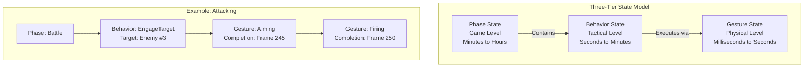

**Key Elements:**
1. **Phase**: Global game state (Deployment, Battle, End)
2. **Behavior**: Tactical decisions (MoveTo, Defend, Engage)
3. **Gesture**: Immediate actions (Idle, Aiming, Firing, Reloading)
4. **Temporal tracking**: Gestures track completion time

#### Variations

**OpenCombat-SDL**: Flat bitfield (partial implementation)
```cpp
class State {
    uint64_t bits;  // 64 orthogonal states
};
// Single tier - all states in bitfield
```
- No inherent hierarchy
- Must manually manage precedence

**OpenCombat**: Full three-tier hierarchy
```rust
enum Phase { Placement, Battle, End }
enum Behavior { MoveTo(Path), Defend(Angle), EngageSoldier(SoldierIndex), ... }
enum Gesture { Idle, Reloading(u64), Aiming(u64), Firing(u64) }
```
- Clean separation of concerns
- Natural timescale separation
- Gesture completion tracking

**CloseCombatFree**: Dual-state system
```cpp
QString unitStatus;  // Runtime: MOVING, FIRING, etc.
// QML states for visual representation
```
- Simpler mental model
- Single current status
- Less sophisticated but easier to understand

#### Consequences

**Benefits:**
- Clear mental model
- Appropriate update frequencies per tier
- Easy to determine "what is unit doing?"
- Gesture completion enables precise timing

**Tradeoffs:**
- More complex than flat states
- Must keep tiers synchronized
- Verbosity in code

**When to Use:** Any game with complex unit behavior on multiple timescales

#### Related Patterns
- **Command Abstraction Pattern**: Orders translate to behaviors
- **Prerequisite Chain Pattern**: Gestures chain automatically

---

### Pattern 5: Order Queue Pattern

#### Intent
Allow units to accept multiple commands in sequence, executing them one at a time with automatic state transitions between orders.

#### Problem
Players need to:
- Issue multiple commands without waiting for completion
- Plan unit actions in advance
- Chain commands (move here, then attack, then defend)
- Cancel or modify pending orders

Without a queue, units can only do one thing at a time.

#### Solution

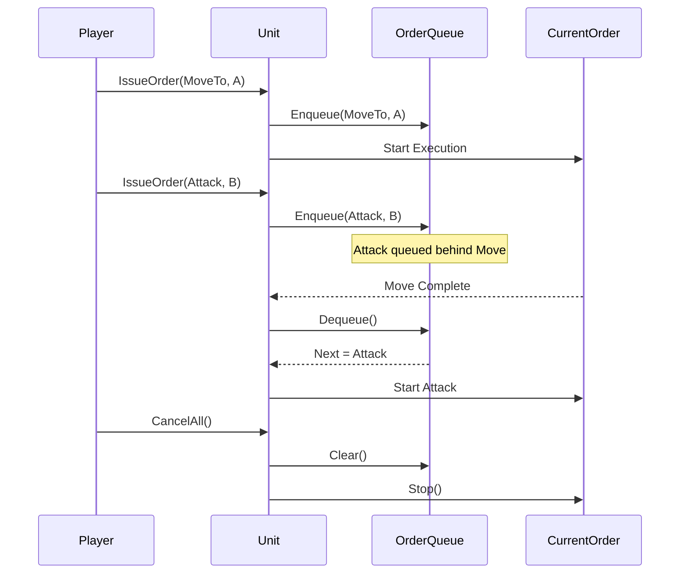

**Key Elements:**
1. **FIFO queue**: Orders processed in sequence
2. **Current order pointer**: Active order being executed
3. **Enqueue operation**: Add order to back of queue
4. **Completion callback**: Trigger next order when current completes
5. **Clear operation**: Cancel all pending orders

#### Variations

**OpenCombat-SDL**: Two-tier queue (Orders + Actions)
```cpp
class Object {
    std::deque<Order*> _orders;      // High-level
    std::deque<Action*> _actionQueue; // Low-level
};
// Orders decompose into Actions
```

**OpenCombat**: Order with chaining
```rust
enum Order {
    MoveTo(WorldPaths, Option<Box<Order>>), // Next order chained
}
// Orders can reference next order directly
```

**CloseCombatFree**: Simple QObjectList
```cpp
QObjectList mOrders;  // Sequential execution
void continueQueue();  // Called on completion
```
- Animation-driven completion
- Very simple implementation

#### Consequences

**Benefits:**
- Enables planning and coordination
- Reduces micromanagement
- Natural fit for real-time gameplay
- Visual feedback shows queue

**Tradeoffs:**
- Requires queue management UI
- Can become stale (orders for dead targets)
- Memory overhead for queue storage

**When to Use:** Real-time games where planning is important

#### Related Patterns
- **Command Pattern**: Orders are commands
- **State Hierarchy Pattern**: Orders map to behaviors

---

### Pattern 6: Stance System Pattern

#### Intent
Model how a unit's physical posture affects gameplay—movement speed, visibility, cover effectiveness, and weapon accuracy.

#### Problem
Real combatants choose postures:
- **Standing**: Fast movement, good visibility, poor cover
- **Crouching**: Moderate movement, moderate cover
- **Prone**: Slow movement, excellent cover, hard to spot

The game must model posture tradeoffs meaningfully.

#### Solution

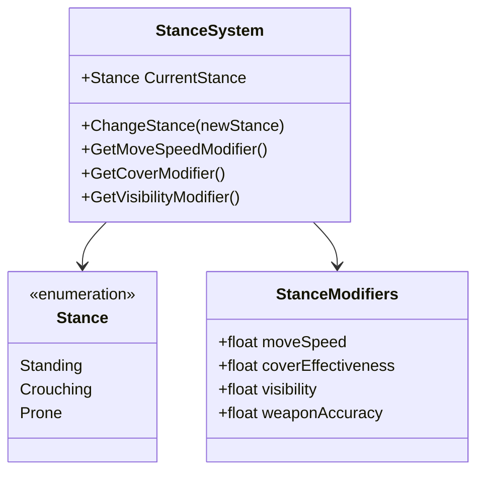

**Key Elements:**
1. **Stance enumeration**: Clear postures (Standing, Crouching, Prone)
2. **Modifier table**: Each stance affects multiple systems
3. **Transition time**: Changing stance takes time
4. **Automatic selection**: AI can choose optimal stance

#### Variations

**OpenCombat-SDL**: Stance as state bit
```cpp
enum SoldierState {
    Standing = 0,
    Prone = 1,
    // ...
};
// Terrain cover varies by stance:
// <Cover Standing="0.1" Prone="0.5" />
```
- Stance affects cover calculation
- Separate from movement states

**OpenCombat**: Body enum in Behavior
```rust
enum Body {
    StandUp,
    Crouch,
    Prone,
}

// Visibility modifiers by stance:
// StandUp: 0.5 visibility
// Crouch: -0.3 visibility
// Prone: -0.9 visibility
```
- Stance affects visibility heavily
- Separate from movement

**CloseCombatFree**: Speed multipliers
```cpp
// Sneak order: 0.4x speed
// MoveFast: 1.5x speed
// Implicit stance from movement type
```
- Less explicit stance modeling
- Speed differences instead

#### Consequences

**Benefits:**
- Meaningful tactical choices
- Realistic combat dynamics
- Players must trade off speed vs safety
- Rich AI decision space

**Tradeoffs:**
- UI complexity (showing stance)
- AI must consider stance in planning
- Animation requirements

**When to Use:** Any tactical game where positioning matters

#### Related Patterns
- **Cover Evaluation Pattern**: Stance affects cover
- **Visibility Pattern**: Stance affects being seen

---

### Pattern 7: Morale Cascade Pattern

#### Intent
Model psychological state and its propagation through unit hierarchies, where nearby casualties and threats affect individual and group morale.

#### Problem
Combat psychology is crucial:
- Soldiers panic under fire
- Squad casualties affect remaining members
- Leaders bolster nearby soldiers
- Panic can spread contagiously

Without morale, combat is too deterministic and unrealistic.

#### Solution

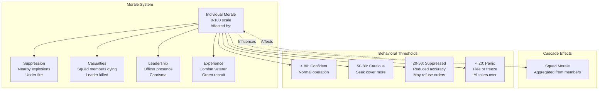

**Key Elements:**
1. **Individual morale**: 0-100 scale per soldier
2. **Modifiers**: Suppression, casualties, leadership, experience
3. **Squad aggregation**: Squad morale affects members
4. **Threshold behaviors**: Different AI at different morale levels
5. **Recovery**: Morale regenerates when not under threat

#### Variations

**OpenCombat-SDL**: 8-attribute system
```cpp
struct Attributes {
    Rating Aggressiveness;
    Rating Leadership;
    Rating Charisma;
    Rating Knowledge;
    Rating Experience;
    Rating Intelligence;
    Rating Morale;
    Rating Stamina;
};
// Complex interplay between attributes
```

**OpenCombat**: Simple feeling enum
```rust
enum Feeling {
    Calm,
    Alert,
    Danger,
    Panic,
}
// Under fire → Danger → affects behavior
```

**CloseCombatFree**: Status-based
```cpp
// BROKEN, BERSERK, etc.
// Triggered by casualties
// Less graduated than numeric morale
```

#### Consequences

**Benefits:**
- Realistic combat psychology
- Elite vs green troop differentiation
- Tactical suppression becomes viable
- Emergent behaviors (mass panic)

**Tradeoffs:**
- Complex tuning required
- Can frustrate players ("why won't they obey?")
- Needs clear UI feedback

**When to Use:** Realistic tactical games

#### Related Patterns
- **Threat Assessment Pattern**: Morale responds to threats
- **State Hierarchy Pattern**: Morale affects behavior selection

---

## 11.5 Command Patterns

### Pattern 8: Command Abstraction Pattern

#### Intent
Separate high-level player intent (orders) from low-level unit execution (actions/gestures), allowing translation and decomposition between abstraction layers.

#### Problem
Players think in tactical terms:
- "Move to that building"
- "Defend this position"
- "Attack that enemy"

But units execute physical actions:
- Stand up, walk forward, turn, stop
- Raise weapon, aim, fire, reload

The gap must be bridged cleanly.

#### Solution

```mermaid
flowchart TB
    subgraph "Command Abstraction Layers"
        P[Player Intent
        "Take that hill!"]
        O[Order
        Strategic Command
        - MoveTo(Position)
        - Defend(Angle)
        - Engage(Target)]
        B[Behavior
        Tactical Decision
        - FindPath
        - SelectCover
        - AimWeapon]
        A[Action
        Physical Execution
        - WalkTo(Tile)
        - RotateTo(Angle)
        - FireWeapon]
        G[Gesture
        Animation State
        - Idle
        - Aiming(Frame 130)
        - Firing(Frame 135)]
    end
    
    P -->|UI Translation| O
    O -->|AI Decomposition| B
    B -->|System Translation| A
    A -->|Animation| G
    
    style P fill:#f99
    style O fill:#ff9
    style B fill:#9f9
    style A fill:#99f
    style G fill:#f9f
```

**Key Elements:**
1. **Orders**: High-level player commands
2. **Behaviors**: Tactical AI decisions
3. **Actions**: Low-level system commands
4. **Gestures**: Animation states
5. **Translation layers**: Convert between levels

#### Variations

**OpenCombat-SDL**: Two-tier (Orders → Actions)
```cpp
// Orders: MoveOrder, FireOrder, DefendOrder
// Actions: WalkTo, RunTo, Rotate, Fire
// Squad::HandleMoveOrder() translates
```

**OpenCombat**: Three-tier (Orders → Behaviors → Gestures)
```rust
// Order: MoveTo
// Behavior: MoveTo(WorldPaths)
// Gesture: Idle, Aiming, Firing with frame tracking
// Clear separation with message passing
```

**CloseCombatFree**: Simple queue
```cpp
// Orders queued directly
// Each order triggers status change
// Status drives animation
// Less abstraction, more direct
```

#### Consequences

**Benefits:**
- Clean separation of concerns
- AI operates at appropriate level
- Easy to add new order types
- Player intent preserved through chain

**Tradeoffs:**
- Multiple layers to maintain
- Debugging requires tracing through layers
- Potential for translation errors

**When to Use:** Games with complex command hierarchies

#### Related Patterns
- **Order Queue Pattern**: Commands queued for execution
- **State Hierarchy Pattern**: Behaviors use state system

---

### Pattern 9: Formation Control Pattern

#### Intent
Enable coordinated movement of squad members in geometric formations, reducing pathfinding overhead and enabling tactical positioning.

#### Problem
Squad members shouldn't all pathfind independently:
- Expensive (N paths for N soldiers)
- Results in chaotic movement
- No tactical cohesion
- Units get in each other's way

#### Solution

```mermaid
flowchart TB
    subgraph "Formation System"
        L[Leader/Point Man
        Does actual pathfinding]
        F[Formation Geometry
        - Column (travel)
        - Line (combat)
        - Wedge (assault)
        - File (stealth)]
        M[Member Positions
        Calculated from:
        - Formation type
        - Member index
        - Leader position
        - Heading]
    end
    
    L -->|Provides path| P[Path]
    F -->|Defines| M
    L -->|Provides| POS[Position/Heading]
    POS -->|Used by| M
    M -->|Results in| IND[Individual destinations
    for each member]
```

**Key Elements:**
1. **Point man**: Single unit does pathfinding
2. **Formation geometry**: Relative positions defined per formation type
3. **Position calculation**: Members calculate target positions based on formation
4. **Heading consideration**: Formation rotates with leader's direction

#### Variations

**OpenCombat-SDL**: Partial implementation
```cpp
enum FormationType {
    Column,    // Travel
    Line,      // Combat
    File,      // Stealth
    Wedge,     // Assault
};
// Only horizontal line implemented
// Formation::GetFormationPosition() stub
```

**OpenCombat**: Individual pathing with formation influence
```rust
fn issue_squad_order(squad, order) {
    let formation_positions = calculate_formation(
        squad.formation,
        paths.destination(),
        squad.members.len()
    );
    
    for (i, member) in squad.members.iter().enumerate() {
        let individual_path = calculate_path(
            member.position,
            formation_positions[i]
        );
        member.order = MoveTo(individual_path);
    }
}
```

**CloseCombatFree**: Not implemented
- Direct movement only
- No formation system

#### Consequences

**Benefits:**
- Reduced pathfinding cost
- Tactical positioning
- Visual cohesion
- Realistic military movement

**Tradeoffs:**
- Complex math for position calculation
- Difficult to implement correctly
- Formation changes mid-movement are hard

**When to Use:** Squad-based tactical games

#### Related Patterns
- **Soldier/Squad Aggregate Pattern**: Squad uses formations
- **Pathfinding Pattern**: Point man does pathfinding

---

### Pattern 10: Prerequisite Chain Pattern

#### Intent
Automatically insert required intermediate actions when a unit attempts an action it cannot currently perform, enabling emergent behavior without explicit scripting.

#### Problem
Soldiers can't fire while:
- Prone (must stand up first)
- Reloading (must finish first)
- Moving (must stop first)

Without automatic prerequisites, players must micromanage every state transition.

#### Solution

```mermaid
flowchart TB
    subgraph "Prerequisite Chain Example"
        A[Goal: Fire at Enemy]
        B{Can Fire?
        Check: Standing?
        Check: Reloaded?
        Check: Not Busy?}
        C[Insert: StandUp
        Duration: 500ms]
        D[Insert: Reload
        Duration: 3000ms]
        E[Execute: Fire
        Duration: 500ms]
        F[Result: Enemy hit]
        
        A --> B
        B -->|Not Standing| C
        B -->|Not Reloaded| D
        C --> E
        D --> E
        E --> F
    end
    
    subgraph "Action Requirements"
        R1[StandingFire requires:
        - Standing state
        - Reloaded state]
        R2[Run requires:
        - Standing state
        - Not encumbered]
        R3[Stop requires:
        - (none)
        Removes: Moving]
    end
```

**Key Elements:**
1. **Action requirements**: Each action specifies prerequisites
2. **Automatic discovery**: System finds actions that set required states
3. **Chain insertion**: Prerequisites prepended to queue
4. **Emergent behavior**: Complex sequences emerge from simple rules

#### Variations

**OpenCombat-SDL**: Full prerequisite system
```cpp
// SoldierActions.txt format:
// Name, Group, Time, Requirements, Adds, Subtracts
StandingFire, Combat, 400, "Standing Reloaded", "Firing", "Reloaded"
LieDown, Stance, 500, "Standing", "Prone", "Standing"

void Soldier::AddAction(Action* action) {
    int prereq = CheckRequirements(action->Index, &_currentState);
    while (prereq != -1) {
        Action* prereqAction = new Action(prereq);
        _actionQueue.push_front(prereqAction);
        prereq = CheckRequirements(prereq, &_currentState);
    }
    _actionQueue.push_back(action);
}
```

**OpenCombat**: Gesture timing
```rust
// Gesture completion tracked
Gesture::Aiming(end_frame, weapon)
// Cannot fire until frame >= end_frame
// System waits automatically
```

**CloseCombatFree**: Status-driven
```cpp
// setUnitStatus("AIMING")
// Animation completes
// onRunningChanged() continues queue
```

#### Consequences

**Benefits:**
- Intelligent unit behavior
- Reduced player micromanagement
- Emergent complexity from simple rules
- Natural state transitions

**Tradeoffs:**
- Debugging can be difficult
- Infinite loops possible (circular prerequisites)
- Player may not understand why unit does something

**When to Use:** Games with complex state machines

#### Related Patterns
- **State Hierarchy Pattern**: Prerequisites check states
- **Order Queue Pattern**: Prerequisites inserted into queue

---

## 11.6 Perception Patterns

### Pattern 11: Line of Sight Pattern

#### Intent
Determine whether one entity can see another, considering terrain elevation, obstacles, and visibility modifiers.

#### Problem
Tactical games require visibility calculations:
- Can Soldier A see Soldier B?
- What cover is available?
- Where are the blind spots?
- How does elevation affect vision?

#### Solution

```mermaid
flowchart TB
    subgraph "Line of Sight System"
        Q[Query: Can A see B?]
        
        Q --> D[Distance Check
        Too far = invisible]
        D -->|Pass| R[Raycast/Bresenham
        Sample points between A and B]
        R --> T[Terrain Check
        Elevation differences
        Obstacles]
        T -->|Pass| M[Modifiers
        - Stance (prone = harder to spot)
        - Movement (moving = easier to spot)
        - Smoke/Effects]
        M -->|Pass| V[Visible!]
    end
    
    subgraph "Accumulated Opacity"
        A[Start: 0.0 opacity]
        B[Sample terrain
        Each point adds opacity]
        C{Accumulated >= 0.5?}
        D2[Blocked!]
        E[Continue to next point]
        F[End: Visible!]
        
        A --> B
        B --> C
        C -->|Yes| D2
        C -->|No| E
        E --> B
        B -->|End reached| F
    end
```

**Key Elements:**
1. **Ray sampling**: Bresenham line algorithm
2. **Terrain checks**: Elevation and obstacles
3. **Opacity accumulation**: Gradual blocking
4. **Modifier application**: Stance, movement, effects
5. **Threshold**: Binary visible/hidden decision

#### Variations

**OpenCombat-SDL**: 3D Bresenham
```cpp
bool LineOfSight::IsVisible(Point from, Point to, World* world) {
    std::vector<Point> line = Bresenham3D(from, to);
    for (const Point& p : line) {
        if (world->GetElevation(p) - from.z > threshold)
            return false;
        if (world->GetElement(p)->BlocksVision())
            return false;
    }
    return true;
}
```

**OpenCombat**: Accumulated opacity
```rust
fn calculate_visibility(from, to, map) -> Visibility {
    let mut accumulated_opacity = 0.0;
    for point in bresenham_line(from, to) {
        if distance(from, point) <= 6.0 { continue; } // Near exemption
        accumulated_opacity += map.terrain_at(point).opacity;
        if accumulated_opacity >= 0.5 {
            return Visibility::Hidden;
        }
    }
    Visibility::Visible
}
```

**CloseCombatFree**: Dual check
```cpp
bool isVisible(Point from, Point to) {
    return checkElevationLOS(from, to) && checkObstacleLOS(from, to);
}
```

#### Consequences

**Benefits:**
- Realistic visibility
- Elevation matters tactically
- Cover system integration
- Fog of war naturally supported

**Tradeoffs:**
- Computationally expensive
- Requires optimization (caching, spatial partitioning)
- Complex edge cases

**When to Use:** Any tactical game with concealment

#### Related Patterns
- **Spatial Partitioning Pattern**: Optimizes LOS queries
- **Threat Assessment Pattern**: LOS used for threat detection

---

### Pattern 12: Threat Assessment Pattern

#### Intent
Enable units to autonomously detect and respond to threats in their environment, making intelligent decisions about engagement, cover-seeking, and suppression.

#### Problem
Without AI:
- Units wait passively for orders
- Unrealistic (real soldiers return fire)
- Requires excessive micromanagement
- Frustrating when units stand still under fire

#### Solution

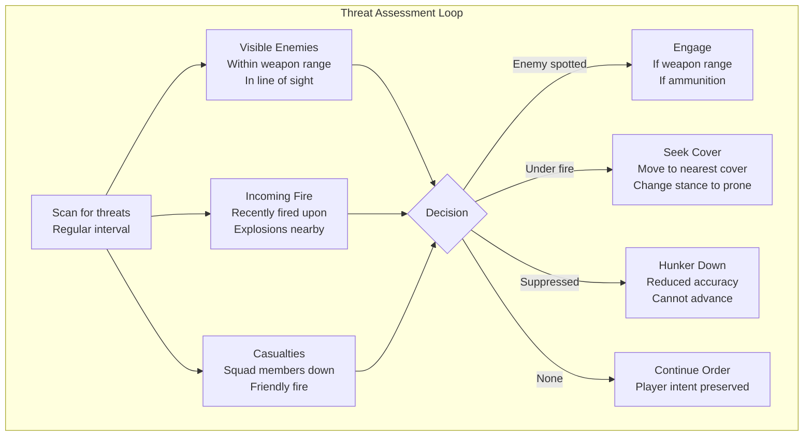

**Key Elements:**
1. **Threat detection**: Visible enemies, incoming fire, explosions
2. **Priority system**: Immediate survival > combat > orders
3. **Response behaviors**: Engage, cover, suppress, retreat
4. **Override rules**: When AI can override player orders

#### Variations

**OpenCombat-SDL**: No AI
```cpp
// Units wait for orders
// No autonomous behavior
// Pure player control
```

**OpenCombat**: Reactive AI
```rust
fn evaluate_threats(soldier, world) -> Option<Behavior> {
    if let Some(enemy) = find_visible_enemy(soldier, world) {
        return Some(Behavior::EngageSoldier(enemy));
    }
    if soldier.under_fire == Feeling::Danger {
        if let Some(cover) = find_nearest_cover(soldier, world) {
            return Some(Behavior::Hide(cover.direction));
        }
    }
    None
}
```

**CloseCombatFree**: State-based triggers
```cpp
// DEFENDING: Fire at enemies in range
// AMBUSHING: Fire when enemy enters radius
// No complex decision making
```

#### Consequences

**Benefits:**
- Realistic autonomous behavior
- Reduced micromanagement
- Emergent tactics
- Self-preservation instincts

**Tradeoffs:**
- Can frustrate players ("why did he move?")
- Requires careful tuning
- Complex edge cases

**When to Use:** Games where AI autonomy desired

#### Related Patterns
- **Line of Sight Pattern**: Detects visible threats
- **Cover Evaluation Pattern**: Finds cover when threatened
- **Morale Cascade Pattern**: Affects threat response

---

### Pattern 13: Cover Evaluation Pattern

#### Intent
Enable units to identify, evaluate, and utilize protective terrain features that reduce incoming damage.

#### Problem
Tactical combat requires cover:
- Buildings provide complete protection
- Walls provide partial protection
- Elevation provides advantage
- Units must choose optimal positions

#### Solution

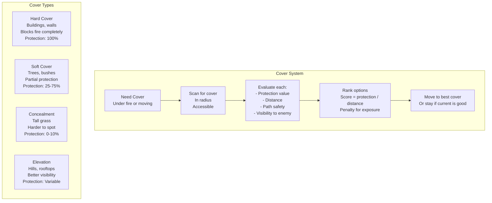

**Key Elements:**
1. **Cover scan**: Query terrain for protective features
2. **Protection values**: Quantified protection per cover type
3. **Evaluation function**: Score based on protection, distance, exposure
4. **Stance modifiers**: Prone gets more benefit from low cover

#### Variations

**OpenCombat-SDL**: Stance-based cover
```xml
<Element>
    <Name>Stone Wall</Name>
    <Cover Standing="0.8" Prone="0.9" />
</Element>
```

**OpenCombat**: Cover + opacity
```rust
struct TerrainType {
    cover: f32,      // Protection value
    opacity: f32,    // Vision blocking
}
```

**CloseCombatFree**: Category-based
```qml
Prop {
    cover: "great"  // none, poor, average, great
}
```

#### Consequences

**Benefits:**
- Meaningful tactical choices
- Terrain importance
- Realistic combat flow
- AI can play competently

**Tradeoffs:**
- Cover calculation overhead
- Requires good level design
- Can create stalemates

**When to Use:** All tactical games

#### Related Patterns
- **Line of Sight Pattern**: Cover blocks LOS
- **Threat Assessment Pattern**: Seek cover when threatened
- **Stance System Pattern**: Stance affects cover benefit

---

## 11.7 System Patterns

### Pattern 14: Spatial Partitioning Pattern

#### Intent
Efficiently organize entities in game world space to enable fast queries (nearby entities, line of sight, etc.) without checking every entity.

#### Problem
Naive O(N) queries don't scale:
- "Find all enemies within 100 meters"
- "What units can see this position?"
- "Is anyone standing on this tile?"

With 500 units, O(N²) becomes 250,000 checks per frame.

#### Solution

```mermaid
flowchart TB
    subgraph "Spatial Partitioning"
        G[Grid/Tile Approach
        Uniform cells
        O(1) insertion
        O(cells_in_radius) query]
        
        H[Hash Approach
        Spatial hash
        Buckets by location
        Good for sparse worlds]
        
        Q[Quadtree
        Hierarchical
        Variable density
        Good for uneven distribution]
    end
    
    subgraph "Tile-Based Implementation"
        W[World Grid
        10x10 pixel tiles]
        
        L[Linked Lists
        Per-tile entity lists
        Head pointer in array]
        
        I[Insertion
        O(1) to tile list]
        
        Q2[Query
        Check radius tiles
        Traverse lists]
        
        W --> L
        L --> I
        L --> Q2
    end
```

**Key Elements:**
1. **World subdivision**: Divide space into cells/tiles
2. **Entity registration**: Track which cell each entity is in
3. **Movement update**: Re-register when entity changes cell
4. **Radius queries**: Check cells within radius

#### Variations

**OpenCombat-SDL**: Linked lists per tile
```cpp
class World {
    std::vector<Object*> _tileObjects;  // Head pointer per tile
    
    void AddObject(Object* obj, int tileX, int tileY) {
        obj->NextObject = _tileObjects[tileIndex];
        if (obj->NextObject) obj->NextObject->PrevObject = obj;
        _tileObjects[tileIndex] = obj;
    }
};
```

**OpenCombat**: Grid-based terrain
```rust
struct Map {
    terrain: Vec<Vec<TerrainIndex>>,  // 2D grid
}
// Entity positions tracked separately
// Queries via spatial index
```

**CloseCombatFree**: QML parent-child
```qml
// Visual tree provides spatial organization
// Less optimized for queries
```

#### Consequences

**Benefits:**
- Fast spatial queries
- Scalable to large worlds
- Essential for AI and combat

**Tradeoffs:**
- Memory overhead for structures
- Movement requires re-registration
- Edge cases (entities spanning cells)

**When to Use:** Any game with entity queries

#### Related Patterns
- **Line of Sight Pattern**: Uses spatial partitioning for sampling
- **Threat Assessment Pattern**: Uses spatial queries for threat detection

---

### Pattern 15: Message Bus Pattern

#### Intent
Enable decoupled communication between game systems through a centralized message queue, allowing systems to react to events without direct coupling.

#### Problem
Direct method calls create tight coupling:
```cpp
// Bad: Soldier directly calls World
world->SpawnBullet(from, to);

// Bad: UI directly accesses Soldier
soldier->GetHealth();
```

Changes ripple through codebase.

#### Solution

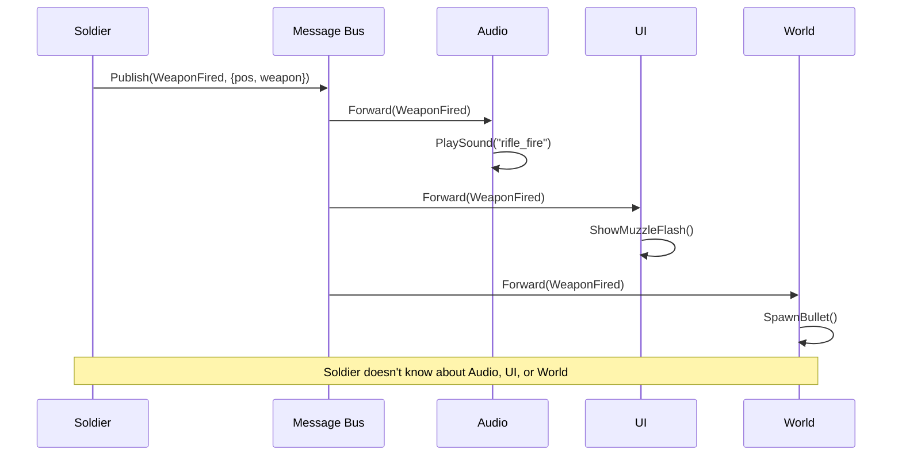

**Key Elements:**
1. **Message types**: Enumerated event types
2. **Bus/queue**: Central message router
3. **Publishers**: Send messages without knowing recipients
4. **Subscribers**: Register interest in message types
5. **Delivery**: Bus routes messages to subscribers

#### Variations

**OpenCombat-SDL**: Direct method calls
- Tight coupling
- Simple but rigid

**OpenCombat**: Full message system
```rust
enum BattleStateMessage {
    Soldier(SoldierIndex, SoldierMessage),
    SetPhase(Phase),
    PushBulletFire(BulletFire),
}

// All state changes via messages
// Enables replay and networking
```

**CloseCombatFree**: Qt signals/slots
```cpp
// Qt's built-in message system
signals:
    void unitStatusChanged(QString status);
    void actionFinished(int unit, qreal x, qreal y);
```

#### Consequences

**Benefits:**
- Decoupled systems
- Easy to add new features
- Replay by re-sending messages
- Network synchronization

**Tradeoffs:**
- Debugging harder (indirect flow)
- Message overhead
- System order dependencies

**When to Use:** Complex games with many interacting systems

#### Related Patterns
- **Command Pattern**: Messages often are commands
- **Event Sourcing Pattern**: Log messages for replay

---

### Pattern 16: Deterministic Simulation Pattern

#### Intent
Ensure that given the same initial state and inputs, the simulation produces identical results every time—essential for multiplayer synchronization and replay recording.

#### Problem
Floating-point, randomness, and timing make games non-deterministic:
```cpp
// Non-deterministic examples:
float damage = baseDamage * random();  // Random!
soldier.position += velocity * dt;     // FP precision varies
```

For multiplayer, all clients must see exactly the same game state.

#### Solution

```mermaid
flowchart TB
    subgraph "Deterministic Simulation"
        I[Initial State
        Same for all clients]
        
        C[Consistent Inputs
        All clients receive:
        - Player commands
        - Random seeds
        - At same simulation frame]
        
        F[Fixed Timestep
        Deterministic dt
        Never use real time]
        
        R[Reproducible Random
        Seeded RNG
        Same sequence on all clients]
        
        S[Simulation Step
        State' = f(State, Inputs)
        No external dependencies]
        
        V[Verification
        Hash game state
        Compare across clients]
    end
    
    I --> F
    C --> S
    F --> S
    R --> S
    S --> V
```

**Key Elements:**
1. **Fixed timestep**: Consistent delta time
2. **Seeded RNG**: Reproducible randomness
3. **No floating-point accumulation**: Or consistent rounding
4. **Input synchronization**: All clients process same inputs
5. **State verification**: Hash to detect desync

#### Variations

**OpenCombat-SDL**: Not deterministic
- Uses real time
- No multiplayer support

**OpenCombat**: Fully deterministic
```rust
// Fixed timestep
const DT: f32 = 1.0 / 60.0;

// Seeded RNG
let mut rng = SeededRng::new(seed);

// All state changes via messages
// Can replay by reprocessing messages
```

**CloseCombatFree**: Not applicable
- Single-player only
- Animation-driven timing

#### Consequences

**Benefits:**
- Multiplayer synchronization
- Replay recording
- Debug by replaying
- Verification/testing

**Tradeoffs:**
- Complex implementation
- Input latency in multiplayer
- Cannot use real-time features

**When to Use:** Multiplayer games, replay features

#### Related Patterns
- **Message Bus Pattern**: Messages enable determinism
- **Command Pattern**: Commands logged for replay

---

### Pattern 17: Hot Reload Pattern

#### Intent
Enable modification of game data and scripts at runtime without restarting, dramatically improving iteration speed for developers and modders.

#### Problem
Traditional development cycle:
1. Edit file
2. Recompile (minutes)
3. Restart game
4. Navigate to test scenario
5. Test change

This kills iteration speed and creative flow.

#### Solution

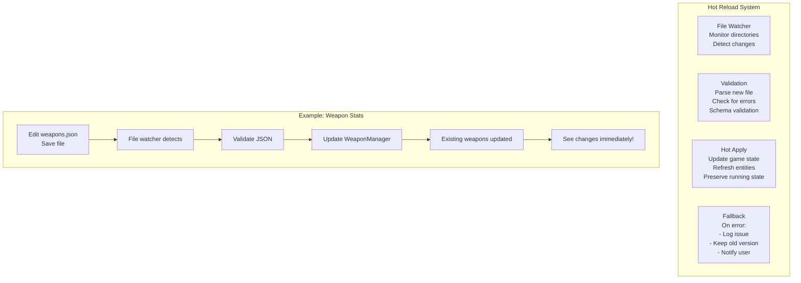

**Key Elements:**
1. **File watching**: OS-level file change detection
2. **Validation**: Check file before applying
3. **Hot apply**: Update game state gracefully
4. **Error handling**: Fail gracefully on bad files

#### Variations

**OpenCombat-SDL**: No hot reload
- Restart required
- XML parsed at startup only

**OpenCombat**: Runtime config
```rust
// Some config values can change
ChangeConfigMessage::VisibilityModifier(new_value)
// But not full hot reload
```

**CloseCombatFree**: Full hot reload
```cpp
// QML supports hot reload naturally
void reloadScenario(const QString& file) {
    QQmlComponent component(&engine, file);
    QObject* scenario = component.create();
    // Replace current scenario
}
```

#### Consequences

**Benefits:**
- Rapid iteration
- Better modding support
- Immediate feedback
- Improved development velocity

**Tradeoffs:**
- Complex implementation
- State consistency challenges
- Not suitable for all changes

**When to Use:** Any game with significant data/scripting

#### Related Patterns
- **Component Composition Pattern**: Easy to swap components
- **Data-Driven Design Pattern**: Enables hot reload

---

## 11.8 Decision Framework

### Choosing Pattern Variations

The three Close Combat clones demonstrate that patterns can be implemented in multiple ways. Use this framework to decide which variation suits your project:

#### Simulation Depth vs Moddability

| Your Priority | Choose | Example |
|---------------|--------|---------|
| **Deep Simulation** | OpenCombat-SDL approach | Bitfield states, hardcoded behaviors |
| **Balance** | OpenCombat approach | Deterministic simulation, JSON data |
| **Maximum Moddability** | CloseCombatFree approach | QML content, full scripting |

**Key Question**: Can you recompile quickly? If yes, choose deeper simulation. If no, choose moddability.

#### Single-Player vs Multiplayer Determinism

| Requirement | Pattern Choice |
|-------------|----------------|
| **Single-player only** | Any approach works |
| **Local multiplayer** | Deterministic simulation recommended |
| **Network multiplayer** | Deterministic simulation required |
| **Replay recording** | Message bus + determinism required |

**Key Question**: Do all players need identical game states? If yes, implement deterministic simulation from day one.

#### Procedural vs Designer-Authored Content

| Content Approach | Architecture |
|------------------|--------------|
| **Fully procedural** | Seed-based generation, no content files |
| **Mixed** | JSON/YAML data + procedural elements |
| **Designer-authored** | Full data-driven, hot reload |
| **Community modded** | Scripting support (Lua), mod manager |

**Key Question**: Who creates content? Developers only = simpler. Community = full modding support.

#### Runtime Flexibility vs Performance

| Performance Need | Pattern Selection |
|------------------|-------------------|
| **Maximum performance** | C++17/20, custom allocators, DOD |
| **Good performance** | Modified ECS, spatial hashing |
| **Acceptable performance** | Scripting for logic, C++ for hot paths |
| **Modding > Performance** | QML/Lua, hot reload |

**Key Question**: Target platform and entity count? Mobile/low-end = performance. Desktop/high-end = flexibility acceptable.

### Recommended Combinations

#### For a New Close Combat Clone (2026+)

Based on analysis of all three projects:

**Core Architecture**:
- **Language**: C++20 or Rust
- **Entity System**: Modified ECS (OpenCombat style)
- **State Management**: Three-tier hierarchy
- **Commands**: Order queue with prerequisite chaining
- **Perception**: Opacity-based LOS
- **AI**: Reactive with behavior trees
- **Multiplayer**: Deterministic lockstep

**Modding Support**:
- **Data**: JSON/YAML for definitions
- **Scripts**: Lua for behaviors and AI
- **Hot Reload**: File watcher for rapid iteration
- **Format**: Standard mod structure with dependencies

**Performance**:
- **Spatial**: Grid-based partitioning
- **Pathfinding**: A* with directional costs
- **Object Pool**: For bullets and effects

This hybrid approach captures the best of all three worlds: OpenCombat-SDL's simulation depth, OpenCombat's modern architecture, and CloseCombatFree's moddability.

---

## 11.9 Pattern Relationships

### Pattern Dependency Graph

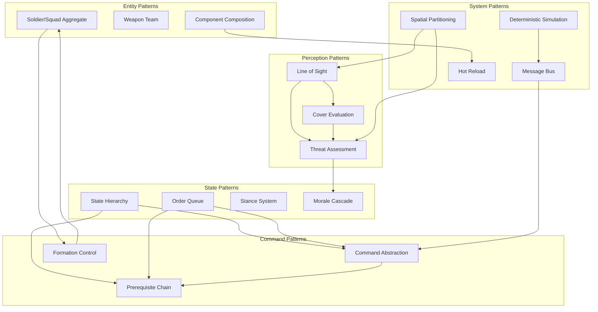

### Pattern Combinations That Work Well

1. **Three-Tier State + Command Abstraction + Order Queue**
   - Natural hierarchy of intent
   - Clean separation of concerns
   - Used by: OpenCombat

2. **Spatial Partitioning + Line of Sight + Threat Assessment**
   - Efficient threat detection
   - Realistic perception
   - Used by: All three games

3. **Soldier/Squad Aggregate + Formation Control + State Hierarchy**
   - Coordinated group behavior
   - Natural military structure
   - Used by: OpenCombat-SDL, OpenCombat

4. **Component Composition + Hot Reload + Scripting**
   - Maximum moddability
   - Rapid iteration
   - Used by: CloseCombatFree

5. **Message Bus + Deterministic Simulation + Command Pattern**
   - Replay and multiplayer
   - Clean architecture
   - Used by: OpenCombat

---

## 11.10 Conclusion: Patterns as Vocabulary

The patterns cataloged in this chapter form a vocabulary for discussing tactical wargame architecture. When you say "we use a Three-Tier State Hierarchy with Order Queues," other developers immediately understand the structural implications.

The three Close Combat clones demonstrate that:

1. **There are no universal solutions, only pattern variations**—each project chose different implementations based on their constraints and goals.

2. **Patterns can be composed**—the most effective architectures combine multiple patterns (e.g., OpenCombat's message-driven state updates + deterministic simulation).

3. **Tradeoffs are inevitable**—CloseCombatFree chose moddability over performance; OpenCombat chose determinism over simplicity. These are valid choices based on project priorities.

4. **Patterns emerge from practice**—none of these patterns were invented for these games. They were discovered through the hard work of solving real problems.

### For Future Implementers

Use this pattern language to:
- **Communicate** with your team using shared terminology
- **Evaluate** architectural decisions against proven solutions
- **Anticipate** problems before they occur
- **Document** your architecture in terms others understand

The patterns presented here are not prescriptive rules but rather descriptive observations of what has worked. Adapt them to your context, combine them creatively, and add new patterns as you discover them.

The Close Combat series set a high bar for tactical wargaming. These patterns provide a foundation for meeting—and exceeding—that standard in your own implementations.

---

**End of Chapter 11**

---

*This pattern catalog was synthesized from analysis of three Close Combat clone implementations: OpenCombat-SDL (2005-2008), CloseCombatFree (2011-2012), and OpenCombat (2020-2024). May it serve as a guide for future tactical wargame architects.*
